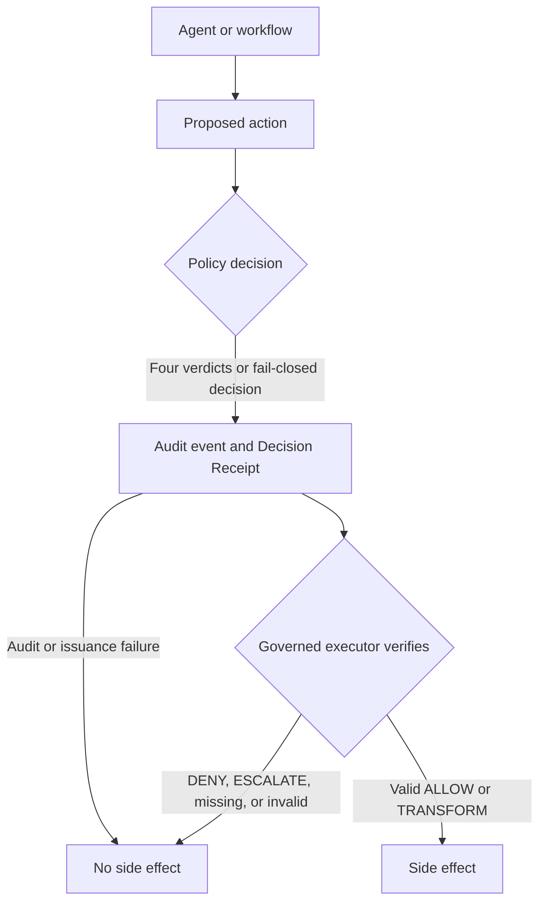

ACGS is a governed agent infrastructure project. Its core enforcement kernel is gove-zone, a vendor-neutral, receipt-gated governance layer for AI-agent side effects.

# ACGS

**Receipt-gated runtime governance for AI-agent side effects.**

[](packages/gove-zone/CHANGELOG.md)

[](LICENSE)
[](docs/README.md)
[](https://acgs.ai/)

> For every execution path wired through ACGS: **No valid Decision Receipt, no side effect.**

ACGS sits immediately before an AI agent can change files, infrastructure,
data, communications, or money. It evaluates policy, issues a project-defined
Decision Receipt that binds the actor, action, exact arguments, tenant, and
policy evidence, and lets a governed executor proceed only when that receipt
verifies.

ACGS complements agent frameworks, MCP, IAM, sandboxes, content guardrails,
and SIEM. It does not replace them. The ACGS monorepo contains several
governance components; [`packages/gove-zone`](packages/gove-zone/) is the core
Python enforcement kernel.

**Current source metadata:** `gove-zone 1.0.0rc1`, with a Beta package
classifier. The candidate history still requires release reconciliation. These
checked-in values do not by themselves prove that this version was tagged,
published on PyPI, deployed to production, certified, or independently
assured. Other monorepo components have independent versions and maturity
levels.

## How it works



The agent proposes an action; it does not authorize itself. The gate binds the
decision to the exact execution context. Every completed decision—including
`DENY` and `ESCALATE`—retains an audit event and receipt, but only a valid
`ALLOW` or `TRANSFORM` can execute. A mismatched, missing, expired, or otherwise
invalid receipt fails closed at the governed executor. When a shared
`ReceiptConsumptionLedger` is configured, a consumed receipt also fails closed.

## Verify the invariant locally

Prerequisites: Python 3.11+, [`uv`](https://docs.astral.sh/uv/), and a POSIX
shell such as Bash. This runs on a plain clone — no submodules or private tokens
required.

The one-command reviewer path:

```bash
make review
```

`make review` runs the documentation smoke suite, the full `gove-zone`
enforcement-kernel test suite, and the receipt-gated invariant smoke, and prints
`review OK` when the core invariant is proven. The full multi-package CI gate is
`make verify` (adds JS, typecheck, submodule-bound packages, and coverage/budget
gates; it needs submodules and all stacks present). `make verify` is a superset
of `make review`'s checks.

The separate constitutional hash verification
(`scripts/verify_constitutional_hashes.py`) requires the complete source tree,
including required submodule contents, and fails closed on a bare clone. The
core governance kernel remains independently reproducible without optional
research references — the `make review` path above needs no submodules. See
[`docs/REPRODUCIBILITY.md`](docs/REPRODUCIBILITY.md).

Or run the underlying steps directly from the repository root:

```bash
tmp="$(mktemp -d)"
uv run --package gove-zone gove-zone smoke \
  --audit "$tmp/acgs-gove-zone-smoke-audit.jsonl"
uv run --extra crypto --package gove-zone python \
  packages/gove-zone/examples/receipt-gated-execution/demo.py
uv run --package gove-zone python examples/tamper_demo/demo.py
```

The console package also ships a dependency-free local buyer-evidence gallery
for reviewer handoff. It is local buyer-evidence only, not hosted Storybook
proof, production deployment proof, legal review, or external assurance.

```bash
pnpm -F acgi-ai run evidence:build
pnpm -F acgi-ai run test:buyer-evidence
```

Expected result: the allowed action executes; denied, missing, tampered, and
mismatched receipts do not; the audit chain verifies; and tampered evidence
fails chain or receipt verification.

Start with the guided [`START_HERE`](docs/START_HERE.md) path or read the
canonical [`PROOF_PATH`](docs/PROOF_PATH.md) narrative. Recorded evidence is
available as a legacy [asciinema cast](docs/launch/evidence/demo-proof-sequence.cast)
and [plain-text transcript](docs/launch/evidence/demo-proof-sequence.txt), both
recorded against `0.1.0.dev0` without a captured commit SHA. Treat them as
point-in-time evidence and reproduce the commands against the commit you intend
to evaluate.

## Implemented surfaces and evidence

| Capability | Evidence |
|---|---|
| Policy-before-execution dispatch | `packages/gove-zone/src/gove_zone/kernel.py`; `packages/gove-zone/tests/test_fail_closed.py` |
| Decision Receipt schema and validation | `packages/gove-zone/src/gove_zone/receipt.py`; `packages/gove-zone/tests/test_decision_receipt.py` |
| Receipt-gated executor | `packages/gove-zone/src/gove_zone/executor.py`; `packages/gove-zone/tests/test_executor_guard.py` |
| Actor, action, argument, tenant, and policy binding | `packages/gove-zone/tests/test_argument_binding.py`; `test_tenant_safety.py`; `test_receipt_expiry.py` |
| Tamper-evident audit chain | `packages/gove-zone/src/gove_zone/audit.py`; `packages/gove-zone/tests/test_audit_chain.py`; `test_audit_chain_corruption.py` |
| Audit-only replay verification | `packages/gove-zone/src/gove_zone/replay.py`; `packages/gove-zone/tests/test_replay.py` |
| Side-store decision re-derivation when raw calls and the original policy are retained | `packages/gove-zone/src/gove_zone/replay_store.py`; `packages/gove-zone/tests/test_replay.py` |
| Ed25519 receipt-signing support | `packages/gove-zone/src/gove_zone/signing.py`; `packages/gove-zone/tests/test_receipt_signing.py` |
| Runtime, MCP, and function-call adapter surfaces | `packages/gove-zone/src/gove_zone/integration.py`; [`docs/INTEGRATION_MATRIX.md`](docs/INTEGRATION_MATRIX.md) |
| Local proof pack and offline verifier | `gove-zone proofpack`; `packages/gove-zone/tests/test_cli.py` |

Runtime support is tiered. “Shipped,” “pattern,” and “roadmap” do not mean the
same thing; consult the [integration matrix](docs/INTEGRATION_MATRIX.md) before
making compatibility claims.

## Deployment contract

The invariant holds only on execution paths that are wired through a governed
gate. Three deployment choices are load-bearing:

- **Trusted signatures.** Receipt issuance signs only with an explicit signer.
  Governed executor gates separately require trusted signature verification by
  default; they do not generate or trust a key. Without a configured matching
  verifier, the gate raises before calling the tool. Unsigned development mode
  requires an explicit opt-out through `require_signature=False` or
  `GovernanceProfile.dev`.
- **Single use.** Stateless verification does not prevent a valid receipt from
  being reused. Share a `ReceiptConsumptionLedger` across every executor call
  that must enforce one-time consumption.
- **External audit anchoring.** A hash chain detects internal modification, but
  a truncated prefix can remain internally consistent. Persist the expected
  event count and/or final event hash outside the local audit store and verify
  those anchors during chain verification.

Use `gove_zone.executor.execute_with_receipt`, `GovernedExecutor`, or the
documented receipt-verification boundary. Do not treat a direct
`DecisionReceipt.verify()` call as a complete execution gate.

## Scope and claim boundary

This repository provides local engineering evidence. It is:

- not production-certified, not compliance-certified, and not regulator-approved;
- not a replacement for content moderation and not a replacement for sandboxing;
- not a complete IAM/PKI system; and
- not a full formal-verification system.

It does not claim:

- that any live agent host is already wired through the governed executor; or
- safety against a fully compromised issuer or execution host.

See the [`CLAIMS`](docs/CLAIMS.md) ledger and
[`SECURITY_MODEL`](docs/SECURITY_MODEL.md) for the evidence boundary and safe
public wording.

## Main repository surfaces

| Path | Purpose |
|---|---|
| `packages/gove-zone/` | Receipt-gated Python kernel, policies, executor, audit, replay, signing, adapters, and CLI. |
| `packages/acgs-lite/` | Separate nested governance package; follow its package-local release state. |
| `packages/Acgs-Swarm/` | Constitutional swarm research; separate nested repository. |
| `acgs_governance_eval_mvp/` | Evaluation and governance MVP surfaces. |
| `acgs-cft-governance-pack/` | Infrastructure governance pack. |
| `acgi-ai/` | Frontend and control-plane console. |
| `docs/` | Architecture, security, integration, claim, adoption, and proof documentation. |
| `examples/` | Runnable root integration examples. |
| `tests/docs/` | Documentation, example, and link regression checks. |

The complete workspace registry and package boundaries are documented in
[`MONOREPO.md`](MONOREPO.md).

## Documentation paths

| Goal | Start here |
|---|---|
| Prove the core invariant | [`START_HERE`](docs/START_HERE.md) → [`PROOF_PATH`](docs/PROOF_PATH.md) |
| Integrate an execution gate | [`INTEGRATION_GUIDE`](docs/INTEGRATION_GUIDE.md) → [`INTEGRATION_MATRIX`](docs/INTEGRATION_MATRIX.md) |
| Map the layered governance stack | [`governance-stack-index`](docs/governance-stack-index.md) |
| Review the receipt contract | [`DECISION_RECEIPT_SPEC`](docs/DECISION_RECEIPT_SPEC.md) |
| Review security and limitations | [`SECURITY_MODEL`](docs/SECURITY_MODEL.md) → [`CLAIMS`](docs/CLAIMS.md) |
| Understand package stability | [`API_STABILITY`](packages/gove-zone/docs/API_STABILITY.md) → [`CHANGELOG`](packages/gove-zone/CHANGELOG.md) |
| Prepare a release | [`RELEASING`](packages/gove-zone/docs/RELEASING.md) → [`PyPI readiness`](docs/gove-zone-pypi-readiness.md) |
| Browse all documentation | [`docs/README.md`](docs/README.md) |

## Development checks

For documentation-only changes:

```bash
uv run python -m pytest tests/docs --import-mode=importlib -q
make lint-docs
```

For `gove-zone` package changes:

```bash
# Run from inside the package so uv resolves gove-zone's own dependencies
# (crypto/yaml/mcp). The root `uv run --package gove-zone …` form needs
# `--extra crypto --extra yaml --extra mcp` added or 15 optional-dep tests fail.
cd packages/gove-zone && uv run python -m pytest --import-mode=importlib -q
cd packages/gove-zone && bash scripts/release_check.sh
```

Use `make verify` only when intentionally validating the full multi-package
workspace. Read [`AGENTS.md`](AGENTS.md) before editing across package or nested
repository boundaries.
