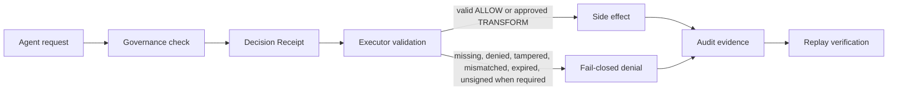

# Runtime architecture

ACGS is the receipt-gated execution membrane between AI-agent reasoning and real-world side effects.

Core invariant:

> **No valid Decision Receipt, no side effect.**

## Component map

| Component | Implementation | Responsibility |
|---|---|---|
| Policy engine | `packages/gove-zone/src/gove_zone/policy.py` | Evaluates a proposed `ToolCall` and returns `ALLOW`, `DENY`, `TRANSFORM`, or `ESCALATE`. Includes `BoundaryPolicy`, `PathBoundaryPolicy`, and `RuleSetPolicy`. |
| Decision Receipt | `packages/gove-zone/src/gove_zone/receipt.py` | Public proof-of-decision artifact binding actor, action, args, policy, validator, authority, expiry, audit anchor, hash, and optional signature. |
| Receipt validator | `DecisionReceipt.verify`, `ReceiptVerifier` | Fail-closed validation of required fields, hash/signature, decision type, tenant, boundary, action, arguments, policy, actor, validator, authority, expiry. |
| Executor gate | `packages/gove-zone/src/gove_zone/executor.py` | Runs the side effect only after receipt validation succeeds. Rejects missing, denied, malformed, tampered, mismatched, or unsigned-when-required receipts. |
| Audit log | `packages/gove-zone/src/gove_zone/audit.py` | Append-only JSONL chain with `previous_hash` and `event_hash`; detects edits, reorders, truncation, and malformed tails. |
| Replay verifier | `packages/gove-zone/src/gove_zone/replay.py` and `replay_store.py` | Replays decisions from audit events and optional raw-argument side-store; detects argument/policy drift. |
| Signing mode | `packages/gove-zone/src/gove_zone/signing.py` | Optional Ed25519 signing for receipts. `require_signature` defaults to `True`: without a configured trusted verifier the gate fails closed (raises) rather than emitting an unsigned receipt — it does not auto-sign. Unsigned local "dev mode" is an explicit opt-in (`require_signature=False`). Production closure requires signer + verifier + `require_signature=True`. |
| Policy bundles | `RuleSetPolicy`, `TenantPolicyStore` | Canonicalizes rule bundles, binds policy ids/hashes/versions, and isolates tenant policy lookup. |
| MCP/runtime adapter | `packages/gove-zone/src/gove_zone/integration.py` | Normalizes Claude/Codex hook payloads, MCP `tools/call`, OpenAI-style function calls, and generic tool events into governance-shaped calls. |
| Integration boundary | Executor or tool gateway | The model may request an action; the executor must enforce the receipt gate before the side effect. |

## Main flow

## Trust boundaries

| Boundary | Trust assumption | Enforced by | Limitation |
|---|---|---|---|
| Agent → governance check | Agent can propose but not self-authorize. | Actor/validator separation and `expected_actor` at the gate. | Actor identity still depends on integrator authentication. |
| Governance check → receipt | Receipt must bind exact decision context. | Canonical hash, required fields, policy/action/argument/tenant/boundary fields. | Unsigned local receipts are hash-bound but recomputable by a host-compromised issuer. |
| Receipt → executor | Executor must verify before running. | `execute_with_receipt`, `GovernedExecutor`, `ReceiptVerifier`. | Direct tool paths outside the gate remain an integration bypass risk. |
| Audit chain | Evidence must be tamper-evident. | Chain hash and `verify_chain()`. | Local JSONL is not WORM/off-host durability. |
| Signing | Signature proves a trusted private key signed the receipt hash. | Ed25519 verifier and `require_signature=True`. | No PKI/revocation/key custody management. |

## Failure modes

Fail closed on:

- policy evaluation exception;
- policy watchdog timeout when configured;
- audit append failure before execution;
- missing receipt;
- malformed receipt;
- tampered receipt hash;
- denied or escalated decision;
- tenant/boundary/action/argument/policy mismatch;
- expired receipt;
- self-validation or actor mismatch;
- signed receipt without verifier;
- unsigned receipt when signature is required;
- malformed audit tail.

Documented residuals:

- direct executor bypass is outside the kernel and must be closed by integration architecture;
- local audit JSONL is tamper-evident but not physically immutable;
- unsigned dev mode is not a production signing guarantee;
- identity, key custody, revocation, and production deployment posture require operator systems around the kernel.

## Evidence links

- Kernel: `packages/gove-zone/src/gove_zone/kernel.py`
- Receipt: `packages/gove-zone/src/gove_zone/receipt.py`
- Executor: `packages/gove-zone/src/gove_zone/executor.py`
- Audit: `packages/gove-zone/src/gove_zone/audit.py`
- Replay: `packages/gove-zone/src/gove_zone/replay.py`
- Signing: `packages/gove-zone/src/gove_zone/signing.py`
- Integration adapter: `packages/gove-zone/src/gove_zone/integration.py`
- Tests: `packages/gove-zone/tests/test_*`
