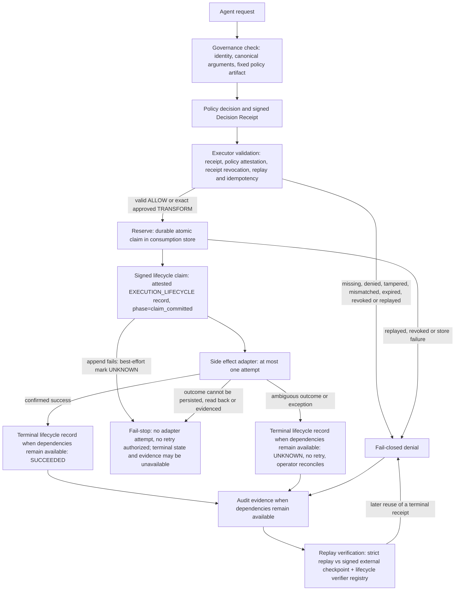

# Runtime architecture

ACGS / gove-zone is the receipt-gated execution membrane between AI-agent reasoning and real-world side effects.

Core invariant:

> **No valid Decision Receipt, no side effect.**

## Component map

| Component | Implementation | Responsibility |
|---|---|---|
| Policy engine | `packages/gove-zone/src/gove_zone/policy.py` | Evaluates a proposed `ToolCall` and returns `ALLOW`, `DENY`, `TRANSFORM`, or `ESCALATE`. Includes `BoundaryPolicy`, `PathBoundaryPolicy`, and `RuleSetPolicy`. |
| Side-effect authorization kernel | `authorization.py`, `managed_execution.py` | Shared strict authorization and final-execution path used by Release Gate (P0), MCP Gateway (P1), and Spend Guard (P2). |
| Decision Receipt | `packages/gove-zone/src/gove_zone/receipt.py` | Public proof-of-decision artifact binding actor, action, args, policy, validator, authority, expiry, audit anchor, hash, and optional signature. |
| Policy artifact attestation | `authorization.py` (`PolicyArtifactAttestation`) and `policy.py` (`PolicyArtifactSnapshot`) | Content-addresses the exact policy artifact and binds its attestation into strict authorization and final revalidation. |
| Receipt validator | `DecisionReceipt.verify`, `ReceiptVerifier` | Fail-closed validation of required fields, hash/signature, decision type, tenant, boundary, action, arguments, policy, actor, validator, authority, expiry. |
| Executor gate | `packages/gove-zone/src/gove_zone/executor.py` | Runs the side effect only after receipt validation succeeds. Rejects missing, denied, malformed, tampered, mismatched, or unsigned-when-required receipts. |
| Consumption store | `packages/gove-zone/src/gove_zone/consumption.py` | Persists single-use receipt consumption, receipt revocation, and idempotency bindings. Its current storage schema is v4; this is not the Decision Receipt schema version or signing-key revocation. |
| Audit log | `packages/gove-zone/src/gove_zone/audit.py` | Append-only JSONL chain with `previous_hash` and `event_hash`. A **bare** chain detects edits, reorders, and malformed tails. Detecting a trusted full rewrite or truncation additionally requires an external signed `AuditCheckpoint` (`namespace`, `generation`, `head_hash`, `previous_checkpoint_hash`). |
| Lifecycle attestation | `decision.py` (`RecordKind`, `DecisionRecord.lifecycle`), `signing.py` (`LifecycleAttestation`) | Authenticates an audit record's kind — one of three: `POLICY_DECISION`, `EXECUTION_LIFECYCLE`, `EXECUTION_REFUSAL` — and binds an Ed25519 proof over the exact execution-lifecycle record, excluding the attestation itself, under a lifecycle domain separator. |
| Execution-refusal evidence | `authorization.py` (`ExecutionRefusalEvidence`, `ExecutionReasonCode`), `side_effect_kernel.py` | Integrity evidence for the third audit kind (`EXECUTION_REFUSAL`): proves one bound attempt was refused *before any adapter ran* (`adapter_invoked=False`). Only adapter-never-entered reason codes may be carried; `TIMEOUT`/`OUTCOME_UNKNOWN`/`ADAPTER_FAILED`/`SUCCEEDED` are rejected. A refusal record is non-executable (`DENY`) and never represents `OUTCOME_UNKNOWN`. |
| Immutable artifact snapshot / pre-adapter digest binding (P0) | `path_capability.py` (`ImmutableArtifactSnapshot`, `capture_immutable_artifact`, `ArtifactCaptureLease`), `release_gate.py` | Captures the exact deployment-artifact bytes immediately before the final adapter boundary, recomputes the digest, and constant-time compares it to the receipted `artifact_digest`; a mismatch is a `FAILED_CLOSED` refusal. Route + artifact-requirement registration is atomic. Snapshot bytes/path are execution-local and never serialized into the receipt or proof pack. Per-snapshot capture defaults to 64 MiB and per-executor leased captures to a 256 MiB aggregate (configurable defaults, not absolute guarantees); a leased snapshot releases on close (success, refusal, or `OUTCOME_UNKNOWN`), an abandoned lease via a GC finalizer, and an explicit close detaches exactly once. |
| Lifecycle verifier registry | `packages/gove-zone/src/gove_zone/signing.py` (`LifecycleVerifierRegistry`) | Frozen, immutable trust snapshot of lifecycle authorities (raw Ed25519 public keys by authority id). Supplies the verification root for strict replay; supports forbidden key/authority ids. |
| Product proof-pack verifiers | `release_proof.py`, `mcp_proof.py`, `spend_proof.py` over `proof_pack.py` | `proof_pack.py` is a generic structural codec (canonical bytes, membership, content hashes, path identity) that knows no domain semantics. The product layers add the semantic verify/replay, including `record_kind` and lifecycle checks. That semantic verification is relative to a caller-supplied expected digest and to external receipt/checkpoint/lifecycle/consumption trust inputs; pack-embedded or self-asserted trust is not independent proof. |
| MCP transports | `mcp_stdio_transport.py`, `mcp_http_transport.py`, `mcp_security.py` | Fixed/validated stdio target with ancestor-chain integrity, and a pinned no-redirect Streamable HTTP origin with DNS-rebinding rejection and fail-closed resolution. HTTPS is required for every public and private-service origin; the single exception is the internally minted, capability-limited container fixture at the exact origin `http://downstream:8000/mcp` (`_MCPFixtureHTTPServicePin`), which callers cannot construct and which is fixture-only, non-production. Gateway-held credentials; no agent token passthrough; no direct fallback. |
| Remote MCP transport | `packages/gove-zone/src/gove_zone/mcp_runtime.py` (`RemoteMCPConfig`, `_RemoteGuard`, `RemoteMCPBudgets`, `build_remote_uvicorn_config`, `remote_tls_snapshot`) | The P1 remote listener (`gove-zone mcp serve-http --remote`) terminates TLS directly in Uvicorn against a process-private snapshot of already-validated certificate/key bytes, with no proxy-header trust (`proxy_headers=False`, `forwarded_allow_ips=[]`). Before any MCP dispatch it validates an exact raw `Host` (and absolute-form target), an allowlisted `Origin` (absent-Origin refused unless explicitly opted in with the asymmetric identity verifier), rejects every `Forwarded`/`X-Forwarded-*` header and any SSE/session-resume attempt, and enforces bounded header/body/concurrency/backlog/keep-alive/graceful-shutdown budgets (`RemoteMCPBudgets`), refusing (503) rather than queuing once concurrency is exhausted. |
| Remote workload identity | `packages/gove-zone/src/gove_zone/mcp_identity.py` (`EdDSAJWSVerifier`, `Ed25519TrustSnapshot`, `MCPTokenClaims`) | Authenticates remote-mode callers with a pinned Ed25519/EdDSA compact-JWS verifier: fixed `alg: EdDSA`/`typ: at+jwt`, no `none`/HMAC path, header-carried key material (`jwk`/`jku`/`x5u`/`x5c`) is a hard rejection, the signing key is selected only by exact `kid` from a frozen in-process trust snapshot, and the signature is verified before any claim is read. Claims bind an exact issuer, audience, resource, authority (`mcp.tools.list` vs `mcp.tools.call`), tenant, client, user, session, scope, and bounded time window. This is a local/reference trust profile — a fixed public-key snapshot read once from an operator file — not a managed PKI, key-rotation, or full enterprise IAM system. |
| MCP reference topology | `packages/gove-zone/src/gove_zone/mcp_reference.py` | Fixture-only container-isolated composition separating probe, gateway, and downstream fixture. Reference evidence, not production deployment. The same `create_reference_runtime` (fixed stdio fixture downstream) backs both the local stdio/loopback-HTTP paths and the actual `mcp serve-http --remote` CLI process; the separate Docker Compose topology (`examples/mcp-tool-gateway/reference-topology/gateway_remote.py`, `compose.remote.yaml`) instead runs the remote TLS gateway against a fixed HTTP downstream (`create_reference_http_gateway`) on an isolated internal network. |
| Replay verifier | `packages/gove-zone/src/gove_zone/replay.py` and `replay_store.py` | Replays decisions from audit events and optional raw-argument side-store; detects argument/policy drift. |
| Signing mode | `packages/gove-zone/src/gove_zone/signing.py` | Two distinct postures. At the **low-level receipt API**, Ed25519 signing is *optional* and unsigned local mode is a development/compatibility affordance. In every **strict product path** (P0/P1/P2 and strict standalone) signing is *mandatory* — verified with `require_signature=True` — and unsigned receipts are rejected. Optional-at-the-API is not optional-in-the-product. |
| Policy bundles | `RuleSetPolicy`, `TenantPolicyStore` | Canonicalizes rule bundles, binds policy ids/hashes/versions, and isolates tenant policy lookup. |
| MCP/runtime adapter | `packages/gove-zone/src/gove_zone/integration.py` | Normalizes Claude/Codex hook payloads, MCP `tools/call`, OpenAI-style function calls, and generic tool events into governance-shaped calls. |
| Integration boundary | Executor or tool gateway | The model may request an action; the executor must enforce the receipt gate before the side effect. |

## Main flow

## Trust boundaries

| Boundary | Trust assumption | Enforced by | Limitation |
|---|---|---|---|
| Agent → governance check | Agent can propose but not self-authorize. | Actor/validator separation and `expected_actor` at the gate. | Actor identity still depends on integrator authentication. |
| Governance check → receipt | Receipt must bind exact decision context. | Canonical hash, required fields, policy/action/argument/tenant/boundary fields. | Unsigned local receipts are hash-bound but recomputable by a host-compromised issuer. |
| Receipt → executor | Executor must verify before running. | `execute_with_receipt`, `GovernedExecutor`, `ReceiptVerifier`. | Direct tool paths outside the gate remain an integration bypass risk. |
| Policy artifact → final adapter | The policy used to authorize must be the policy revalidated immediately before execution. | `PolicyArtifactAttestation` and managed final revalidation. | Policy distribution, signer identity, and availability are operator responsibilities. |
| Consumption state | A receipt or idempotency key must not authorize a second adapter attempt or reuse of the same receipt/idempotency binding. | Persistent consumption-store schema v4 and atomic store operations; terminal `SUCCEEDED`/`UNKNOWN` blocks later reuse. | Durability is bounded by the configured backend; it is not a hosted global ledger. Bounds the *authorized attempt*, not the downstream *effect*. |
| Audit chain | Evidence must be tamper-evident. | Chain hash and `verify_chain()` for in-chain edits/reorders; an external signed `AuditCheckpoint` for rewrite/truncation. | A bare JSONL chain cannot detect a trusted full rewrite or truncation to a self-consistent prefix; that needs the external checkpoint. Local JSONL is not WORM/off-host durability. |
| Checkpoint authority ↔ lifecycle authority | The party that anchors the chain must not be the party that attests execution. | Executor refuses a lifecycle append when the lifecycle signer's `key_id` equals the checkpoint `key_id`, or the lifecycle authority id collides with `audit-checkpoint` / `audit-checkpoint:<namespace>`. | Separation is enforced on identity, not physical custody — one operator may still hold both keys. No managed PKI. |
| Signing | Signature proves a trusted private key signed the receipt hash. | Ed25519 verifier and `require_signature=True`. | No managed PKI, signing-key revocation, rotation, or key-custody service. |

## Failure modes

Fail closed on:

- policy evaluation exception;
- policy watchdog timeout when configured;
- audit append failure before execution;
- missing receipt;
- malformed receipt;
- tampered receipt hash;
- denied or escalated decision;
- tenant/boundary/action/argument/policy mismatch;
- expired receipt;
- revoked or already-consumed receipt;
- idempotency-key reuse with different normalized arguments;
- policy artifact attestation or final revalidation mismatch;
- self-validation or actor mismatch;
- signed receipt without verifier;
- unsigned receipt when signature is required;
- malformed audit tail;
- missing, malformed, or unverifiable lifecycle attestation on an execution-lifecycle record;
- lifecycle signing authority absent when a lifecycle record must be appended;
- lifecycle/checkpoint authority collision (shared `key_id` or colliding authority id);
- external audit checkpoint unavailable, malformed, or divergent from the chain;
- consumption store unavailable or unable to confirm state (fail-stop, not fail-open);
- lifecycle claim append failure after the reservation and before the adapter ⇒ best-effort mark `UNKNOWN`, then fail-stop with no adapter attempt. Terminal or `UNKNOWN` lifecycle evidence is confirmed only while the consumption store and audit dependencies remain available; if they are not, the effect is still refused but the lifecycle record may be unconfirmed;
- reservation changed under an in-flight attempt (different `attempt_id`, binding, or idempotency digest);
- ambiguous adapter outcome ⇒ attempt to persist and confirm terminal `UNKNOWN` with **no blind retry**; once that terminal state is confirmed, later reuse of that receipt is refused. If persistence, readback, or evidence confirmation fails, the attempt fail-stops with no retry authorized, but the terminal state and its lifecycle evidence may be unavailable.
- pre-adapter refusal (`FAILED_CLOSED`) is kept distinct from post-adapter ambiguity (`OUTCOME_UNKNOWN`). A `FAILED_CLOSED` denial (`adapter_attempted=False`) means no side effect can have occurred and is recorded as an `EXECUTION_REFUSAL`; the P0 Release Gate reports it as `decision="DENY"` / `execution_status="FAILED_CLOSED"`. A post-adapter ambiguous outcome is reported as `decision="UNKNOWN"` / `execution_status="OUTCOME_UNKNOWN"` and is never downgraded to a proven `DENY`.

Documented residuals:

- direct executor bypass is outside the kernel and must be closed by integration architecture;
- local audit JSONL is tamper-evident but not physically immutable; a bare chain does not detect trusted rewrite or truncation without an external signed checkpoint;
- unsigned dev mode is not a production signing guarantee;
- **at-most-once authorized attempt, not exactly-once effect** — a terminal `UNKNOWN` means ACGS cannot tell whether the downstream side effect occurred. It refuses to retry (a retry could duplicate a real effect) and refuses later authorization of that receipt. Resolving `UNKNOWN` is operator reconciliation against the downstream system, outside ACGS;
- lifecycle and checkpoint authority separation is enforced on identity, not on physical key custody;
- identity, key custody, signing-key revocation, and production deployment posture require operator systems around the kernel; receipt revocation is enforced separately by the strict consumption store.

## Strict and legacy paths

The P0/P1/P2 product paths use the strict managed kernel: signed receipt,
attested policy artifact, anchored audit event, persistent consumption, and final
revalidation at the adapter boundary. `Kernel.evaluate()` and compatible legacy
helpers remain useful for local policy projection, but their returned records are
unanchored until explicitly appended. PURE `Kernel.dispatch()` compatibility is
not evidence that a side effect passed the strict gate.

## Reference fixture versus production topology

The shipped demonstrations remain fixture-only. One container-isolated Remote
HTTP reference separates the probe, gateway, and downstream fixture, but it is
not production deployment or production-topology evidence. A production topology
must keep raw downstream adapters and credentials unreachable from the agent,
deploy the strict gate at the final controllable boundary, authenticate
actor/tenant and validator identities, and operate durable audit, consumption,
policy, and key services.

The P1 remote listener terminates TLS in-process rather than behind an
operator-managed load balancer, reverse proxy, or service mesh, and trusts the
fixture CA certificate and the ephemeral demo JWS authority's keys used by the
actual-CLI and Docker-topology tests, not production key material. Neither the
actual-CLI remote path nor the Docker-isolated topology proves external load
balancing, workload-identity key rotation, high availability, or a durable
cross-process session store; the listener's own availability is not a
fallback path — a downed or saturated gateway is refused, never bypassed, and
the raw downstream fixture must remain unreachable except through the gateway
by deployment policy, not by anything this reference enforces on its own. The
remote-mode graceful-shutdown test asserts a clean POSIX `-SIGTERM` exit from
Uvicorn's `Server.capture_signals()` after a bounded graceful-shutdown window;
if a future Uvicorn changes that re-raised signal to a plain `0` exit code the
assertion would need updating to match, but it cannot mask an actual hang,
which still surfaces as `-SIGKILL` from the test's own kill-after-timeout
fallback. The package contains a Python-only `E2BSandbox` adapter,
but does not
supply the E2B SDK, API key, remote service, or live/production proof. Node and
worktree execution modes are not sandbox providers. `LocalProcessSandbox` also
exposes a `bwrap` option, but anonymous response-FD transport currently fails
closed and no working bwrap profile is shipped. Managed PKI, HSM-backed key
custody, and service availability remain operator controls.

## Evidence links

- Kernel: `packages/gove-zone/src/gove_zone/kernel.py`
- Receipt: `packages/gove-zone/src/gove_zone/receipt.py`
- Executor: `packages/gove-zone/src/gove_zone/executor.py`
- Audit: `packages/gove-zone/src/gove_zone/audit.py`
- Replay: `packages/gove-zone/src/gove_zone/replay.py`
- Signing: `packages/gove-zone/src/gove_zone/signing.py`
- Integration adapter: `packages/gove-zone/src/gove_zone/integration.py`
- Tests: `packages/gove-zone/tests/test_*`
