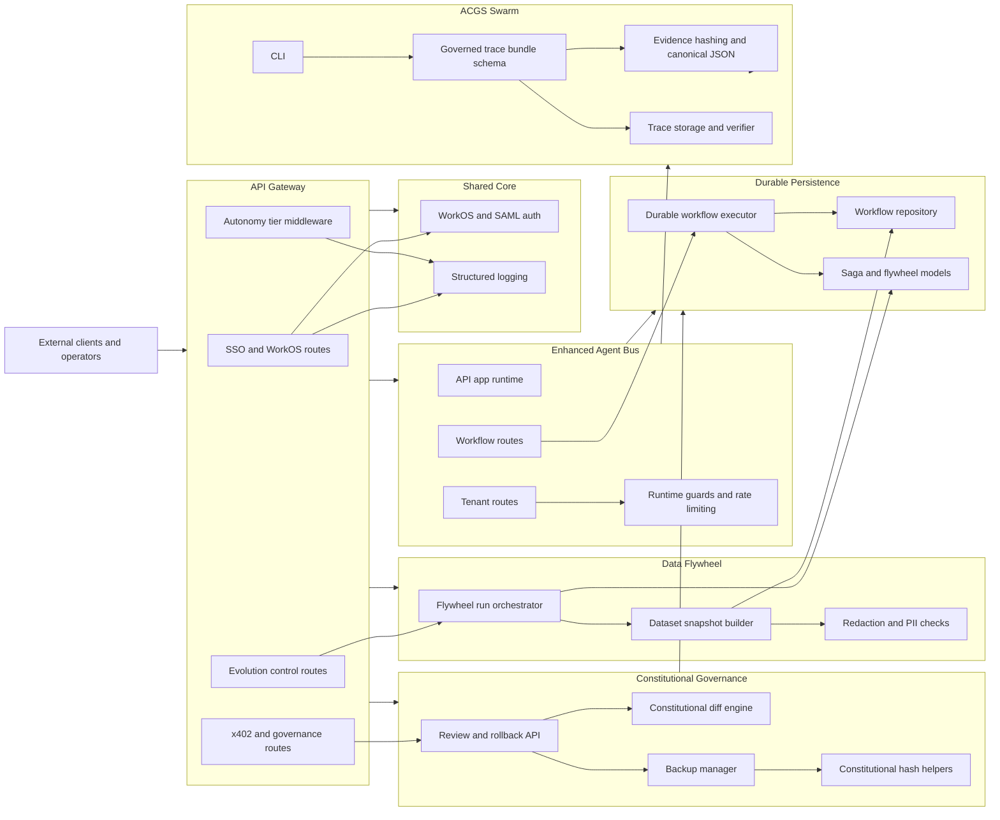

# Architecture

> **Scope:** Architecture notes for the ACGS subproject, generated from the GitNexus knowledge graph. Originally lived at the workspace-root parent as `ARCHITECTURE.md`; moved into the ACGS subproject lane on 2026-05-15 (untracked in the active branch — commit decision belongs to the next ACGS PR cycle).

This document was generated from the GitNexus knowledge graph for the indexed `ACGS` repository. The graph snapshot reports 3,334 files, 148,670 nodes, 287,572 edges, 2,542 functional communities, and 300 detected execution flows.

## Overview

ACGS is organized around a governance platform with API entry points, durable agent/workflow execution, constitutional governance controls, dataset flywheel support, and governed trace/evidence packaging.

The graph shows these major architectural surfaces:

- `src/core/services/api_gateway`: external-facing API routes and middleware for SSO, WorkOS administration, operator control, evolution control, and governance endpoints.
- `src/core/shared`: shared authentication, SAML/WorkOS support, structured logging, and cross-service utilities.
- `packages/enhanced_agent_bus/api`: application runtime, route handlers, workflow APIs, runtime guards, and rate limiting.
- `packages/enhanced_agent_bus/persistence`: durable workflow execution, workflow repository access, event recording, compensation, retries, and dataset snapshot persistence.
- `packages/enhanced_agent_bus/constitutional`: constitutional review APIs, rollback, diffing, backup management, activation sagas, and constitutional hash checks.
- `packages/enhanced_agent_bus/data_flywheel`: dataset build orchestration, snapshot construction, redaction, PII checks, and flywheel run state transitions.
- `packages/enhanced_agent_bus/saga_persistence`: persisted saga/flywheel models used by workflow and dataset processes.
- `packages/acgs-swarm/src/acgs_swarm`: governed trace bundles, evidence hashing, privacy-safe trace storage, verification, and CLI packaging.
- `tests` and package-local test suites: the largest graph communities are test clusters, reflecting broad coverage around the platform surfaces above.

## Functional Areas

### API Gateway

The API gateway exposes routes that start cross-community flows. Graph processes include WorkOS webhook ingestion, WorkOS portal links, SAML handler construction, operator-control status, dataset build requests, and x402 governance certification.

Key files surfaced by the graph include:

- `src/core/services/api_gateway/routes/sso/workos.py`
- `src/core/services/api_gateway/routes/admin_workos.py`
- `src/core/services/api_gateway/routes/evolution_control.py`
- `src/core/services/api_gateway/routes/x402_governance.py`
- `src/core/services/api_gateway/middleware/autonomy_tier.py`
- `src/core/services/api_gateway/workos_event_ingestion.py`

### Shared Auth And Logging

Shared modules provide authentication configuration and observability for API and governance flows. WorkOS and SAML utilities are reused by API routes, while structured logging is a common terminal dependency for gateway processes.

Key files surfaced by the graph include:

- `src/core/shared/auth/workos.py`
- `src/core/shared/auth/saml_config.py`
- `src/core/shared/structured_logging.py`

### Enhanced Agent Bus API

The enhanced agent bus exposes operational APIs for workflows, signup, batch validation, tenants, messages, runtime guards, and rate limiting. Its routes delegate into persistence, workflow execution, tenant models, security compatibility helpers, and Redis-backed rate limiting.

Key files surfaced by the graph include:

- `packages/enhanced_agent_bus/api/app.py`
- `packages/enhanced_agent_bus/api/routes/workflows.py`
- `packages/enhanced_agent_bus/api/routes/signup.py`
- `packages/enhanced_agent_bus/api/routes/batch.py`
- `packages/enhanced_agent_bus/api/runtime_guards.py`
- `packages/enhanced_agent_bus/api/rate_limiting.py`
- `packages/enhanced_agent_bus/routes/tenants/__init__.py`
- `packages/enhanced_agent_bus/routes/models/tenant_models.py`
- `packages/enhanced_agent_bus/_compat/security/error_sanitizer.py`

### Durable Workflow Persistence

Workflow execution is centered on durable persistence and event recording. The graph traces workflow retries through resume, execution, failure finalization, compensations, and event recording.

Key files surfaced by the graph include:

- `packages/enhanced_agent_bus/persistence/executor.py`
- `packages/enhanced_agent_bus/persistence/repository.py`
- `packages/enhanced_agent_bus/saga_persistence/models.py`

### Constitutional Governance

Constitutional governance manages review, rollback, diff computation, backup integrity, activation sagas, and hash validation. Rollback and backup processes are prominent detected flows, and compatibility helpers centralize JSON and active constitutional hash checks.

Key files surfaced by the graph include:

- `packages/enhanced_agent_bus/constitutional/review_api.py`
- `packages/enhanced_agent_bus/constitutional/diff_engine.py`
- `packages/enhanced_agent_bus/constitutional/backup_manager.py`
- `packages/enhanced_agent_bus/constitutional/activation_saga.py`
- `packages/enhanced_agent_bus/_compat/json_utils.py`
- `packages/enhanced_agent_bus/_compat/constitutional_hash.py`

### Data Flywheel

The data flywheel builds privacy-safe dataset snapshots from governance/runtime state. API-triggered dataset builds flow into a run orchestrator, snapshot builder, persistence repository, redaction utilities, PII detection, and dataset isolation checks.

Key files surfaced by the graph include:

- `packages/enhanced_agent_bus/data_flywheel/run_orchestrator.py`
- `packages/enhanced_agent_bus/data_flywheel/dataset_builder.py`
- `packages/enhanced_agent_bus/data_flywheel/redaction.py`
- `packages/enhanced_agent_bus/persistence/repository.py`
- `packages/enhanced_agent_bus/saga_persistence/models.py`

### Governed Swarm Traces And Evidence

The `acgs-swarm` package builds privacy-safe trace bundles and evidence artifacts. The graph traces governed bundle creation through audit conversion, payload summarization, payload hashing, and canonical JSON serialization.

Key files surfaced by the graph include:

- `packages/acgs-swarm/src/acgs_swarm/traces/schema.py`
- `packages/acgs-swarm/src/acgs_swarm/traces/storage.py`
- `packages/acgs-swarm/src/acgs_swarm/traces/verifier.py`
- `packages/acgs-swarm/src/acgs_swarm/evidence.py`
- `packages/acgs-swarm/src/acgs_swarm/cli.py`

## Architecture Diagram

## Key Execution Flows

The graph detected 300 execution flows. The following are representative high-importance cross-community flows selected from the top graph process list and traced step-by-step.

### WorkOS Webhook Event Ingestion

Process: `Workos_webhook_events -> _log`

This flow accepts external WorkOS webhook events, reserves event IDs through ingestion infrastructure, uses Redis client access, and logs the result through shared structured logging.

| Step | Symbol | File |
| --- | --- | --- |
| 1 | `workos_webhook_events` | `src/core/services/api_gateway/routes/sso/workos.py` |
| 2 | `ingest_event` | `src/core/services/api_gateway/workos_event_ingestion.py` |
| 3 | `_reserve_event_id` | `src/core/services/api_gateway/workos_event_ingestion.py` |
| 4 | `_get_redis_client` | `src/core/services/api_gateway/workos_event_ingestion.py` |
| 5 | `info` | `src/core/shared/structured_logging.py` |
| 6 | `_log` | `src/core/shared/structured_logging.py` |

### Workflow Retry And Compensation

Process: `Retry_workflow -> _record_event`

This flow starts at the workflow API, resumes a persisted workflow, executes it, finalizes failed workflows, runs compensations, and records durable workflow events.

| Step | Symbol | File |
| --- | --- | --- |
| 1 | `retry_workflow` | `packages/enhanced_agent_bus/api/routes/workflows.py` |
| 2 | `resume_workflow` | `packages/enhanced_agent_bus/persistence/executor.py` |
| 3 | `execute_workflow` | `packages/enhanced_agent_bus/persistence/executor.py` |
| 4 | `_finalize_workflow_failed` | `packages/enhanced_agent_bus/persistence/executor.py` |
| 5 | `_run_compensations` | `packages/enhanced_agent_bus/persistence/executor.py` |
| 6 | `_record_event` | `packages/enhanced_agent_bus/persistence/executor.py` |

### Dataset Build And Redaction

Process: `Request_dataset_build -> _is_sensitive_key`

This flow is initiated by the API gateway evolution-control route. It runs the flywheel dataset build step, builds a dataset snapshot, redacts exported records, and checks sensitive keys before export.

| Step | Symbol | File |
| --- | --- | --- |
| 1 | `request_dataset_build` | `src/core/services/api_gateway/routes/evolution_control.py` |
| 2 | `run_dataset_build_step` | `packages/enhanced_agent_bus/data_flywheel/run_orchestrator.py` |
| 3 | `build_snapshot` | `packages/enhanced_agent_bus/data_flywheel/dataset_builder.py` |
| 4 | `_build_records` | `packages/enhanced_agent_bus/data_flywheel/dataset_builder.py` |
| 5 | `redact_for_dataset_export` | `packages/enhanced_agent_bus/data_flywheel/redaction.py` |
| 6 | `_is_sensitive_key` | `packages/enhanced_agent_bus/data_flywheel/redaction.py` |

### Constitutional Rollback Diffing

Process: `Rollback_to_version -> Dumps`

This flow rolls back a constitutional version, computes a diff against the target state, analyzes principle changes, serializes principle data, and emits canonical JSON output through compatibility utilities.

| Step | Symbol | File |
| --- | --- | --- |
| 1 | `rollback_to_version` | `packages/enhanced_agent_bus/constitutional/review_api.py` |
| 2 | `compute_diff` | `packages/enhanced_agent_bus/constitutional/diff_engine.py` |
| 3 | `_analyze_principle_changes` | `packages/enhanced_agent_bus/constitutional/diff_engine.py` |
| 4 | `_analyze_dict_principles` | `packages/enhanced_agent_bus/constitutional/diff_engine.py` |
| 5 | `_stringify_principle` | `packages/enhanced_agent_bus/constitutional/diff_engine.py` |
| 6 | `dumps` | `packages/enhanced_agent_bus/_compat/json_utils.py` |

### Governed Trace Bundle Creation

Process: `Build_governed_trace_bundle -> Canonical_json`

This flow builds governed trace bundles for swarm activity. It converts audit data into trace events, summarizes payloads, hashes payload content, and serializes evidence with canonical JSON.

| Step | Symbol | File |
| --- | --- | --- |
| 1 | `build_governed_trace_bundle` | `packages/acgs-swarm/src/acgs_swarm/traces/schema.py` |
| 2 | `_trace_event_from_audit` | `packages/acgs-swarm/src/acgs_swarm/traces/schema.py` |
| 3 | `_summarize_payload` | `packages/acgs-swarm/src/acgs_swarm/traces/schema.py` |
| 4 | `_summarize_known_mapping` | `packages/acgs-swarm/src/acgs_swarm/traces/schema.py` |
| 5 | `hash_payload` | `packages/acgs-swarm/src/acgs_swarm/traces/schema.py` |
| 6 | `canonical_json` | `packages/acgs-swarm/src/acgs_swarm/evidence.py` |

## Cross-Cutting Patterns

- API routes are thin entry points that delegate to shared services, package-level orchestration, or persistence executors.
- Shared authentication and logging are common dependencies for gateway flows.
- Durable workflow behavior is concentrated in `packages/enhanced_agent_bus/persistence/executor.py`, which centralizes retry, compensation, failure finalization, and event recording.
- Constitutional operations keep diffing, backup, rollback, hash checks, and JSON serialization in separate modules.
- Dataset export paths explicitly include redaction and sensitive-key checks before dataset snapshots are persisted or exported.
- Swarm evidence paths use canonical JSON and content hashing to make governed traces reproducible and verifiable.

## Graph Notes

- The largest raw communities in the graph are test communities, so the functional area summary emphasizes production modules and uses tests as supporting coverage evidence rather than as primary architecture.
- GitNexus process traces are function-level call chains. They show representative graph-discovered paths, not every possible runtime path.
- Several graph module labels are broad or test-biased because symbols are inferred from static analysis. File paths are the most reliable source of architectural boundaries in this snapshot.
