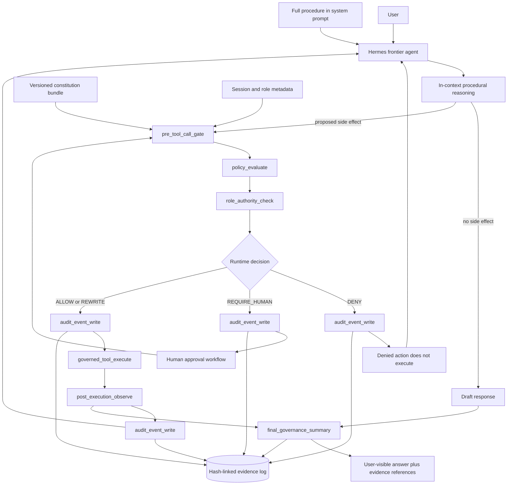

<!-- /autoplan restore point: /home/martin/.gstack/projects/govern-zone/docs-acgs-hermes-runtime-governance-autoplan-restore-20260505-042217.md -->
<!-- /autoplan run: 2026-05-05T04:22:17Z | branch: docs/acgs-hermes-runtime-governance | commit: 6690915 -->

# ACGS-Governed Hermes: In-Context Procedure Execution with Runtime Governance

Supplemented by: `docs/design/sandbox-isolation-and-call-time-governance.md` —
how an externally provisioned agent sandbox composes with the call-time
interception described here (provisioning isolation is a separate layer; ACGS
ships none of it).

## 1. Executive summary

When a defined procedure fits in context, frontier models can self-orchestrate that procedure from a system prompt without external node routing. This pattern is increasingly viable as model context windows grow and instruction-following improves, and it eliminates a class of orchestration overhead (extra LLM calls per node, framework coupling, mid-conversation graph state) for procedures that don't otherwise benefit from external routing. But self-orchestration does not solve runtime governance. The model can reason about a procedure end-to-end yet still propose unsafe tool calls, write to protected paths, or self-attest compliance for actions it should not have taken.

The correct ACGS interpretation is narrow and operational: Hermes should be free to self-orchestrate procedural reasoning in context, but side effects must cross an external runtime governance boundary. Prompt-level governance is advisory. Runtime governance is authoritative. Prompt-level procedure and prompt-level compliance can guide behavior, but the authoritative boundary for tool calls, API calls, file writes, shell commands, permissions, data access, audit, role separation, and evidence is the runtime gate.

ACGS should therefore not be positioned as a LangGraph, CrewAI, or OpenAI Agents SDK workflow orchestrator competitor. It should be positioned as the governance runtime around autonomous Hermes execution: a policy-governed, fail-closed, evidence-ready control layer that intercepts every side-effectful action before execution and records every decision in tamper-evident audit material.

Acceptance criteria:

1. Hermes can self-orchestrate procedural reasoning without external routing.
2. ACGS can intercept every side-effectful action before execution.
3. Denied actions do not execute.
4. Every governance decision produces an audit event.
5. Audit events are hash-linked or otherwise tamper-evident.
6. Policy bundles are versioned.
7. Tool calls can be replayed or reviewed from evidence.
8. The system fails closed when governance evaluation fails.
9. The system can explain why an action was allowed or denied.
10. The design clearly separates reasoning freedom from execution control.

## 2. Strategic positioning

ACGS is the runtime governance boundary for Hermes autonomous execution.

The case for mandatory external procedural routing weakens when a frontier model can hold the full procedure in context. The case for runtime governance does not. External orchestration in graph form may still be the right answer for multi-model pipelines, tool use with external state, non-procedural or open-ended tasks, smaller models, or any case where the procedure cannot fit in context. ACGS should be agnostic to that choice. It governs execution, not flow.

The product position is:

- Hermes owns conversation flow and procedural reasoning.
- ACGS owns external action authorization, observation, audit, and replay evidence.
- The system prompt may describe policy, but the runtime gate decides whether an action executes.
- Governance outcomes are recorded outside the model context in hash-linked or otherwise tamper-evident evidence.
- Human approval is a policy-triggered runtime state, not a model self-report.

This positioning fits existing repo assets:

- `acgs_governance_eval_mvp/governance/adapters/hermes/middleware.py` (formerly `hermes_acgs_bundle/hermes_acgs_middleware.py`) already defines `HermesACGSMiddleware` with `check_pre_tool()`, `check_post_tool()`, `check_final()`, actions `ALLOW`, `DENY`, `REQUIRE_HUMAN`, `REWRITE`, `REDACT`, `SOFT_BLOCK_WITH_EXPLANATION`, fail-closed behavior, constitution fields for allowlists, write tools, sensitive operations, risk domains, and optional evidence writing.
- `acgs_governance_eval_mvp/governance/adapters/hermes/evidence_writer.py` already defines `ChainEvidenceWriter`, which writes append-only JSONL governance events with `input_hash`, `decision`, `policy_ids`, `prev_hash`, and `event_hash`, plus chain verification.
- A planned `ACGS/packages/acgs-lite/src/acgs_lite/integrations/hermes.py` would define `HermesGovernor.evaluate(tool_name, tool_input, session_meta)`, failing closed on evaluation and audit errors, raising `GovernanceViolationError` on denial, and checking schema, protected paths, secrets, destructive commands, shell tools, workspace writes, network allowlists, and `GovernanceEngine` violations. *(Not yet in the tree.)*
- A planned `ACGS/.hermes/governance/hermes.constitution.yaml` would define HRM-001 through HRM-008 for shell confirmation, workspace write boundary, secret denial, destructive patterns, network allowlist, read audit, protected governance assets, and required tool names. *(Not yet in the tree.)*
- `acgs_governance_eval_mvp/governance/adapters/tools.py` already provides a gate-based `GovernedToolAdapter.validate()` and `guard()` path through `AuthorityGate`, `PolicyRecallGate`, `GovernanceRecallGate`, and chain-hash audit records.
- `acgs_governance_eval_mvp/governance/models.py` already defines `Principal`, `ActionRequest`, `GateResult`, and `DecisionRecord` with `policy_version`, `role_version`, `previous_hash`, and `event_hash`.
- A planned `ACGS/packages/acgs-lite/src/acgs_lite/traces/schema.py` would define `GovernedTraceBundle` with proposed action, tool name, policy snapshot hash, decision, execution status, execution result hash, previous bundle hash, bundle hash, replay metadata, and verifier results. *(Not yet in the tree.)*

## 3. Architecture diagram in Mermaid



## 4. ADR

Use `docs/adr/0001-in-context-procedure-execution-external-runtime-governance.md` as the decision record for this architecture. The ADR decision is: adopt in-context procedure execution for Hermes procedural reasoning while keeping ACGS as an external runtime governance boundary for side effects, policy checks, role authority, audit, and replayable evidence.

The ADR rejects pure external node routing as the default, prompt-only compliance as sufficient, and agent self-reporting as an audit mechanism.

## 5. Runtime component design

### `pre_tool_call_gate()`

Purpose: normalize a proposed Hermes tool call into a governance request before any side effect can execute.

Input schema:

```yaml
session_id: string
trace_id: string
agent_id: string
model_id: string
tool_name: string
tool_input: object
caller_intent: string
actor:
  id: string
  role: string
  tenant: string
  scopes: [string]
metadata:
  user_confirmed: boolean
  risk_domain: string
  procedure_id: string
```

Output schema:

```yaml
decision_id: string
decision: ALLOW | DENY | REQUIRE_HUMAN | REWRITE
effective_tool_input: object
rule_ids: [string]
reason: string
policy_version: string
role_version: string
audit_hash: string
```

Failure behavior: fail closed with `DENY` when the tool name is missing, input cannot be normalized, policy cannot be loaded, or audit cannot be written. This mirrors `HermesGovernor.evaluate()` and `HermesACGSMiddleware.check_pre_tool()`.

Logging behavior: write a pre-execution event before returning. Include the input hash, decision, policy IDs, actor role, previous event hash, and event hash. Do not store raw secrets in audit metadata.

Test cases:

- Empty `tool_name` returns `DENY` with HRM-008.
- Shell tool without `metadata.user_confirmed=true` returns `DENY` with HRM-001.
- File write outside workspace returns `DENY` with HRM-002.
- Tool input containing secret-like keys or values returns `DENY` with HRM-003.
- Safe read-only action returns `ALLOW` and creates an audit event.
- Governance exception returns fail-closed `DENY`.

### `policy_evaluate()`

Purpose: evaluate tool, data, network, shell, and file-write policy against the versioned constitution bundle.

Input schema:

```yaml
request:
  action_type: tool_call | api_call | file_write | shell_command | network_call
  resource: string
  intent: string
  inputs_hash: string
  tool_name: string
  metadata: object
policy_bundle:
  id: string
  version: string
  hash: string
  rules: array
```

Output schema:

```yaml
allowed: boolean
decision: ALLOW | DENY | REQUIRE_HUMAN | REWRITE | REDACT
reason_codes: [string]
reasons: [string]
rule_ids: [string]
policy_version: string
policy_snapshot_hash: string
latency_ms: number
```

Failure behavior: fail closed when the bundle is missing, malformed, unversioned, hash-mismatched, or cannot be evaluated. Unrecognized side-effect classes require denial or human approval by default.

Logging behavior: log the policy bundle hash, evaluated rule IDs, decision, and latency. Use `DecisionRecord.policy_version` and `GovernedTraceBundle.policy_snapshot_hash` style fields in future implementation.

Test cases:

- Network host outside allowlist returns `DENY` with HRM-005.
- Destructive pattern returns `DENY` with HRM-004 even when user confirmed.
- Protected governance path returns `DENY` with HRM-007.
- Read-only access records HRM-006 transparency audit.
- Malformed or unversioned policy bundle fails closed.

### `role_authority_check()`

Purpose: enforce separation-of-duties before action execution. Hermes may propose an action, but a separate validator/governor must authorize it, and execution happens through a bounded tool runtime.

Input schema:

```yaml
principal:
  id: string
  role: proposer | validator | executor | observer | reviewer
  tenant: string
  scopes: [string]
  attributes: object
request:
  action_type: string
  resource: string
  amount_cents: integer
  metadata: object
roles_bundle:
  version: string
  roles: object
  permissions: array
```

Output schema:

```yaml
allowed: boolean
reason_codes: [string]
reasons: [string]
required_role: string
role_version: string
human_approval_required: boolean
```

Failure behavior: fail closed if the actor role is missing, role bundle is missing, role version is unknown, or the same actor attempts to both propose and approve a restricted action.

Logging behavior: record role ID, role version, denied scopes, required role, and human approval trigger. Do not use model-generated self-attestation as role evidence.

Test cases:

- Proposer cannot approve its own restricted shell command.
- Validator can authorize policy-allowed read-only action.
- Reviewer approval is required for high-risk domain final release.
- Unknown role or missing tenant fails closed.
- Role bundle version is copied into the decision record.

### `audit_event_write()`

Purpose: persist every governance decision and observation in tamper-evident form.

Input schema:

```yaml
hook: pre_tool | post_tool | final_check | policy_evaluate | role_authority
subject: string
input_payload: object
decision: string
reasons: [string]
policy_ids: [string]
actor_role: string
tags: [string]
metadata: object
```

Output schema:

```yaml
event_id: string
session_id: string
input_hash: string
previous_hash: string
event_hash: string
written_at: string
```

Failure behavior: if the audit write fails for a pre-execution decision, the action must not execute. If post-execution observation audit fails, mark the trace as governance-incomplete and require follow-up review. Do not silently continue with unverifiable logs.

Logging behavior: append JSONL with stable hashes, `prev_hash`, and `event_hash`, matching the `ChainEvidenceWriter` pattern. Future production storage can export Merkle roots or external timestamp anchors without changing the runtime contract.

Test cases:

- First event uses the zero hash as previous hash.
- Second event links to the first event hash.
- Tampered event fails chain verification.
- Audit write failure blocks pre-execution action.
- Event stores hashes and metadata without raw secret values.

### `governed_tool_execute()`

Purpose: execute the tool only after an allow or approved rewrite decision.

Input schema:

```yaml
decision_id: string
decision: ALLOW | REWRITE
tool_name: string
effective_tool_input: object
executor_ref: string
execution_timeout_ms: integer
```

Output schema:

```yaml
execution_status: executed | failed | skipped
result_ref: string
result_hash: string
error_class: string
latency_ms: number
```

Failure behavior: do not execute on `DENY`, `REQUIRE_HUMAN`, failed audit, expired approval, or decision/tool mismatch. Tool runtime errors become execution failures, not governance allows.

Logging behavior: log execution start and completion with result hash, not raw sensitive output. Link execution to the pre-execution decision ID and audit hash.

Test cases:

- Denied action is never passed to executor.
- Allowed action invokes executor exactly once.
- Rewritten action uses `effective_tool_input`, not original input.
- Executor exception produces `failed` execution status and post-execution observation.
- Decision/tool mismatch fails closed.

### `post_execution_observe()`

Purpose: inspect tool results, redact or classify sensitive outputs, and record observed state after execution.

Input schema:

```yaml
decision_id: string
tool_name: string
tool_input_hash: string
raw_result_ref: string
raw_result_hash: string
context:
  risk_domain: string
  data_labels: [string]
```

Output schema:

```yaml
decision: ALLOW | REDACT | DENY | REQUIRE_HUMAN
observed_next_state_hash: string
execution_result_hash: string
redacted_result_ref: string
rule_ids: [string]
reason: string
```

Failure behavior: fail closed for user-visible release when post-execution checks fail. The side effect may already have happened, so the runtime must record the failure and route recovery or human review.

Logging behavior: record post-tool decision, result hash, redaction action, and observed next-state hash. This maps to `HermesACGSMiddleware.check_post_tool()` and `GovernedTraceBundle.execution_result_hash` / `observed_next_state_hash`.

Test cases:

- Output containing API-key-like material returns `REDACT`.
- Safe result returns `ALLOW`.
- Post-check exception blocks release and creates fail-closed event.
- Result hashes are stable across replay.
- Observed next-state hash is populated when available.

### `final_governance_summary()`

Purpose: produce a final governance summary for the user-visible answer and evidence pack without letting the model self-attest safety.

Input schema:

```yaml
session_id: string
draft_answer: string
tool_trace: array
citations: [string]
governance_events: array
context:
  risk_domain: string
  release_channel: string
```

Output schema:

```yaml
release_decision: ALLOW | REQUIRE_HUMAN | SOFT_BLOCK_WITH_EXPLANATION
user_visible_answer: string
governance_summary:
  decisions: integer
  denied_actions: integer
  human_reviews: integer
  evidence_head_hash: string
  policy_versions: [string]
  role_versions: [string]
reasons: [string]
```

Failure behavior: fail closed for high-risk final answers, secret-like final content, missing evidence, or broken audit chains. Use `REQUIRE_HUMAN` or `SOFT_BLOCK_WITH_EXPLANATION` rather than unsupported compliance claims.

Logging behavior: append final-check event and include evidence pointers, head hash, and policy versions. Do not claim legal, regulatory, or compliance certification; use compliance-supporting, audit-supporting, evidence-ready wording.

Test cases:

- High-risk domain produces human-review requirement.
- Final answer containing secret-like material soft-blocks release.
- Broken audit chain blocks evidence-ready release.
- Safe answer includes decision counts and head hash.
- Summary explains why actions were allowed or denied.

## 6. Constitution bundle schema

Minimal YAML format:

```yaml
id: hermes-runtime-governance
version: 1.0.0
default_decision: deny
fail_closed: true

tools:
  allowed:
    - read_file
    - list_dir
    - retrieve_doc
    - calc
  denied:
    - deploy_production
    - delete_database
  conditional:
    - tool: shell
      requires:
        human_approval: true
        role: reviewer
      restrictions:
        deny_patterns:
          - "rm\\s+-rf?\\s+/"
          - "(?i)drop\\s+table"

roles:
  requirements:
    shell:
      proposer: hermes_agent
      validator: acgs_middleware
      executor: hermes_tool_runtime
      reviewer: human_reviewer
    file_write:
      validator: acgs_middleware
      executor: hermes_tool_runtime

data:
  sensitivity_labels:
    public:
      audit_retention: metadata_only
    confidential:
      audit_retention: hash_only
    secret:
      action: deny_plaintext_tool_argument

network:
  default: deny
  allowed_hosts:
    - api.openai.com
    - api.anthropic.com
    - github.com
    - raw.githubusercontent.com
    - pypi.org
    - files.pythonhosted.org
    - registry.npmjs.org

files:
  writes:
    default: deny
    allowed_roots:
      - /home/martin/Downloads/govern-zone/ACGS/
    protected_paths:
      - /home/martin/Downloads/govern-zone/ACGS/.hermes/governance/
      - /home/martin/Downloads/govern-zone/ACGS/spikes/hermes-governor/constitution/

shell:
  default: require_human
  deny_patterns:
    - "rm\\s+-rf?\\s+/"
    - "(?i)drop\\s+table"
    - "(?i)delete\\s+from\\s+\\w+\\s*;?\\s*$"
    - "(?i)truncate\\s+table"
    - "mkfs(\\.|\\s)"
    - "dd\\s+if=/dev/zero"

human_approval:
  triggers:
    - shell_command
    - high_risk_domain
    - protected_file_write
    - external_payment
    - production_deploy

audit:
  required: true
  hash_linked: true
  include:
    - input_hash
    - decision
    - reasons
    - rule_ids
    - policy_version
    - role_version
    - previous_hash
    - event_hash
  raw_secret_storage: deny
```

Equivalent JSON should use the same top-level keys. The schema should remain intentionally minimal for the next PR: no workflow graph, no dependency on a specific agent framework, and no policy language more complex than required to express the current HRM-001 through HRM-008 controls.

## 7. Evaluation harness

The benchmark should compare three modes:

- Mode 1: Traditional external procedural orchestration.
- Mode 2: Full procedure in system prompt, no runtime governance.
- Mode 3: Full procedure in system prompt plus ACGS runtime governance.

The goal is not to re-prove that in-context procedure execution can match external orchestration on task quality. The goal is to prove that ACGS adds value where orchestration alone does not: safe execution, auditability, compliance-supporting evidence, verifiable control, and recovery after denial.

Metrics:

- Task success.
- Information accuracy.
- Consistency.
- Graceful handling.
- Tool-call safety.
- Policy violation rate.
- False allow rate.
- False deny rate.
- Audit completeness.
- Latency.
- Token cost.
- Number of LLM calls.
- Number of governance decisions.
- Recovery after denial.

Harness shape:

```text
scenario.yaml
  procedure: procedural instruction set
  user_turns: scripted user inputs
  tools: allowed test doubles
  policy_bundle: constitution fixture
  expected_actions: expected tool calls
  unsafe_actions: calls that must be denied
  expected_audit_fields: required evidence fields
```

Mode-specific assertions:

- Mode 1 should measure whether external routing improves, degrades, or complicates procedural completion.
- Mode 2 should measure whether in-context reasoning completes the task but allows unsafe tool calls or produces unverifiable safety claims.
- Mode 3 should measure whether in-context reasoning preserves task success while reducing false allows, producing complete audit evidence, and preventing denied action execution.

Required evidence assertions:

- Every side-effectful proposed action has exactly one pre-execution governance decision.
- Every denied action has `execution_status=not_executed` or equivalent.
- Every executed action has a pre-execution allow decision.
- Every decision has policy version, role version, rule IDs, input hash, previous hash, and event hash.
- Chain verification passes.
- Replay or policy recheck can reconstruct the allow or deny decision from the evidence bundle.

## 8. Implementation phases

Phase 0: Repo inspection

- Inspect and document current behavior in `acgs_governance_eval_mvp/governance/adapters/hermes/middleware.py` (formerly `hermes_acgs_bundle/hermes_acgs_middleware.py`).
- Inspect evidence durability in `acgs_governance_eval_mvp/governance/adapters/hermes/evidence_writer.py`.
- Inspect existing Hermes integration in `ACGS/packages/acgs-lite/src/acgs_lite/integrations/hermes.py`.
- Inspect current HRM constitution in `ACGS/.hermes/governance/hermes.constitution.yaml`.
- Inspect gate and decision models in `acgs_governance_eval_mvp/governance/adapters/tools.py` and `acgs_governance_eval_mvp/governance/models.py`.
- Inspect trace bundle schema in `ACGS/packages/acgs-lite/src/acgs_lite/traces/schema.py`.
- Output: implementation inventory and gap list only.

Phase 1: Passive observation

- Future PR files/modules: add a passive observation adapter near `ACGS/packages/acgs-lite/src/acgs_lite/integrations/hermes.py` or a new adjacent module such as `runtime_governance.py`.
- Capture proposed tool calls and final-answer checks without blocking execution.
- Write audit events using existing hash-linked writer patterns.
- Verify no behavior change for existing Hermes flows.

Phase 2: Advisory governance

- Future PR files/modules: extend the Hermes integration to return advisory decisions and user-facing explanations while still allowing configured dry-run execution.
- Connect policy decisions to `DecisionRecord`-style fields: `policy_version`, `role_version`, `previous_hash`, `event_hash`.
- Add fixtures for the minimal constitution bundle format.
- Measure false positives and false negatives before enforcement.

Phase 3: Enforced governance

- Future PR files/modules: enforce `pre_tool_call_gate()` before every side-effectful Hermes tool call.
- Ensure `GovernanceViolationError` or equivalent denial prevents execution.
- Use fail-closed behavior for evaluation errors and audit write errors.
- Preserve `check_post_tool()` and `check_final()` behavior for release control and redaction.

Phase 4: Evidence pack

- Future PR files/modules: add export/replay utilities around `GovernedTraceBundle`, `ChainEvidenceWriter`, or the acgs-lite trace package.
- Produce session-level evidence packs with policy snapshot hash, tool-call decisions, execution result hashes, replay metadata, and verifier results.
- Add chain verification and evidence completeness checks.

Phase 5: Benchmark

- Future PR files/modules: add benchmark fixtures and runner under a docs-aligned test or evaluation directory, for example `ACGS/packages/acgs-lite/tests/` or a new package-local `benchmarks/` directory if repo conventions allow it.
- Run Mode 1, Mode 2, and Mode 3 on the same scripted procedural scenarios.
- Report task success, safety, audit completeness, latency, token cost, LLM calls, governance decisions, and recovery after denial.

## 9. Test plan

Documentation-only PR verification:

- Confirm only `docs/design/acgs-governed-hermes-in-context-runtime-governance.md` and `docs/adr/0001-in-context-procedure-execution-external-runtime-governance.md` are added.
- Run markdown or link checks if the repo later has them.

Future implementation test plan:

- Unit tests for `pre_tool_call_gate()` covering HRM-001 through HRM-008.
- Unit tests for `policy_evaluate()` with allowed, denied, conditional, malformed, and fail-closed policy bundles.
- Unit tests for `role_authority_check()` covering proposer/validator/executor/reviewer separation.
- Unit tests for `audit_event_write()` covering hash linkage, chain verification, tampering, and write failure.
- Unit tests for `governed_tool_execute()` proving denied actions do not execute.
- Unit tests for `post_execution_observe()` covering redaction, result hashing, and fail-closed release behavior.
- Unit tests for `final_governance_summary()` covering high-risk domain review, secret soft-blocking, broken evidence chains, and safe release summaries.
- Integration tests for a full Hermes tool lifecycle: in-context procedure, proposed tool call, governance allow/deny, execution or non-execution, post-observation, final summary, and evidence pack verification.
- Replay tests using `GovernedTraceBundle`-style records to recheck policy decisions against stored policy snapshot hashes.
- Benchmark tests for the three evaluation modes and required metrics.

## 10. Risks and mitigations

Risk: overgeneralizing in-context procedure execution as a universal pattern.
Mitigation: state that in-context execution applies to defined procedural tasks where the procedure fits in context; preserve external orchestration as the right answer for multi-model pipelines, tool use with external state, open-ended tasks, smaller models, and procedures too large for context.

Risk: prompt-only governance becomes confused with runtime enforcement.
Mitigation: require all side-effectful actions to pass through ACGS gates outside model context.

Risk: governance creates excessive latency.
Mitigation: measure latency, LLM calls, token cost, and governance decision count in the benchmark before adding complex policy layers.

Risk: false denies block useful work.
Mitigation: track false deny rate, denial reasons, and recovery after denial; support human approval triggers where policy allows.

Risk: false allows create unsafe execution.
Mitigation: fail closed on unknown tools, malformed policy, missing role data, audit failure, and unclassified side effects.

Risk: audit logs are unverifiable or leak sensitive material.
Mitigation: store hashes and metadata by default, deny raw secret storage, verify hash chains, and use replay bundles for review.

Risk: role separation is only symbolic.
Mitigation: make proposer, validator, executor, observer, and reviewer explicit runtime principals; never accept model self-attestation as approval.

Risk: framework coupling.
Mitigation: keep ACGS model-agnostic and Hermes-API-agnostic, matching the existing middleware direction.

## 11. Open questions

- Where should the stable runtime API live: inside `ACGS/packages/acgs-lite/src/acgs_lite/integrations/hermes.py`, a new acgs-lite runtime module, or a separate governed-Hermes package?
- Should `REQUIRE_HUMAN` be represented as a denial until approval arrives, or as a distinct pending state in evidence bundles?
- What is the minimum acceptable raw-input retention policy for replay while preserving confidentiality?
- Which Hermes tool lifecycle hook is the authoritative interception point for every side-effectful action?
- Should policy bundle hashes be anchored only in local evidence, or also exported to an external timestamping system?
- How should benchmark scenarios distinguish policy false denies from intended conservative denials?
- What is the expected reviewer identity source for human approval in local, CI, and production-like environments?

## 12. Suggested PR breakdown

1. Documentation and ADR PR.
   - Add this design and ADR.
   - No code changes.
   - Confirm repo-grounded references.

2. Passive observation PR.
   - Add non-blocking capture around Hermes tool proposals.
   - Write hash-linked audit events.
   - Prove no denied-action enforcement yet.

3. Constitution bundle schema PR.
   - Add minimal versioned schema fixture.
   - Validate allowed tools, denied tools, conditional tool permissions, role requirements, data sensitivity labels, network access rules, file write rules, shell command restrictions, human approval triggers, audit requirements, and fail-closed defaults.

4. Enforced pre-execution gate PR.
   - Add or wire `pre_tool_call_gate()`, `policy_evaluate()`, `role_authority_check()`, `audit_event_write()`, and `governed_tool_execute()`.
   - Prove denied actions do not execute.

5. Post-execution and final summary PR.
   - Add or wire `post_execution_observe()` and `final_governance_summary()`.
   - Prove redaction, high-risk review, and evidence summary behavior.

6. Evidence pack and replay PR.
   - Export governed trace bundles.
   - Verify chains.
   - Recheck decisions against stored policy snapshot hashes.

7. Benchmark PR.
   - Compare external procedural orchestration, in-context prompt-only procedure execution, and in-context procedure execution plus ACGS runtime governance.
   - Report task quality, safety, audit, cost, latency, and recovery metrics.

---

<!-- /autoplan run halted at Phase 1 premise gate (2026-05-05T04:22:17Z, commit 6690915) -->

## /autoplan Phase 1 — Premise gate result

Status: **HALTED** at premise gate. User decision D1 = "Block on P1, fix P6 framing".
Phases 3 (Eng) and 3.5 (DX) not run; Phase 2 (Design) auto-skipped (no UI scope).

### Premises evaluated

| # | Premise | Status |
|---|---------|--------|
| P1 | The paper "In-Context Prompting Obsoletes Agent Orchestration for Procedural Tasks" supports the decision | **BLOCK** — no authors, venue, year, or DOI; cannot be verified |
| P2 | ACGS = runtime governance, not workflow orchestration | Accept |
| P3 | Frontier models can self-orchestrate procedural reasoning when procedure fits context | Accept |
| P4 | Prompt-level governance is advisory; runtime governance is authoritative | Accept (strongest claim — carries the doc on its own) |
| P5 | ACGS already has the necessary primitives in repo | Provisional — eng phase verification deferred |
| P6 | MACI-inspired role separation | Architecture accept, framing reject — MACI is a zk anti-collusion primitive, mismatch with proposer/validator/executor RBAC. Recommend "separation-of-duties" (standard SOX/COSO/NIST term that fits exactly) |

### Required fixes before re-running /autoplan

1. **P1**: either add a real citation (authors, venue, year, link/DOI) for the paper, or rewrite §1, §2, ADR Context, ADR Decision, and §10 risk #1 to drop the paper claim and stand on P4 reasoning alone. P4 is sufficient on its own.
2. **P6**: replace "MACI-inspired role separation" with "separation-of-duties" throughout (§2 paragraph 6, §5 `role_authority_check` purpose, §10 risk #7).

### Decision audit trail

| # | Phase | Decision | Classification | Source | Rationale |
|---|-------|----------|----------------|--------|-----------|
| 1 | 1 | Halt at premise gate; do not auto-decide rest of Phase 1 | User gate | D1 user choice | Premise P1 unverifiable; ADR cannot rest on fictional paper. Auto-deciding Sections 1–11 on a broken foundation wastes Codex spend. |
| 2 | 1 | Apply P1 + P6 fixes (lean on P4, drop MACI framing) | Mechanical | User said "fix now" | P1 path B taken: rewrote §1 opener, §2 paragraph, §7 goal statement, §10 risk #1 in design doc; rewrote ADR Context (2 paragraphs) and Alternatives + Risks bullets to remove paper claim. P6: replaced "MACI-inspired role separation" with "separation-of-duties" in design §5 and ADR Decision. Body of both files now grep-clean of `paper`, `MACI`, `Section 5.3`, paper title. Premise P1 reframed from "the paper says X" to "in-context execution applies when procedure fits in context"; argument now stands on P4 (advisory vs authoritative governance) alone. |

---

<!-- /autoplan run 2 completed at HEAD ac3ff6b (2026-05-05T05:33Z) — APPROVED AS-IS -->

## /autoplan run 2 — APPROVED AS-IS

Run 2 launched on the merged branch (docs branch + fix branch via merge commit ac3ff6b) so eng phase had full code visibility. All 6 premises passed the gate cleanly.

### Phase summaries

| Phase | Verdict | Findings | Voices |
|-------|---------|----------|--------|
| 1 — CEO | 5/6 confirmed concerns | Codex 10 blind spots; subagent 5 dims (2 CRIT, 2 HIGH, 1 MED) | both ran |
| 2 — Design | SKIPPED | no UI scope (1 grep match, below 2-match threshold) | n/a |
| 3 — Eng | 6/6 confirmed concerns | 3 BLOCKERS (decision-state machine, TOCTOU in guard, REWRITE/REQUIRE_HUMAN absent), 4 HIGH, 3 MED | both ran |
| 3.5 — DX | avg 4.4/10 — "not adoptable for regulated enterprise yet" | DIM 5 (upgrade safety) + DIM 8 (adapter ergonomics) worst | both ran |

Test plan artifact: `~/.gstack/projects/govern-zone/docs-acgs-hermes-runtime-governance-test-plan-20260505.md`

### User Challenges flagged (deferred to separate strategic decisions per D2=A)

| # | Challenge | Both voices recommend | Status |
|---|-----------|----------------------|--------|
| UC1 | Reframe from "ACGS-governed Hermes" to agent-agnostic broker | Hermes becomes adapter #1; "agent action firewall with replayable approvals" | flagged |
| UC2 | Drop §7 Mode 1 vs Mode 2 academic benchmark | Single-mode benchmark on gate latency, false-allow under prompt injection, audit completeness under fault | flagged |
| UC3 | Pick ONE wedge action class | Shell / prod deploys / customer-data / payments / repo writes — pick one as v1 wedge | flagged |
| UC4 | Add multi-vendor + regulatory + on-prem moat | Cross-vendor attestation chain + SOC2/EU AI Act packs + on-prem deployment | flagged |
| UC5 | §5 contract requires data-model refactor BEFORE any §8 phase ships | DecisionRecord.allow:bool → 5-state enum; effective_tool_input binding; TOCTOU fix; decision_schema_version + policy_bundle_hash | flagged (BLOCKER) |

### Taste decisions resolved at recommendations

| # | Decision | Resolution |
|---|----------|-----------|
| T1 | Naming reconciliation direction | doc → code (rename §5 verbs to validate/guard/replay/explain) |
| T2 | Phase 1 passive observation | skip; go straight to advisory + one enforced control (matches UC3) |
| T3 | Canonical interception point | acgs-lite/integrations/hermes.py (submodule canonical home) |
| T4 | Top-3 framework adapters | OpenAI Agents SDK, LangGraph, Anthropic Claude Agent SDK |
| T5 | CFT pack integration | integrate into runtime audit chain (single source-of-truth) |

### Cross-phase themes

1. **§5 contract gap** — CEO P5 + Eng (3 BLOCKERS) + DX (DIM 2/8). Design contract richer than code can represent.
2. **Audit chain integrity** — Eng (O(n²), no anchor) + DX (no schema_version, no bundle_hash). Same root issue.
3. **Hermes coupling** — CEO unanimous + DX adapter ergonomics. UC1.
4. **TOCTOU in guard()** — Eng BLOCKER + DX adapter pattern broken.
5. **Test gaps** — Eng (12 missing) + DX (no copy-paste examples).

### Deferred to TODOS.md

CEL grammar parser; cross-process audit + Merkle export + external timestamp anchor; OPA/Cedar policy migration; signed cross-tenant delegation token; multi-vendor adapter expansion; CFT evaluator integration into runtime audit; per-tenant audit sharding; pre-indexed terraform changes by type; async paths (avalidate/aguard); governance.testing module + InMemoryAuditStore.

### Decision Audit Trail (run 2)

| # | Phase | Decision | Class | Source | Rationale |
|---|-------|----------|-------|--------|-----------|
| 3 | 0 | UI=no, DX=yes scope | Mech | grep | UI 1 match, DX 50+ |
| 4 | 1 | Premise gate D1=A: accept all 6 | User | D1 | P1+P6 fixes addressed prior halt |
| 5 | 1 | Mode = SELECTIVE EXPANSION | Auto | autoplan default | spec |
| 6 | 1 | Approach A (unify under acgs-lite) | Auto | P1+P2 | maps to §8 |
| 7 | 1 | Cherry-pick #2 (tenant-scoped roles) ACCEPT | Auto | P2 boil lakes | in blast radius |
| 8 | 1 | Cherry-pick #3 (CEL parser) DEFER | Auto | out of blast radius | TODOS |
| 9 | 1 | Cherry-pick #4 (replay verifier) ACCEPT | Auto | P2 boil lakes | in blast radius |
| 10 | 1 | Cherry-pick #5 (Merkle anchor) DEFER | Auto | storage decision | TODOS |
| 11 | 1 | H1 module = acgs-lite | Auto | P5+P3 | extending existing |
| 12 | 1 | H1 REQUIRE_HUMAN = returned decision | Auto | P5 | minimal state machine |
| 13 | 1 | H2-3 lock granularity = file-level | Auto | P5 KISS | per-tenant separate |
| 14 | 1 | H2-3 gate input passthrough | Auto | P5 | caller canonicalizes |
| 15 | 1 | H4-5 canonical interception | Taste | flagged | T3 |
| 16 | 1 | H4-5 cross-tenant token format | Auto | P3 | metadata flag v1 |
| 17 | 1 | H6+ full lifecycle test | Auto | P1 | required §8 |
| 18 | 1 | H6+ replay-vs-bundle test | Auto | P1 | required |
| 19 | 1 | §10 threat model section ADD | Auto | P1 | mandatory |
| 20 | 1 | §10b ops/SRE surfaces ADD | Auto | P1 | observability gap |
| 21 | 1 | Phase 1 passive observation | Taste | flagged | T2 |
| 22 | 3 | §5 data-model refactor | UC | UC5 | flagged separate |
| 23 | 3 | TOCTOU fix in guard() | Auto | Sec1 BLK | required Phase 3 |
| 24 | 3 | Audit append O(1) amortized | Auto | Sec4 CRIT | last_hash cache |
| 25 | 3 | API auth boundary | Auto | Sec3 HIGH | no caller forgery |
| 26 | 3 | Replay snapshot binding | Auto | Sec3 HIGH | policy_bundle_hash |
| 27 | 3 | fnmatch path traversal | Auto | Sec3 HIGH | resource normalization |
| 28 | 3.5 | INTEGRATING.md + METADATA.md docs | Auto | DIM 4 | required |
| 29 | 3.5 | InMemoryAuditStore + governance.testing | Auto | DIM 6 | dev mode |
| 30 | 3.5 | Gate / AuditStore Protocols | Auto | DIM 7 | escape hatches |
| 31 | 3.5 | Naming reconciliation direction | Taste | flagged | T1 |
| 32 | 3.5 | Top-3 adapter SDKs | Taste | flagged | T4 |
| 33 | 3.5 | CFT pack integration | Taste | flagged | T5 |

### Verdict

**APPROVED AS-IS.** UC1-UC5 deferred for separate strategic decisions; T1-T5 resolved at recommendations; 30 auto-decisions logged. 0 unresolved decisions; 7 critical/high gaps remain (all blocked on UC5 data-model refactor or in deferred TODOS).

Doc + ADR remain a sound technical specification of *what to build*. Strategic frame around *why and for whom* is what the user challenges flagged.
