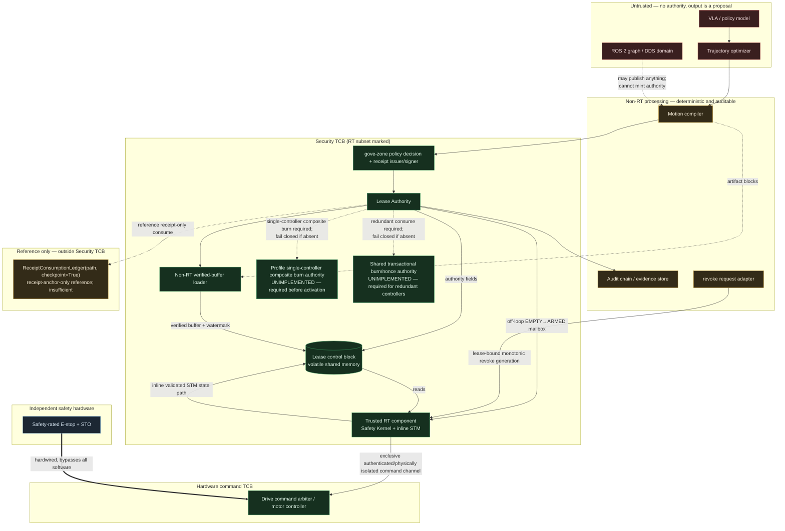

# RFC: ACGS Physical Execution Profile (VLA / Embodied Robotics)

**Status:** Draft — design only. No implementation exists.
**Scope:** An *execution profile* + adapter layer over the existing gove-zone kernel.
**Explicit non-goal:** modifying `gove_zone` core, or creating a second governance system.

---

## 0. Claim boundaries (read first)

- This design is **not** a functional-safety system and does not replace one.
  Cryptographic authority answers *"was this motion authorized?"*. It does not
  answer *"is this motion physically safe?"*. The latter requires a certified
  safety function (ISO 10218 / ISO 13849 / IEC 61508 category-rated hardware
  E-stop and safety-rated monitored stop) that this profile **sits beside, never
  replaces**.
- **A signature is not a safety case.** A valid Motion Authority Receipt means an
  authority decided the motion was permitted under a policy bundle. It carries no
  claim of collision-freeness, stability, or human safety.
- No claim of formal verification, certification, or completeness is made here.
  The safety contract (§4) is a *constraint filter*, not a proof.
- Nothing in this document is deployed, tested, or benchmarked. All timing
  figures are design budgets, not measurements.

---

## 1. Invariant

> **No valid Motion Authority Receipt, no actuator lease.
> No valid actuator lease, no torque.**

This is the physical restatement of the ACGS membrane: the side effect cannot
occur before authority is validated. In the digital kernel the side effect is a
tool call; here it is a current command to a motor.

The second clause matters more than the first. Receipt validation is expensive
and non-deterministic in latency. Torque enablement must be decidable in constant
time inside a hard-real-time loop. The **Servo Lease** (§5) is the object that
bridges those two worlds.

---

## 2. Authority separation

The governing constraint on this architecture is that **the servo loop is a hard
real-time context and ACGS is not**. Therefore:

**Forbidden inside the servo loop:** signature verification, hashing of
unbounded data, policy evaluation, network or IPC round-trips, dynamic
allocation, logging that can block, page faults on unlocked memory, and anything
whose worst-case execution time is not statically bounded.

### Time-domain decomposition

| Stage | Domain | Budget (design target) | May do crypto? |
|---|---|---|---|
| VLA inference | best-effort | 50–500 ms | n/a |
| Trajectory optimizer | best-effort | 5–100 ms | n/a |
| Motion compiler | best-effort, deterministic | 1–20 ms | yes (produces digests) |
| ACGS policy evaluation | best-effort | 1–10 ms | yes |
| Receipt issuance + validation | best-effort | 1–20 ms | yes (Ed25519) |
| Lease issuance | soft real-time | < 1 ms | yes, once |
| **Real-time safety kernel** | **hard real-time** | **≤ 100 µs @ 1 kHz** | **never** |
| Actuator / drive | hardware | — | never |

### Pipeline

```
VLA (proposer)
  └─> trajectory optimizer            (improves, does not authorize)
        └─> motion compiler           (canonicalizes → executable artifact + digests)
              └─> ACGS policy evaluation   (gove_zone Kernel — unmodified)
                    └─> Motion Authority Receipt   (DecisionReceipt, commit tier)
                          └─> Lease Authority      (validates receipt, consumes nonce)
                                └─> Servo Lease    (volatile, bounded, single-use)
                                      └─> RT Safety Kernel  (per-tick constraint filter)
                                            └─> drive command arbiter
                                                  └─> actuator
```

Each arrow is one-way. No downstream stage may re-enter an upstream one. In
particular **the optimizer runs before authorization and never after** — see
threat T-08.

---

## 3. Trust boundaries



### TCB enumeration (security TCB and RT subset)

In the **security TCB**:
1. RT Safety Kernel executable (fixed, hash-pinned at boot).
2. The compiled `PhysicalSafetyContract` blob it loads at activation.
3. The lease control block layout in shared memory.
4. The RT clock source and tick counter.
5. The Lease Authority binary and its pinned configuration.
6. The Lease Authority's bootstrap write path for the authority page and its
   typed `EMPTY -> ARMED` request to the STM, including the OS identity,
   permissions, and process isolation that revoke the authority-page write
   after activation. Field-specific mappings below enforce ownership.
7. The policy bundle and policy-decision path that decide whether the proposed
   motion is `ALLOW`.
8. The receipt issuer, signer, verification-key custody, and the configuration
   binding those identities and keys to the Lease Authority.
9. The non-RT loader executable, its exclusive ownership of the verified
   setpoint buffer, and its exclusive capability to release-store
   `blocks_verified`. A compromised loader can publish an unverified watermark,
   so it is security-critical even though it never defines policy constraints.
10. The logical State Transition Monitor (STM) API within item 1. The trusted RT
    component has the state page's only RW mapping; STM is its sole reviewed
    state-mutation code path and performs constant-time permitted-predecessor
    CAS. It is not an OS isolation boundary against compromise of the RT kernel.
    The servo loop calls it inline; it never performs IPC, waits, allocates, or
    takes a lock. Its revoke operation permits only
    `ARMED|ACTIVE -> REVOKED`; it refuses promotions and terminal overwrites.
11. The drive command boundary: arbiter/firmware, pinned bus/interface
    configuration, command-channel credentials or physical isolation, and the
    hardware acceptance path that converts an authenticated RT command into
    current/torque. Drives accept commands only from the RT kernel over this
    exclusive channel; ROS, DDS, and other processes receive neither the bus
    mapping nor command credential. Compromise can command arbitrary motion
    within independent drive/E-stop limits and is therefore a TCB compromise.
12. For a single controller, a separate profile-local composite receipt-plus-
    `mar_nonce` burn authority with one durable transaction/lock and protected
    checkpoint is REQUIRED but UNIMPLEMENTED. It must atomically reject reuse of
    either the exact receipt anchor or exact bound nonce. Lease issuance and
    activation fail closed until this authority exists. Its store, lock,
    checkpoint, and integrity controls enter the TCB when implemented; deletion,
    truncation, or rollback could otherwise reopen authority.
13. For any redundant-controller deployment, the shared nonce/receipt-burn
    authority plus its durable transactional or consensus store. Compromise can
    reopen burned receipts across controllers. This authority is not yet
    implemented; redundant controllers remain unsupported and must fail closed
    rather than fall back to per-host ledgers.

The published receipt-only
`ReceiptConsumptionLedger(path, checkpoint=True).consume(receipt)` is
non-authoritative reference code for this Draft profile. It is outside the
Security TCB, cannot satisfy item 12, and is excluded from the claim that
compromise can mint accepted motion. Its dotted diagram edge is descriptive,
not an activation dependency or authority grant.

Items 1--4, including item 1's inline STM path, are the **RT software subset**: only they
execute or are read in the servo loop. Items 5--9 remain in the security TCB off the RT path because
they mediate whether authority becomes executable or a command is published as
verified. External LA, revoke, and lifecycle callers never enter the servo loop:
they submit fixed-size requests through per-principal SPSC mailboxes owned by
the RT protection domain. While ticks are scheduled, lifecycle and revoke callers
only publish an allocation-bound monotonic revoke generation and only the servo thread may invoke STM
for revocation. After scheduling stops and RT quiescence is proven, the trusted
RT component's control thread may perform a pending direct bounded transition.
The servo loop acquire-loads the revoke generation at its first and final state
checks. No
synchronous IPC or blocking operation exists on the servo path.
Item 11 is the **hardware command subset** immediately downstream of that loop;
items 12--13 are required future replay authorities outside the hot path.
Compromise of the policy decision, issuer/signer, key custody, Lease Authority,
loader, trusted RT component, drive command boundary, profile-local composite
burn authority, shared burn authority, or their OS isolation can mint an
accepted motion, forge a lease,
reopen consumed authority, or
publish unverified commands and therefore can cause unauthorized motion; those
failures are not containable to denial. A compromised revoke adapter is
constrained to denial or failure to request early revocation: it has no writable
lease-state, identity, or acknowledgement mapping and no transition authority.
Its sole RW capability is the safe-direction `revoke_publish_page` containing
`published_generation` for its allocation.
Acceptance tests
must prove that an untrusted component cannot write the lease block, substitute
a policy bundle or signing key, roll back a durable burn, or cause a receipt from
a compromised/unpinned decision path to verify. A direct ROS publisher or
untrusted process attempting drive actuation must be rejected at the bus/arbiter
boundary without actuator motion.

**Not** in the TCB: the VLA, the optimizer, ROS 2, DDS, the motion compiler,
the audit store, and general network paths. The exclusive authenticated or
physically isolated RT-to-drive channel is the explicit exception. Compromise of those
non-TCB components must be containable to *denial of motion*, never to
*unauthorized motion*.

ROS 2 is an integration layer, **not a security boundary**. Any node on the DDS
domain can publish any topic. The profile therefore assumes the ROS graph is
hostile and places the enforcement point below it.

---

## 4. Motion Authority Receipt (MAR)

**Design rule: no new receipt type.** A MAR *is* a `gove_zone.receipt.DecisionReceipt`.
The physical binding lives in fields that already exist. This is what keeps the
profile an adapter rather than a fork:

> **Why the hash binding is sound, and where a core check is still required.**
> The design depends on `constraints` being covered by the canonical hash —
> otherwise an attacker could swap a calibration digest without invalidating
> `receipt_hash`. Verified against the published kernel: `constraints` is
> emitted inside `_hash_payload()`, which `compute_hash` canonicalizes, so the
> physical block is hash-bound and signature-covered against later mutation of
> the receipt.
>
> That is **not** a comparison against the loader's live compiled
> `PhysicalSafetyContract`. `DecisionReceipt.verify()` has no
> `expected_constraints` parameter and no "Constraints mismatch" branch; the
> published `execute_with_receipt` gate likewise does not pin a caller-supplied
> constraint dict. Hash-binding stops a tampered receipt; it does not stop a
> valid receipt issued against a different physical contract. The Lease
> Authority in §7 **must** compare `constraints["physical"]` (and the
> contract digest inside it) to the live compiled contract before arming a
> lease. That comparison is a profile requirement, not an existing kernel
> primitive.

| MAR concept | Existing `DecisionReceipt` field |
|---|---|
| action identity | `proposed_action = "robot.motion.execute"` |
| motion request binding | `argument_hash` = `sha256_json(canonical MotionRequest)` |
| physical binding block | `constraints["physical"]` |
| irreversibility | `constraints["physical"]["lease"]` bounds the one motion grant; no separate tier API is assumed |
| robot cell | `execution_boundary = "cell:<site>/<cell-id>"` |
| operator/task authority | `authority`, `validator_id`, `validator_role` |
| short life | `expires_at` |
| chain evidence | `previous_audit_hash`, `audit_event_hash` |
| tamper-evidence | `receipt_hash`, `signature`, `signing_key_id` |

`ToolCall` maps cleanly too: `name="robot.motion.execute"`,
`path=("site","cell-3","arm-0","joint-group-a")` for policies-on-paths,
`state={...}` for cell state (door closed, human presence, shift mode). Its
canonical arguments also bind the artifact `source_hash` and immutable source
repository revision; a different upload or revision is a different call.

### `constraints.physical` — the binding block

The receipt must bind **executable meaning**, not coordinates. A trajectory is
only meaningful relative to a robot, a frame, a calibration, and a tool.

```json
{
  "profile": "acgs.physical/v0",
  "robot": {
    "robot_id": "cell-3/arm-0",
    "serial": "UR5e-2024-00417",
    "firmware_digest": "sha256:…",
    "kinematic_model_digest": "sha256:…",
    "calibration_digest": "sha256:…",
    "tool": { "tool_id": "gripper-2f85", "tcp_digest": "sha256:…", "payload_kg": 0.85 }
  },
  "action_space": {
    "kind": "joint_position",
    "dof": 6,
    "joint_order": ["j0","j1","j2","j3","j4","j5"],
    "units": { "position": "rad", "velocity": "rad/s", "torque": "N·m" },
    "control_rate_hz": 1000,
    "coordinate_frame": "base_link",
    "frame_tree_digest": "sha256:…"
  },
  "trajectory": {
    "trajectory_digest": "sha256:…",
    "merkle_root": "sha256:…",
    "block_size_ticks": 100,
    "block_count": 42,
    "duration_ms": 4200,
    "encoding": "acgs.motion.canonical/v0"
  },
  "compiler": {
    "compiler_digest": "sha256:…",
    "compiler_version": "acgs-motion-compiler/0.1.0",
    "input_plan_digest": "sha256:…"
  },
  "safety_contract": {
    "contract_digest": "sha256:…",
    "contract_version": "cell-3/strict/v7",
    "physical_contract_projection_hash": "sha256:…",
    "live_device_projection_hash": "sha256:…"
  },
  "initial_state": {
    "joint_position_hash": "sha256:…",
    "joint_position": [0.0, -1.57, 1.57, 0.0, 1.57, 0.0],
    "tolerance_rad": 0.01,
    "observation_timestamp": "2026-07-26T22:40:00.123Z",
    "observation_max_age_ms": 200,
    "perception_digest": "sha256:…"
  },
  "lease": {
    "nonce": "01J…",
    "sequence_lo": 0,
    "sequence_hi": 4199,
    "max_duration_ms": 4500,
    "actuator_group": "arm-0/joints"
  }
}
```

### Canonical physical-contract projection and activation comparison

The Lease Authority does not compare an ad hoc subset of the receipt or mix
compiled authority with live observations. The MAR binds two disjoint,
closed-schema projections.

```text
PhysicalContractProjection/v0:
  profile
  compiler.{compiler_digest,compiler_version}
  safety_contract.{contract_version}

LiveDeviceProjection/v0:
  robot.{robot_id,serial,firmware_digest,kinematic_model_digest,
         calibration_digest,tool.{tool_id,tcp_digest,payload_kg}}
  action_space.{kind,dof,joint_order,units,control_rate_hz,
                coordinate_frame,frame_tree_digest}
```

Both projections use RFC 8785 canonical JSON encoded as UTF-8. Non-finite
numbers, unknown fields, duplicate keys, omitted required fields, implicit
defaults, and fields from the other projection are rejected. Their serialized
digests are exactly:

```text
physical_contract_projection_hash =
  "sha256:" + lowerhex(
    SHA256("acgs.physical.contract-projection/v0\0" ||
           JCS(PhysicalContractProjection)))

live_device_projection_hash =
  "sha256:" + lowerhex(
    SHA256("acgs.physical.live-device-projection/v0\0" ||
           JCS(LiveDeviceProjection)))
```

Each digest is therefore `sha256:` followed by exactly 64 lowercase hexadecimal
characters. The projection preimages exclude both projection-hash fields and
`contract_digest`, avoiding self-reference. `contract_digest` separately covers
the complete compiled contract, including both expected projection hashes. The
loaded compiled contract is valid only when recomputing each projection from
the artifact yields its embedded expected projection hash.

| Field set | Authoritative source | Exact before-arm comparison |
|---|---|---|
| `profile` | Loaded compiled contract | MAR `PhysicalContractProjection` equals compiled-artifact projection |
| `compiler_digest`, `compiler_version` | Loaded compiler/artifact manifest | MAR value equals compiled-artifact value |
| `contract_version` | Loaded compiled safety contract | MAR value equals compiled-artifact value |
| `physical_contract_projection_hash` | Loaded compiled contract | Recomputed MAR hash equals the compiled contract's expected static hash |
| `live_device_projection_hash` | Loaded compiled contract plus fresh device projection | Recomputed MAR hash, compiled expected live hash, and fresh live hash are all equal |
| Robot identity, firmware, kinematics, calibration | Fresh controller/device query | MAR `LiveDeviceProjection` equals live projection |
| Installed tool id, TCP digest, configured payload | Fresh tool/controller query | MAR value equals live value |
| Action-space kind, DOF, order, units, rate, frame, frame tree | Fresh controller/cell capability query | MAR value equals live value |

Immediately before requesting `EMPTY -> ARMED`, the Lease Authority constructs
the static projection from the MAR and independently from the loaded compiled
artifact. It requires field-for-field canonical equality, recomputes the static
hash, and compares it to the MAR-bound
`physical_contract_projection_hash` and to the compiled contract's embedded
expected static hash. Separately, it constructs the live projection from the
MAR and from freshly queried robot, tool, controller, and cell inputs. It
requires field-for-field canonical equality and three-way equality among the
recomputed MAR live hash, the compiled contract's embedded expected live hash,
and the freshly recomputed live-device hash. It also requires the complete
compiled `contract_digest` to equal the MAR value. These comparisons are one
indivisible activation predicate: a validly signed MAR that mixes contract A's
`contract_digest` with contract B's `live_device_projection_hash` is rejected
even when contract B happens to match the freshly queried device.

String, array order, integer, digest, unit, frame, rate, identity, and tool
values are compared exactly—no coercion, tolerance, fallback, or default is
allowed. A robot/tool/action-space field substituted into the static projection,
or a compiler/contract field substituted into the live projection, is an
unknown-field plus missing-required-field failure. Any unavailable authoritative
input, malformed digest encoding, static/live substitution, or mismatch fails
before arming.

Per-motion fields are deliberately outside the contract projection and are
checked separately against the same MAR: `trajectory` (digest/root/block shape,
duration, encoding), `compiler.input_plan_digest`, `initial_state`, `lease`, the
canonical `MotionRequest`/`argument_hash`, `source_hash`, and immutable source
revision. Their comparisons are exact except for the one declared physical
comparison: measured initial joint positions may differ only within the bound
`initial_state.tolerance_rad`; observation age must be within
`observation_max_age_ms`, while timestamp, perception digest, trajectory,
sequence, nonce, duration, actuator-group, source, and artifact bindings remain
exact. Contract-owned and per-motion fields may not be moved between these sets
by an adapter.

### Why each binding exists

- **firmware / kinematic / calibration digests** — the same joint angles mean a
  different Cartesian pose under a different calibration. Without these, a
  receipt authorizing a safe motion on robot A authorizes an unsafe motion on
  robot B (T-03).
- **action_space + units + frame** — a `0.5` that means rad/s under one profile
  and m/s under another is an unbounded authority escalation. Units are
  hash-bound, never inferred.
- **compiler_digest + input_plan_digest** — proves *which* deterministic
  transformation produced the authorized artifact from the proposal. A changed
  compiler yields a different receipt.
- **merkle_root + block_size** — the trajectory-bytes root. It is *not* used
  directly for enforcement: the lease carries `execution_root`, which binds it to
  the derived lease context (robot, calibration epoch, contract, lease, and boot;
  §6.3). This identity does not itself provide freshness or replay protection.
  It lets the RT path verify integrity
  incrementally, off the critical path (§5.3), instead of hashing 4200 setpoints
  per tick.
- **initial_state + tolerance** — binds the authorization to the world state it
  was computed against. Motion authorized from pose X must not start from pose Y.
- **sequence_lo/hi + nonce + max_duration** — makes the authority bounded in
  count *and* wall time, and single-use.

### Issuance flow

`Kernel.dispatch` is an execute-and-return API: after `ALLOW` or `TRANSFORM` it
invokes the registered tool. Registering `robot.motion.execute` and calling
`dispatch` would run the motion **before** the Lease Authority could validate a
MAR. Issuance must not execute.

1. Motion compiler emits canonical artifact + digests (`trajectory_root` /
   `merkle_root`, contract digest, calibration epoch). Non-finite values,
   out-of-order timestamps, and NaN/Inf are rejected **here**, at encode time.
   The compiler does **not** emit `execution_root` — that root includes
   `receipt_id`, `lease_id`, and `boot_id`, which do not exist yet (§6.3).
2. `ToolCall` constructed. `audited = Kernel.evaluate_and_append(call)` evaluates
   the cell's policy bundle and appends the decision without executing. Mint only
   with `DecisionReceipt.from_record(audited.record, audited.audit_hash,
   audited.append_result["previous_hash"], ...)`. Do **not** call `dispatch` or
   substitute `evaluate_and_record`: the immutable append result is the source
   of both the event hash and predecessor hash.
3. `DENY` / `ESCALATE` → no executable receipt. `ESCALATE` is **never**
   executable. A physical-motion `TRANSFORM` also cannot proceed directly: the
   rewritten arguments are recompiled, rebound to new artifact/contract
   digests, rehashed, and submitted through a fresh evaluation. The original
   arguments are discarded and MUST never execute. Only the resulting final
   `ALLOW` decision can be minted into a MAR or receive a lease.
4. `ALLOW` → receipt issued with a nonempty, timezone-aware `expires_at` no
   later than the cell's configured maximum MAR TTL, using the Lease Authority's
   trusted clock, and signed (`require_signature=True` with a real
   verifier — see §11). Direct `DecisionReceipt.verify()` defaults
   `require_signature=False` and is **not** an execution boundary.
   The physical profile MUST select `require_expiry=True` explicitly (for
   example through `GovernanceProfile.production_strict`) or use receipt v2's
   strict expiry requirement. The plain shipped executor default is
   `require_expiry=False`; it is insufficient for this profile. At the profile
   gate, missing, naive, expired, overlong, or untrusted-clock lifetimes fail
   closed.
5. `evaluate_and_append` persists the `DecisionRecord` before
   `DecisionReceipt.from_record` constructs the receipt in memory. The design
   does not claim that the receipt itself is appended by that API. A
   missing/malformed `previous_hash`, or any mismatch between append metadata
   and the audited record, blocks minting and arming. Motion
   runs only later, through `execute_with_receipt` / `GovernedExecutor` after
   the lease is armed.

---

## 5. PhysicalSafetyContract

A contract is a **deterministic, compiled, content-addressed** constraint set. It
is authored offline per cell, reviewed, signed, and pinned. The RT kernel loads
exactly one contract per activation and refuses to run without a digest match
against the receipt.

### The compiler is not an optimizer

The constraint compiler performs a **deterministic transformation**, never a
search. It may *tighten* a constraint; it may never *relax* one. Two invariants
make that checkable rather than aspirational:

**(a) Coverage.** The compiled set must subsume the declared safety requirements:

```
compiled_constraints  ⊇  safety_requirements        (required)
compiled_constraints  ≈  planner_preference         (rejected)
```

**(b) Monotonicity.** Constraints compose in one direction only. Each narrowing
layer must be a subset of the layer above it:

```
operator_override  ⊆  cell_policy  ⊆  robot_capability
```

```
robot   : speed ≤ 2.0 m/s
cell    : speed ≤ 0.5 m/s     ✅ tightens
operator: speed ≤ 0.3 m/s     ✅ tightens
operator: speed ≤ 3.0 m/s     ❌ FAILS COMPILATION — exceeds robot capability
```

A relaxation is a **compile-time error**, not a runtime warning. The compiler
emits no artifact, so no receipt can be issued and no lease can exist. This is
the same fail-closed shape as the digital kernel: absence of authority, not
override of it.

### Constraint provenance

A hash proves integrity but not *explainability* — it says the bytes are intact,
not why the number is what it is. Every compiled constraint therefore carries its
origin, and the provenance block is part of the hashed contract:

```json
{
  "constraint": "cartesian_speed_max",
  "value": 0.3,
  "units": "m/s",
  "source": "operator_override",
  "derived_from": [
    "robot_capability:UR5e/2.0",
    "workspace_limit:v3",
    "calibration_digest:sha256:abc123…",
    "cell_policy:cell-3/strict/v7"
  ],
  "narrowed_from": 0.5,
  "compiler_version": "acgs-physical-compiler/0.1.0",
  "authored_by": "safety-eng:…",
  "reviewed_at": "2026-07-20T09:14:00Z"
}
```

This makes a post-incident question answerable from the artifact alone: *which
input produced this limit, and which layer narrowed it?* Without it, an
investigator can prove the contract was unmodified while still being unable to
explain it.

### Constraint classes

| Class | Form | RT cost |
|---|---|---|
| Joint limits | per-joint `[q_min, q_max]`, box | O(dof) compare |
| Rate limits | `|q̇| ≤ v_max`, `|q̈| ≤ a_max`, `|τ| ≤ τ_max` | O(dof) compare |
| Workspace | convex polytope `Ax ≤ b` in Cartesian | O(rows·dof) MAC |
| Forbidden zones | precomputed signed distance field, `sdf(x) ≥ margin` | O(1) lookup + trilinear interp |
| Payload | mass/inertia envelope vs. commanded torque | O(dof) |
| Self-collision | precomputed capsule-pair table with min-distance | O(pairs), pairs pruned offline |
| Human proximity | zone occupancy → speed-and-separation scaling | O(1) table lookup |

All are chosen for **statically bounded worst-case execution time and no
allocation**. Anything requiring iterative solving (full QP, nonconvex collision
queries) is compiled offline into one of the above forms, never solved in-loop.

### Safety filter

The per-tick check is a **constraint filter**, not an optimizer:

```
admissible(u_k, x_k) :=  within_joint_limits(x_k, u_k)
                      ∧ within_rate_limits(u_k, u_{k-1})
                      ∧ workspace_polytope(fk(x_k)) ≤ b
                      ∧ sdf(fk(x_k)) ≥ margin
                      ∧ speed_separation_ok(zone_state, ‖ẋ_k‖)
                      ∧ finite(u_k)
```

If `admissible` fails, the kernel does **not** attempt to repair the command. It
transitions to the safe response profile. Repair-in-loop is rejected because a
repaired command is an *unauthorized* command — it is not the trajectory the
receipt attests to.

**Control-barrier-function note.** A discrete-time CBF condition
`h(x_{k+1}) ≥ (1-α)·h(x_k)` may be compiled in as an additional scalar test where
a valid barrier exists for the cell geometry, giving forward-invariance of the
safe set *under the modeling assumptions* (exact dynamics, no actuation delay,
bounded disturbance). Those assumptions do not hold exactly on real hardware.
CBF admissibility is therefore treated as **one more filter term, not a safety
proof**, and never as grounds to weaken the hardware safety layer.

### Safe response profile

Executed with no further authority:

| Profile | Behavior |
|---|---|
| `hold` | zero-velocity servo hold at last admissible setpoint |
| `ramp_stop` | bounded-deceleration stop **continuing along the remaining authorized path** |
| `category_1_stop` | controlled stop that does **not** follow the path further, then torque removal (STO) |
| `category_0_stop` | immediate torque removal |

**The response is selected by violation class, not by cell preference.** This is
a safety-relevant distinction, not a tuning knob: `ramp_stop` keeps following the
authorized geometry, so it is only valid when the violation is *speed-dependent*.
Applying it to a geometric violation would decelerate the robot **into the very
obstacle that triggered the stop**.

| Violated constraint | Mandatory response | Why |
|---|---|---|
| Rate limits (`v_max`, `a_max`), payload envelope | `ramp_stop` | the path is admissible; only the speed is not |
| `TorqueEnvelopeViolation` — commanded/measured torque exceeds `τ_max`, model still holds | `ramp_stop` | a control-envelope breach; the system remains controllable and the path is still valid |
| `TorqueSensorMismatch` — measured torque diverges from the model's prediction beyond tolerance | `category_1_stop` | **`model ≠ reality`** — the dynamics used to plan the trajectory no longer describe the machine, so the remaining path is meaningless |
| `ActuatorIntegrityFailure` — unexpected acceleration, drive fault word, encoder disagreement | `category_1_stop` | a fault, not a limit; continuing motion is unjustifiable at any speed |
| SDF / forbidden zone, workspace polytope, self-collision, human proximity | `category_1_stop` | the *path itself* is inadmissible — continuing along it worsens the violation |
| Non-finite setpoint (check 6), integrity stall (check 5), sequence violation (check 4) | `category_1_stop` | the commanded geometry is untrusted or unknown |
| Calibration epoch change (check 9, T-13) | `category_1_stop` | joint angles no longer mean what they meant at authorization |
| Lease revoked, deadline exceeded, boot-id mismatch | `category_1_stop` | authority is gone; no basis to keep moving |
| Hardware fault signal (safety-rated channel) | `category_0_stop` | below the software layer |

**Faults and limit breaches must not share a class.** A limit breach means *the
machine did what we asked and we asked for too much* — the model is intact, so
decelerating along the authorized path is sound. A fault means *the machine is
not the machine we modeled*; the trajectory was planned against dynamics that no
longer apply, so following it further has no safety argument behind it regardless
of speed. Collapsing the two is how "we have a torque limit" becomes a false
sense of coverage.

A cell may only make a response **stricter** than the table (e.g. configure
`category_0_stop` where `category_1_stop` is mandated), never weaker. The mapping
is compiled into the contract and hash-bound, so a cell cannot silently relax it.

Safe-stop needs no receipt. **Stopping is always authorized.** Only motion
requires authority.

---

## 6. Servo Lease

The lease is the constant-time, real-time-safe projection of a receipt.

### Properties

- **Derived, never primary.** A lease exists only as the product of a fully
  validated receipt. The Lease Authority performs every expensive check *once*.
- **Replay authority is explicit and not yet implemented for this profile.**
  The shipped reference is constructed as
  `ReceiptConsumptionLedger(path, checkpoint=True)` and then called as
  `.consume(receipt)`. It burns only the receipt anchor; `checkpoint=True` is
  constructor configuration, not an external expected-tail argument, and the
  API has no `mar_nonce` or composite transaction. It is therefore insufficient
  to issue a physical lease.
  A conforming single-controller deployment requires a separate profile-local
  composite receipt-plus-`mar_nonce` burn authority that atomically burns the
  exact receipt anchor and exact bound `mar_nonce` under one durable
  transaction/lock and protected checkpoint.
  Missing authority, unavailable or uncertain transaction, checkpoint deletion
  or truncation, rollback, duplicate receipt anchor, or duplicate nonce all fail
  before `EMPTY -> ARMED`. This authority is REQUIRED but UNIMPLEMENTED, so this
  Draft profile must fail closed at activation until it exists.
  Multi-controller semantics separately require the durable shared
  nonce/receipt-burn authority in T-02. That authority is also unimplemented;
  redundant controllers remain unsupported and fail closed. Freshness/replay
  protection comes from signed receipt bindings, bounded expiry, consumed
  receipt/nonce state, pinned boot state, and the applicable composite authority
  -- not from `execution_root`.
- **No reboot survival.** The control block lives in volatile shared memory
  (`tmpfs`/`/dev/shm`, `mlock`ed) and carries the kernel `boot_id`. On mismatch
  the RT kernel refuses it. A lease can never outlive the machine state it was
  validated against.
- **Bounded scope.** One actuator group, one sequence range, one contract digest,
  one wall-clock deadline.
- **Atomic consumption.** Each tick advances a monotonic counter by compare-and-swap.
- **Revocable and latched.** The STM performs every state transition as a
  compare-and-swap from
  one explicitly permitted predecessor: fresh-block `EMPTY -> ARMED`, `ARMED -> ACTIVE`, `ACTIVE ->
  CONSUMED`, and `ARMED|ACTIVE -> REVOKED`. No transition can overwrite
  `REVOKED`, `EXPIRED`, or `CONSUMED`; terminal states cannot be overwritten,
  and blind stores are forbidden. Deadline
  failure requests `ARMED|ACTIVE -> EXPIRED`; revocation is dominant in
  the sense that no activation, completion, or expiry path can replace an
  already observed `REVOKED`. The RT kernel acquire-loads the state every tick
  and safe-stops on any non-`ARMED`/`ACTIVE` value. Re-authorization creates a
  new lease.

### Control block (fixed layout, page-separated capabilities)

```c
/* Page A: LA initializes once and seals RO before activation. */
struct lease_authority_page {
  uint64_t magic;             /* profile + layout version */
  uint64_t boot_id_lo, boot_id_hi;
  uint8_t  receipt_hash[32];  /* binding back to the MAR */
  uint8_t  contract_digest[32];
  uint8_t  execution_root[32]; /* context-bound root, §6.3 — NOT bare merkle_root */
  uint32_t actuator_group;
  uint32_t dof;
  uint64_t seq_lo, seq_hi;
  uint64_t deadline_tick;     /* RT monotonic tick, not wall clock */
  uint32_t block_size_ticks;
  uint64_t calibration_epoch; /* pinned at issuance; see T-13 */
};

/* Page B: loader RW only; every other principal RO. */
struct loader_watermark_page {
  _Atomic uint32_t blocks_verified; /* loader release-store; RT acquire-load */
};

/* Page C: RT kernel RW only; every other principal RO. */
struct rt_sequence_page {
  _Atomic uint64_t seq_next;  /* CAS-advanced each tick */
};

/* Page D: trusted RT component RW only; external processes RO or unmapped.
   Inline STM is the component's sole validated state-mutation code path. */
struct lease_state_page {
  _Atomic uint32_t state;     /* EMPTY | ARMED | ACTIVE | CONSUMED | REVOKED | EXPIRED */
};

/* Written by the calibration owner ONLY; read-only to everything else.
   Any successful calibration, tool change, or kinematic reload bumps this
   monotonically BEFORE the new values become readable. */
struct calibration_epoch_cell { _Atomic uint64_t epoch; };

/* Three separate page-aligned request mappings; never one shared field page. */
struct revoke_identity_page {          /* LA initializes, then RO externally */
  uint8_t allocation_id[32];
  uint8_t lease_identity[32];          /* immutable generation namespace */
};
struct revoke_publish_page {           /* adapter RW; contains ONLY this field */
  _Atomic uint64_t published_generation;
};
struct revoke_ack_page {               /* trusted RT component RW only */
  _Atomic uint64_t acknowledged_generation; /* exact processed generation */
};
```

The verified setpoint buffer is a fifth region: loader RW, RT kernel RO, and
unmapped from LA/STM/revoke adapter. OS credentials and separate file descriptors enforce
the matrix below; page alignment ensures no writable mapping exposes a
neighbor's field or cache line.

| Principal | Writable mapping | All other lease/request regions |
|---|---|---|
| Lease Authority | authority and `revoke_identity_page` during bootstrap only; mappings revoked before activation returns | state/publish/ack and all non-authority regions unmapped or RO |
| non-RT loader | verified setpoint buffer and `loader_watermark_page` only | RO or unmapped |
| Trusted RT component (Safety Kernel + inline STM) | `rt_sequence_page`, `lease_state_page`, and `revoke_ack_page` | identity/publish RO; every other external-owned region RO or unmapped; state writes use the logical STM API by code invariant |
| revoke request adapter | `revoke_publish_page` only | identity RO; ack and every lease region unmapped or RO |

The STM is not a service process or a protection boundary. It is a bounded
function inside the same trusted RT component that owns the state RW mapping.
A compromised RT component can bypass it; that component is already in the TCB.
Each STM invocation validates one transition tuple and executes at most one CAS
in constant time.
External fixed-size mailboxes and the three page-aligned revoke structures are
separate request memory, not lease memory. Identity, publish, and acknowledgement
never share a writable page, so protection is page-level rather than a false
field-level claim. Each allocation receives a fresh random allocation/lease
identity and independent generation namespace. The revoke adapter's sole RW
capability is the safe-direction `revoke_publish_page.published_generation` for
its allocation. It has no writable lease-state, identity, or acknowledgement
mapping. RT snapshots the immutable
identity and published generation consistently, rejects an identity mismatch, and
monotonically advances `acknowledged_generation` after processing. Multiple
requests may coalesce but none can be forgotten. A publish after either per-tick
snapshot is observed no later than the next tick.

Retirement revokes every request mapping. A stale handle therefore targets only
the retired allocation and cannot address a fresh allocation, whose identity
and generation namespace are new. Activation never clears or rebinds an old
request page; it allocates a new page with generation zero exactly once.

Negative capability tests attempt every external cross-field write: LA after
activation cannot change authority/state, loader cannot change
authority/sequence/state, and the revoke adapter cannot map or write lease state,
identity, or acknowledgement; its only writable word is its allocation's
safe-direction `published_generation`. Each forbidden external attempt must fault
or be refused while the original bytes remain unchanged. Structural review and
unit tests—not OS mapping claims—prove
that trusted RT source mutates state only through STM. State-transition tests
also prove invalid predecessors are refused and requests for
`REVOKED -> ACTIVE|ARMED` or `CONSUMED|EXPIRED -> ACTIVE|ARMED` cannot promote a
terminal lease. Compromise of the trusted RT component invalidates this
guarantee and is explicitly inside the TCB threat boundary.

### Per-tick RT check (the whole hot path)

```
/* seq_lo/seq_hi are INCLUSIVE; i is the zero-based index into the buffer. */
fail_terminal(reason, target=REVOKED):
   observed = STM.transition_inline(ARMED|ACTIVE -> target); /* at most one CAS */
   preserve the first terminal winner if CAS loses;
   emit failure evidence; category_1_stop; return END_TICK

process_revoke_snapshot(revoke):
   result = STM.transition_inline(ARMED|ACTIVE -> REVOKED); /* first CAS */
   observed = result.current_state; /* success returns REVOKED; loss returns current */
   if result == CAS_LOST and observed == ACTIVE: /* ARMED -> ACTIVE won */
      result = STM.transition_inline(ACTIVE -> REVOKED); /* one bounded retry */
      observed = result.current_state;
   if observed in {REVOKED, EXPIRED, CONSUMED}:
      release-store acknowledged_generation = revoke.published; /* exact snapshot */
      emit revoke evidence with observed terminal state and generation;
      category_1_stop;
      return END_TICK /* caller must not continue this tick */
   /* Still ARMED/ACTIVE or unexpected: pending request remains unacknowledged. */
   emit pending-terminalization evidence; category_1_stop; return END_TICK
   /* Next tick retries the same generation before any command can emit. */

1. revoke = snapshot_generation_for(lease_identity);
   if revoke.published > revoke.acknowledged:
      return process_revoke_snapshot(revoke)
   state = acquire-load;
   if ARMED: STM.transition_inline(ARMED->ACTIVE) must succeed; else reload state;
   require current state == ACTIVE;
   otherwise preserve terminal winner or ensure REVOKED, category_1_stop, return
2. boot_id matches current boot                else -> fail_terminal(BOOT_MISMATCH)
3. tick <= deadline_tick                       else -> fail_terminal(DEADLINE, EXPIRED)
4. seq = CAS(seq_next, s, s+1); seq_lo <= seq <= seq_hi
                                               else -> fail_terminal(SEQUENCE)
5. i = seq - seq_lo
   i / block_size_ticks < blocks_verified      else -> fail_terminal(WATERMARK)
6. u = setpoint[i]; finite(u)                  else -> fail_terminal(NONFINITE)
7. admissible(u, x_measured)                   else -> fail_terminal(INADMISSIBLE)
8. perception_age <= max_age                   else -> fail_terminal(STALE_PERCEPTION)
9. calibration_epoch == lease.calibration_epoch
                                               else -> fail_terminal(CALIBRATION)
10. revoke = snapshot_generation_for(lease_identity);
    if revoke.published > revoke.acknowledged:
       return process_revoke_snapshot(revoke)
    final_state = acquire-load immediately before emit;
    final_state == ACTIVE; otherwise preserve a safe terminal winner or ensure
    REVOKED, category_1_stop, emit failure evidence, return
11. emit u to drive
12. if seq == seq_hi:
      outcome = STM.transition_inline(ACTIVE->CONSUMED); /* exactly one CAS */
      if outcome == SUCCESS: report normal CONSUMED completion and return;
      if observed state is REVOKED/EXPIRED: preserve it, category_1_stop,
          report that terminal outcome, return;
      otherwise make at most one additional conditional
          STM.transition_inline(ARMED|ACTIVE->REVOKED) CAS;
          category_1_stop and emit failure evidence regardless of its result;
          return; never loop and never report normal completion while ACTIVE
```

This is an honest bounded next-tick revocation contract, not an atomic hardware
emission gate. A revoke that wins before check 10 prevents the command. A
concurrent revoke after check 10 may permit at most the current command already
committed to the drive interface. Continued execution observes and latches the
request no later than the next tick, then emits nothing. If this was the final
command and `ACTIVE -> CONSUMED` wins before the request is processed, the state
remains terminal `CONSUMED`; the protected control path acknowledges the revoke
generation as terminal/non-executable and does not promote or reset it. No
subsequent tick may emit under that lease. Stronger
same-instruction cancellation would require a hardware emission primitive that
atomically tests lease state with command acceptance; this profile does not
claim one.

Acknowledgement proves terminal observation, not merely a CAS attempt. If the
first revoke CAS loses to `ARMED -> ACTIVE`, the servo thread retries
`ACTIVE -> REVOKED` exactly once. A second loss or any nonterminal/unexpected
state leaves the generation pending and unacknowledged, performs
`category_1_stop`, ends the tick, and retries before emission on the next tick.
Thus a CAS loss can delay acknowledgement but cannot authorize a later command.

Check 9 is one 64-bit compare. It is what makes calibration binding a *live*
property rather than an activation-time snapshot: re-verifying the calibration
*digest* would require hashing in the loop, which is forbidden, so the RT kernel
compares a monotonic epoch that the calibration owner must bump **before**
publishing new values. Any calibration change mid-motion therefore stops the
robot, even if the new calibration is legitimate.

Both bounds are inclusive, so a trajectory of `block_count × block_size_ticks`
setpoints is addressed by `seq_lo = 0`, `seq_hi = count - 1`. Step 12 runs only
after the final command is committed. Its guarded inline
`ACTIVE -> CONSUMED` STM transition must succeed before normal completion is
reported; success returns without scheduling a next out-of-range tick. If a
concurrent `REVOKED`/`EXPIRED` wins, that terminal state is
preserved, no extra command is emitted, and the kernel safe-stops. Any other
failure makes at most one additional conditional CAS to `REVOKED`, safe-stops,
emits failure evidence regardless of that CAS result, and
never reports normal completion while the lease remains `ACTIVE`.

The steady ACTIVE branch performs one sequence CAS. The first tick may also
make one inline STM `ARMED -> ACTIVE` transition; the final tick may also make
one inline STM `ACTIVE -> CONSUMED` transition. The final unexpected-failure
branch performs one sequence CAS, exactly one `ACTIVE -> CONSUMED` CAS, and at
most one additional conditional `ARMED|ACTIVE -> REVOKED` CAS: at most two state
CAS operations, with no loop. An ordinary expiry/integrity branch makes at most
one safe-terminal state CAS and no emit. WCET characterization must measure each
branch separately, including the constant-time primitive. A revoke branch makes
one state CAS, or exactly one additional `ACTIVE -> REVOKED` retry when its first
CAS loses to activation; it performs no sequence CAS and never emits.
**No IPC, wait, timeout, hash, lock, or allocation occurs in the hot path.**

Every authority or integrity failure in checks 1--10 therefore follows the
same ordering: inline safe-terminal transition (deadline may choose `EXPIRED`,
all others choose `REVOKED`), preserve any first terminal winner, execute
`category_1_stop`, record the observed terminal outcome, and return without
emitting. Because terminal states are latched, no subsequent tick can emit.

### 6.3 Trajectory integrity without in-loop crypto

Hashing the trajectory per tick is impossible within 100 µs. Instead:

- The compiler splits the trajectory into fixed blocks and builds a Merkle tree;
  `merkle_root` is bound in the receipt.

#### What a Merkle root does and does not give you

A bare `merkle_root` provides trajectory **integrity** and block **inclusion**. It
does **not** provide freshness, controller identity, actuator authenticity, or any
correspondence to the physical world. On its own it therefore admits:

```
valid old trajectory + valid old root + different physical context
      = still cryptographically valid
```

The root must bind the execution context, not just the bytes. Split the two
roots so construction order is possible:

- **`trajectory_root` / `merkle_root`** — compiler output. Trajectory bytes
  only. Available before any receipt or lease exists.
- **`execution_root`** — computed at **lease issuance**, after `receipt_id`,
  `lease_id`, and `boot_id` exist. Never a compiler output. The loader
  recomputes it from the live tuple and compares; it does not trust a
  pre-authorization root that could not have included those fields.

The verified root is domain-separated and computed over the context tuple:

```
execution_root = H( "acgs.physical.traj/v0"
                  ‖ merkle_root          /* the trajectory bytes            */
                  ‖ receipt_id           /* which authorization             */
                  ‖ robot_id             /* which machine                   */
                  ‖ calibration_digest   /* what the joint angles MEAN      */
                  ‖ contract_digest      /* which safety envelope           */
                  ‖ lease_id             /* which single-use grant          */
                  ‖ calibration_epoch    /* monotonic; see T-13             */
                  ‖ boot_id )            /* which power cycle               */
```

`execution_root` — not `merkle_root` — is the derived lease-context identity the
lease block carries and the loader compares. A different robot, calibration,
contract, lease, or boot produces a different identity and a comparison
mismatch. The root neither authorizes motion nor supplies freshness/replay
protection; those come from the signed receipt and the explicit authorities
listed above.
- A **non-RT loader thread** verifies block *n+1* against the root while the RT
  loop consumes block *n* (double buffering), then increments `blocks_verified`.
- The non-RT loader publishes `blocks_verified` only after verification with an
  atomic release-store; the RT loop reads it with an acquire-load. Its integrity
  obligation is check 5: *never read past the verified watermark*. That is one
  integer compare with a defined publication boundary.
- The loader exclusively owns the verified setpoint buffer and is the only
  principal permitted to write `blocks_verified`; both capabilities are in the
  security TCB. Other non-RT components receive read-only mappings.
- If the loader falls behind, `blocks_verified` stalls, check 5 fails, and the
  RT loop transitions the lease to `REVOKED` before `category_1_stop`.
  **Falling behind degrades to a terminal stop, never to unverified motion.**

### 6.4 Compiler / Loader authority boundary

The compiler and the loader must never both be able to decide what is permitted.
If the loader can reinterpret constraints, it becomes a **second authority** —
and a second authority is a second place for the two answers to diverge, with no
receipt recording which one won.

The split is absolute:

| | Compiler (offline, deterministic) | Loader (online, non-RT) |
|---|---|---|
| **Decides** | what the constraints *are* | nothing |
| **Does** | resolve layers, check monotonicity, generate provenance, emit `ExecutionArtifact` | verify artifact, validate lease, bind runtime |
| **Output on conflict** | `CompilationRejected` — no artifact | refuse to arm — no lease |

**The loader is explicitly forbidden to:**

```
✗ modify or re-derive constraints
✗ resolve conflicts between capability / policy / operator layers
✗ upgrade, widen, or "fix up" a capability
✗ substitute a default for a missing field
✗ recompute a digest it was supposed to compare against
```

Its entire vocabulary is *verify* and *refuse*. Every value it enforces was
decided by the compiler and is hash-bound; the loader's only decisions are
boolean. This mirrors the digital kernel's separation: policy evaluation
produces the receipt, and the gate only checks it — the gate never re-evaluates
policy.

> **Runtime enforcement verifies authority. It does not reconstruct authority.**

---

## 7. ROS 2 adapter (Lifecycle Node)

`acgs_motion_authority_node` — a managed lifecycle node. It is **plumbing and
observability**, not enforcement.

### State transitions

| Transition | Checks performed |
|---|---|
| `configure` | load contract blob; verify `contract_digest`; verify RT kernel binary hash; map shared memory; lock pages; verify clock source is monotonic RT |
| `activate` | require MAR; verify signature, `receipt_hash`, nonempty timezone-aware expiry with trusted clock and bounded maximum TTL (`require_expiry=True` / strict receipt version), tenant, boundary, actor, policy digest; compare the MAR's static `PhysicalContractProjection` only with the compiled artifact and compare its disjoint `LiveDeviceProjection` only with freshly queried robot/tool/action-space inputs; require exact field equality, canonical digest encoding, both bound projection hashes, and the complete contract digest before arming; separately verify every per-motion field with only the declared initial-joint tolerance; verify perception age; **read `calibration_epoch`, re-verify the calibration digest at that epoch, and pin the epoch into the lease** (T-13); allocate fresh lease/boot identities, fresh request page, and fresh generation namespace; derive `execution_root` (§6.3); require the profile-local composite receipt-plus-`mar_nonce` burn authority and fail closed while it is unimplemented; only after its one durable atomic burn may activation initialize fresh authority fields and request STM `EMPTY -> ARMED`; never clear/rebind an old request page or reuse a terminal block |
| `deactivate` | publish an allocation-bound revoke request; while ticks are scheduled only the servo thread may invoke STM; `category_1_stop` (never path-following ramp stop); stop scheduling and wait for RT quiescence; if the lease is already `CONSUMED`, `REVOKED`, or `EXPIRED`, the trusted control thread directly acknowledges the observed terminal generation without attempting a transition; otherwise perform the bounded terminal transition; return only after terminal acknowledgement |
| `cleanup` | publish the allocation's terminal revoke; stop scheduling new RT ticks; wait for RT quiescence; if still pending, the trusted RT component's control thread may then perform the bounded direct STM transition and acknowledge only a terminal state; only after acknowledgement/terminal observation revoke mappings, unmap, and retire/destroy without zero/reset/reuse; reauthorization creates a fresh allocation, identity, and namespace |
| `error` (`on_error`) | publish an allocation-bound revoke request; `category_1_stop`; while scheduled, only the servo thread invokes STM; emit refusal evidence; require operator acknowledgement before re-activate |
| `shutdown` | publish a terminal revoke; stop scheduling new RT ticks; `category_0_stop`; wait for RT quiescence; only then may the trusted control thread perform a pending bounded direct STM transition; after acknowledgement/terminal observation revoke mappings, unmap, and retire/destroy without reset or reuse |

Activation is **fail-closed and non-negotiable**: any failed check aborts the
transition to `inactive`. There is no "warn and continue" path.
If activation allocates a fresh block but fails before the `EMPTY -> ARMED` CAS,
the block was never published as a lease. The authority stops tick scheduling,
proves no RT tick ever started for that allocation and RT quiescence holds, then
retires/destroys the never-published `EMPTY` allocation directly without waiting
for revoke acknowledgement. That allocation is never exposed, reset, or reused;
this pre-publication retirement is distinct from cleanup of an observable lease.
During cleanup and shutdown the state remains terminal for the allocation's
entire observable lifetime. No mapping is revoked or unmapped before both RT
quiescence and revoke acknowledgement/terminal observation. Retirement then
destroys the allocation; it never writes `EMPTY`, zeroes state, or reuses identity.
While servo ticks remain scheduled, only the servo thread calls STM for a revoke;
every non-servo, adapter, and lifecycle caller can only publish a request. Direct
control-thread transition is permitted only after tick scheduling has stopped and
RT quiescence is proven.

### Interfaces

- `~/authorize` (service) — accepts a serialized MAR, returns lease handle or a
  structured refusal. **The only path to motion authority.**
- `~/status` (topic) — lease state, seq watermark, blocks verified, last refusal.
- `~/revoke` (service) — always available and requires no motion authority. The
  adapter uses its allocation-bound handle to atomically increment
  `published_generation`; it cannot clear or retarget the request. It has no
  writable lease-state, identity, or acknowledgement mapping; its sole RW
  capability is the safe-direction publish page for its allocation. While ticks
  are scheduled, only the servo loop services the request: it compares published and acknowledged
  generations plus immutable lease identity at checks 1 and 10 and invokes the inline
  STM. The STM permits only `ARMED|ACTIVE -> REVOKED`, refusing invalid
  predecessors, promotion, and terminal overwrite. Non-servo/lifecycle callers
  only publish; a trusted control-thread direct transition is allowed only after
  tick scheduling stops and RT quiescence is proven.
- `~/evidence` (topic) — receipt/refusal events mirrored for observability only.

### Why ROS 2 is not the boundary

Any node on the domain can publish `~/status` lookalikes or spoof topics. The
adapter therefore holds **no secret and grants no capability**: it can only pass
a receipt to the Lease Authority, which re-validates independently. Compromising
every ROS node yields denial of service, not unauthorized torque.

---

## 8. Threat model

| ID | Attack | Detection | Fail-closed response | Evidence |
|---|---|---|---|---|
| T-01 | **Signed trajectory mutation** — bytes altered after authorization | Merkle block verify in non-RT loader; `blocks_verified` never advances past a bad block | RT check 5 fails → inline `REVOKED`, then `category_1_stop` (commanded geometry is untrusted); no later tick emits | refusal receipt w/ block index, expected vs. actual block hash |
| T-02 | **Replay** of a previously valid MAR | the shipped `ReceiptConsumptionLedger(path, checkpoint=True).consume(receipt)` is receipt-anchor-only reference code and is insufficient; single-controller activation requires an unimplemented profile-local atomic receipt-plus-`mar_nonce` burn with one durable transaction/lock and protected checkpoint; deletion, truncation, rollback, duplicate anchor, and duplicate nonce are negative tests; redundant controllers separately require shared transactional/consensus authority | activation aborts and no lease is issued while the applicable composite authority is unavailable; single- and redundant-controller modes both fail closed | refusal receipt, nonce, first-consumption timestamp, burn-store integrity result |
| T-03 | **Wrong robot / model / calibration** | `activate` compares receipt digests against **live device-queried** firmware, kinematic, calibration, tool values | activation aborts | refusal receipt listing each mismatched digest |
| T-04 | **NaN / Inf / denormal actions** | rejected at canonical encode; re-checked per setpoint (check 6) | inline `REVOKED` transition, then `category_1_stop`; no later tick emits | refusal receipt w/ seq index and raw bit pattern |
| T-05 | **Unsafe intermediate path** — endpoints legal, path not | per-tick `admissible()`; SDF + polytope evaluated on every setpoint, not just waypoints | inline `REVOKED` transition, then `category_1_stop` at first inadmissible tick — **geometric violation, so the path must not be followed further** (§5) | refusal receipt w/ seq, violated constraint id, margin |
| T-06 | **Stale perception** — world moved since authorization | `observation_max_age_ms` at activation; per-tick `perception_age` (check 8) | activation aborts; mid-motion → inline `REVOKED` transition, then `category_1_stop`; no later tick emits | refusal receipt w/ observation timestamp and measured age |
| T-07 | **Malicious ROS node** — spoofs topics, floods services, impersonates the adapter, or publishes a direct drive command | adapter holds no command capability; Lease Authority re-validates independently; drive arbiter accepts only the exclusive authenticated/isolated RT channel; `~/revoke` is unauthenticated *in the safe direction only* | no lease or actuation; direct drive command rejected; spurious revokes cause stops | audit chain entry plus arbiter rejection evidence |
| T-08 | **Optimizer modifies the authorized trajectory** — refines after authorization | `trajectory_digest` / `merkle_root` bound in receipt; the optimizer sits *upstream* of the compiler and has no write path to the verified buffer | digest mismatch → no lease; check 5 failure mid-motion → inline `REVOKED`, then `category_1_stop` | refusal receipt w/ authorized vs. presented digest |
| T-09 | **Lease forgery** — attacker writes the shm block directly | external mappings enforce field ownership: bootstrap LA writes authority, loader writes buffer/watermark, trusted RT component writes sequence/state, and revoke callers map no writable lease page; STM is the reviewed state-mutation path, not isolation from RT compromise; `magic`/layout version; `boot_id` | unauthorized external writes fault; STM rejects invalid predecessor/target; RT refuses malformed block | integrity alarm plus transition refusal; compromise of the trusted RT component is a TCB compromise |
| T-10 | **Deadline / clock manipulation** | RT kernel uses a monotonic tick counter, never wall clock; `deadline_tick` computed at issuance | tick past deadline → inline `EXPIRED`, then safe-stop; no later tick emits | lifecycle evidence w/ tick counts |
| T-11 | **Sequence rollback / skip** | monotonic CAS on `seq_next`; range check | any non-monotonic advance → inline `REVOKED`, then safe-stop; no later tick emits | refusal receipt w/ observed and expected seq |
| T-12 | **Authority confusion** — `ESCALATE` treated as executable | Lease Authority accepts only `decision == "allow"`; `ESCALATE`/`DENY` produce no lease | no lease | escalation record in audit chain |
| T-13 | **Calibration drift after authorization** — receipt stays valid while the calibration transform changes under it, so authorized joint angles now mean a different pose. **The physical-world-specific failure mode**, and the one T-03 does *not* cover: T-03 checks calibration at `activate`, which says nothing about tick 3000 | per-tick `calibration_epoch` compare (check 9); non-RT re-verification of `calibration_digest` on every epoch bump | inline `REVOKED`, then `category_1_stop`; re-authorization requires a fresh allocation and receipt, never a resumed lease | refusal receipt w/ `receipt_id`, expected vs. observed epoch and digest, controller id, seq at stop, timestamp |

**Residual risks, stated plainly:** host/root compromise of the Lease Authority
machine; private-key custody and revocation (no PKI — the verifier map is static,
inherited from the base kernel); the single-node `ReceiptConsumptionLedger`
provides **no cross-instance replay protection**, so a multi-controller cell needs
a shared consumption authority before this profile is safe there; modeling error
in the contract (a wrong SDF authorizes a real collision); compromise of the drive
arbiter, bus credential/configuration, or motor firmware (which can command motion
despite correct upstream authority); and independent hardware faults. None of
these are addressed by cryptography.

---

## 9. Evidence and audit

Every authorize attempt — granted **or refused** — appends to the existing
chain-hash audit store. Motion-specific evidence adds: `seq` at stop, violated
constraint id, measured vs. authorized initial state, block verification
watermark, and the safe-response profile taken.

This yields replayable answers to "what was this robot authorized to do, by whom,
under which contract, and why did it stop?" — the physical analogue of the
existing receipt replay path. Evidence emission is **never** on the RT path: the
RT kernel writes fixed-size records to a lock-free ring buffer; a non-RT drainer
persists them.

---

## 10. Prototype plan

Each phase has an exit gate. No phase claims the next phase's properties.

| Phase | Scope | Exit gate |
|---|---|---|
| **P0-1** Compiler | `PhysicalExecutionCompiler`: inputs `PhysicalSafetyContract`, `RobotCapability`, `CellPolicy`, `OperatorConstraint`, `CalibrationManifest`, `TrajectoryBundle` → emits `ExecutionArtifact` { `contract_digest`, `constraint_digest`, `trajectory_root`, `calibration_epoch`, `compiler_version`, `provenance` }. **Does not emit `execution_root`** | Monotonicity lattice `operator ⊆ cell ⊆ capability` enforced — a relaxation yields `CompilationRejected` and **no artifact**; provenance present on every constraint and covered by `contract_digest`; byte-identical output for identical input |
| **P0-2** Loader + MAR | MAR as a `constraints.physical` profile; canonical encoder w/ NaN rejection; policy bundle for one cell; mint MAR only from `evaluate_and_append` metadata (no `dispatch`); require signed, bounded, timezone-aware expiry; compare receipt constraints to the live contract; verify `calibration_epoch`; allocate `lease_id` and read `boot_id`; **then** derive `execution_root` (§6.3); consume receipt and nonce; write lease; enable executor | Receipts issue + verify against the unmodified kernel; tests reject missing/mismatched predecessor metadata, empty/naive/expired/overlong expiry, wrong trusted-clock result, receipt/live-constraint mismatch, replay after consumption, boot mismatch, and unavailable shared nonce authority; **a test asserts the loader cannot widen a constraint, resolve a layer conflict, or default a missing field** (§6.4) |
| **P1** Lease + RT kernel in sim | Lease Authority, shm control block, RT kernel as a userspace `SCHED_FIFO` loop against a simulated arm (MuJoCo/Isaac) | All 13 threats (T-01…T-13) reproduced as **failing-before / passing-after** tests; each asserts the side effect did *not* occur |
| **P2** Timing characterization | `PREEMPT_RT` kernel; `cyclictest` baseline; measure worst-case `admissible()` under full contract, incl. the SDF lookup | Measured WCET reported with p99.9 and max; **no green claim without literal output**; budget declared *before* measuring (below) |
| **P3** ROS 2 adapter | Lifecycle node, activation checks, evidence topics; hostile-node test harness | Compromised-ROS-graph test yields DoS only, never motion |
| **P4** Hardware-in-the-loop | One collaborative arm, safety-rated E-stop independent and verified first, payload-free, fenced cell, operator present | Independent review; documented limitations; **no autonomy claim** |

**P4 is not a production readiness gate.** Deploying beside humans requires a
certified functional-safety assessment that is out of scope for this profile.

### SDF WCET is a measurement gate, not a design problem

The SDF lookup is the largest engineering risk in the profile (§11.6). It is
handled by **declaring the budget first and measuring against it** — not by
designing an optimization in advance:

```
SDF evaluation budget      p99 < X µs
                           max < Y µs
                           zero allocation
                           zero lock
```

Measured across a matrix, since a warm-cache number proves nothing about the
worst case: **cold cache · warm cache · cache pressure · interrupt load ·
multi-sensor burst**.

If the budget is missed, the response is **not** to add runtime cleverness.
Escalate in this order:

```
precompute → immutable artifact → runtime lookup        (correct)
runtime reasoning / adaptive resolution / caching heuristics   (rejected)
```

Adding runtime reasoning to hit a timing budget trades a measurable overrun for
an unmeasurable one, and grows the TCB in the one place it must stay smallest.
Restating the profile's governing principle in its timing form: **runtime
enforcement verifies authority, it does not reconstruct authority** — and it
does not re-derive geometry either.

---

## 11. Frozen decisions and open questions

### Frozen before P0 — change these only by amending this RFC

1. **`execution_root` is the derived lease-context identity.** Nothing
   downstream enforces against a bare `merkle_root`, but freshness and replay
   rejection remain the responsibility of signed bindings, expiry, consumed
   receipt/nonce state, pinned boot state, and shared nonce authority (§6.3).
2. **`calibration_epoch` is the RT drift guard.** A calibration change is an
   authority transition, not a parameter update: new calibration ⇒ new receipt,
   never a resumed lease (§6, check 9; T-13).
3. **Constraint monotonicity is not relaxable.** `operator ⊆ cell ⊆ capability`;
   a relaxation is a compile-time error producing no artifact (§5).
4. **Fault ≠ limit breach.** `TorqueEnvelopeViolation` → `ramp_stop`;
   `TorqueSensorMismatch` / `ActuatorIntegrityFailure` → `category_1_stop` (§5).
5. **The loader verifies; it never decides.** Constraint resolution belongs to
   the compiler alone (§6.4).

### Open questions

1. **Signing is mandatory here.** Execution gates
   (`execute_with_receipt`, `GovernedExecutor`) default
   `require_signature=True`. Direct `DecisionReceipt.verify()` defaults
   `False` and is not an execution boundary. This profile requires a real
   verifier at the lease gate. Key custody and rotation for robot cells is
   unsolved and blocks P4.
2. **Cross-controller replay.** `ReceiptConsumptionLedger` is single-node JSONL.
   A cell with redundant controllers needs a shared, fail-closed nonce-reservation
   authority.
3. **Contract authoring and review** — who signs a `PhysicalSafetyContract`, and
   what evidence backs the SDF/limit values? Currently undefined.
4. **Force/impedance and admittance control** — the joint-position action space
   above does not cover contact-rich tasks; the constraint filter formulation
   likely needs an energy/power budget term rather than a position box.
5. **Multi-arm and mobile bases** — one lease per actuator group composes poorly
   when two arms share a workspace; needs a joint-authority design.
6. **WCET of the SDF lookup** under cache pressure is the most likely budget
   violation. The budget and test matrix are now defined (§10); the *values* of
   X and Y are still open and must be set per cell before P2, not fitted to
   whatever the first measurement happens to produce.

---

## 12. Related

- `docs/DECISION_RECEIPT_SPEC.md` — base receipt schema this profile specializes
- `docs/SECURITY_MODEL.md` — trust assumptions inherited unchanged
- `packages/gove-zone/docs/policy-bundles.md` — policy identity and immutability
- `docs/design/sandbox-isolation-and-call-time-governance.md` — digital analogue
  of the same authority-separation argument
