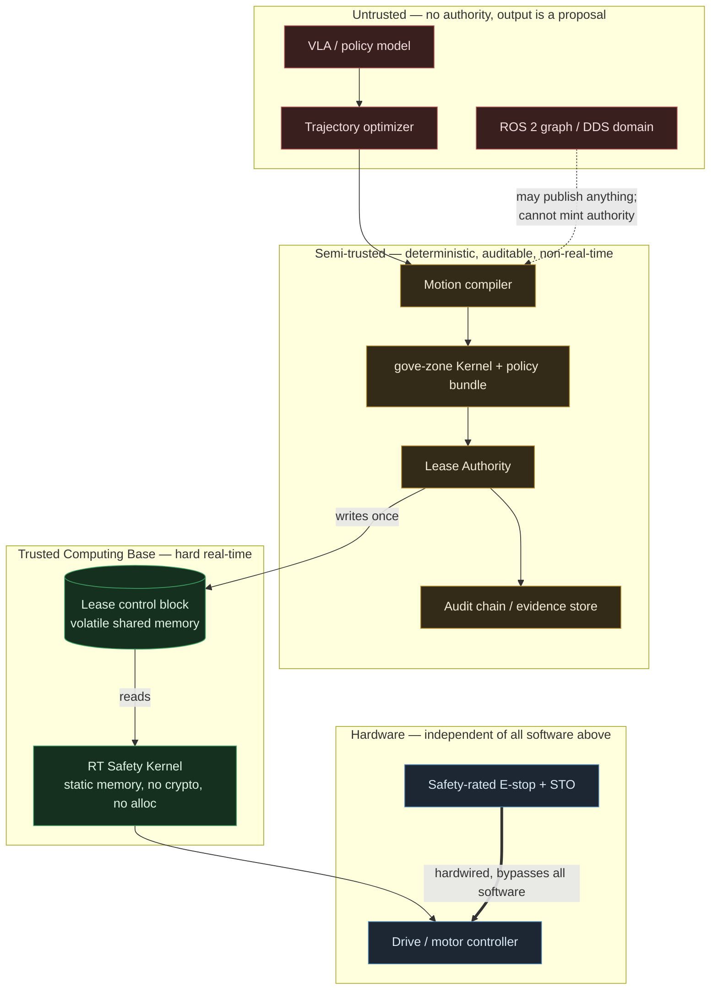

# RFC: ACGS Physical Execution Profile (VLA / Embodied Robotics)

**Status:** Draft — design only. No implementation exists.
**Scope:** An *execution profile* + adapter layer over the existing gove-zone kernel.
**Explicit non-goal:** modifying `gove_zone` core, or creating a second governance system.

---

## 0. Claim boundaries (read first)

- This design is **not** a functional-safety system and does not replace one.
  Cryptographic authority answers *"was this motion authorized?"*. It does not
  answer *"is this motion physically safe?"*. The latter requires a certified
  safety function (ISO 10218 / ISO 13849 / IEC 61508 category-rated hardware
  E-stop and safety-rated monitored stop) that this profile **sits beside, never
  replaces**.
- **A signature is not a safety case.** A valid Motion Authority Receipt means an
  authority decided the motion was permitted under a policy bundle. It carries no
  claim of collision-freeness, stability, or human safety.
- No claim of formal verification, certification, or completeness is made here.
  The safety contract (§4) is a *constraint filter*, not a proof.
- Nothing in this document is deployed, tested, or benchmarked. All timing
  figures are design budgets, not measurements.

---

## 1. Invariant

> **No valid Motion Authority Receipt, no actuator lease.
> No valid actuator lease, no torque.**

This is the physical restatement of the ACGS membrane: the side effect cannot
occur before authority is validated. In the digital kernel the side effect is a
tool call; here it is a current command to a motor.

The second clause matters more than the first. Receipt validation is expensive
and non-deterministic in latency. Torque enablement must be decidable in constant
time inside a hard-real-time loop. The **Servo Lease** (§5) is the object that
bridges those two worlds.

---

## 2. Authority separation

The governing constraint on this architecture is that **the servo loop is a hard
real-time context and ACGS is not**. Therefore:

**Forbidden inside the servo loop:** signature verification, hashing of
unbounded data, policy evaluation, network or IPC round-trips, dynamic
allocation, logging that can block, page faults on unlocked memory, and anything
whose worst-case execution time is not statically bounded.

### Time-domain decomposition

| Stage | Domain | Budget (design target) | May do crypto? |
|---|---|---|---|
| VLA inference | best-effort | 50–500 ms | n/a |
| Trajectory optimizer | best-effort | 5–100 ms | n/a |
| Motion compiler | best-effort, deterministic | 1–20 ms | yes (produces digests) |
| ACGS policy evaluation | best-effort | 1–10 ms | yes |
| Receipt issuance + validation | best-effort | 1–20 ms | yes (Ed25519) |
| Lease issuance | soft real-time | < 1 ms | yes, once |
| **Real-time safety kernel** | **hard real-time** | **≤ 100 µs @ 1 kHz** | **never** |
| Actuator / drive | hardware | — | never |

### Pipeline

```
VLA (proposer)
  └─> trajectory optimizer            (improves, does not authorize)
        └─> motion compiler           (canonicalizes → executable artifact + digests)
              └─> ACGS policy evaluation   (gove_zone Kernel — unmodified)
                    └─> Motion Authority Receipt   (DecisionReceipt, commit tier)
                          └─> Lease Authority      (validates receipt, consumes nonce)
                                └─> Servo Lease    (volatile, bounded, single-use)
                                      └─> RT Safety Kernel  (per-tick constraint filter)
                                            └─> actuator
```

Each arrow is one-way. No downstream stage may re-enter an upstream one. In
particular **the optimizer runs before authorization and never after** — see
threat T-08.

---

## 3. Trust boundaries



### TCB enumeration (deliberately small)

In the TCB:
1. RT Safety Kernel executable (fixed, hash-pinned at boot).
2. The compiled `PhysicalSafetyContract` blob it loads at activation.
3. The lease control block layout in shared memory.
4. The RT clock source and tick counter.

**Not** in the TCB: the VLA, the optimizer, ROS 2, DDS, the motion compiler,
gove-zone itself, the audit store, and every network path. Compromise of any of
those must be containable to *denial of motion*, never to *unauthorized motion*.

ROS 2 is an integration layer, **not a security boundary**. Any node on the DDS
domain can publish any topic. The profile therefore assumes the ROS graph is
hostile and places the enforcement point below it.

---

## 4. Motion Authority Receipt (MAR)

**Design rule: no new receipt type.** A MAR *is* a `gove_zone.receipt.DecisionReceipt`.
The physical binding lives in fields that already exist. This is what keeps the
profile an adapter rather than a fork:

> **Why the hash binding is sound, and where a core check is still required.**
> The design depends on `constraints` being covered by the canonical hash —
> otherwise an attacker could swap a calibration digest without invalidating
> `receipt_hash`. Verified against the published kernel: `constraints` is
> emitted inside `to_dict()`, which is what `compute_hash` canonicalizes, so the
> physical block is hash-bound and signature-covered against later mutation of
> the receipt.
>
> That is **not** a comparison against the loader's live compiled
> `PhysicalSafetyContract`. `DecisionReceipt.verify()` has no
> `expected_constraints` parameter and no "Constraints mismatch" branch; the
> published `execute_with_receipt` gate likewise does not pin a caller-supplied
> constraint dict. Hash-binding stops a tampered receipt; it does not stop a
> valid receipt issued against a different physical contract. The Lease
> Authority in §7 **must** compare `constraints["physical"]` (and the
> contract digest inside it) to the live compiled contract before arming a
> lease. That comparison is a profile requirement, not an existing kernel
> primitive.

| MAR concept | Existing `DecisionReceipt` field |
|---|---|
| action identity | `proposed_action = "robot.motion.execute"` |
| motion request binding | `argument_hash` = `sha256_json(canonical MotionRequest)` |
| physical binding block | `constraints["physical"]` |
| irreversibility | `action_tier = "commit"` (always; motion is never `explore`) |
| robot cell | `execution_boundary = "cell:<site>/<cell-id>"` |
| operator/task authority | `authority`, `validator_id`, `validator_role` |
| short life | `expires_at` |
| chain evidence | `previous_audit_hash`, `audit_event_hash` |
| tamper-evidence | `receipt_hash`, `signature`, `signing_key_id` |

`ToolCall` maps cleanly too: `name="robot.motion.execute"`,
`path=("site","cell-3","arm-0","joint-group-a")` for policies-on-paths,
`state={...}` for cell state (door closed, human presence, shift mode).

### `constraints.physical` — the binding block

The receipt must bind **executable meaning**, not coordinates. A trajectory is
only meaningful relative to a robot, a frame, a calibration, and a tool.

```json
{
  "profile": "acgs.physical/v0",
  "robot": {
    "robot_id": "cell-3/arm-0",
    "serial": "UR5e-2024-00417",
    "firmware_digest": "sha256:…",
    "kinematic_model_digest": "sha256:…",
    "calibration_digest": "sha256:…",
    "tool": { "tool_id": "gripper-2f85", "tcp_digest": "sha256:…", "payload_kg": 0.85 }
  },
  "action_space": {
    "kind": "joint_position",
    "dof": 6,
    "joint_order": ["j0","j1","j2","j3","j4","j5"],
    "units": { "position": "rad", "velocity": "rad/s", "torque": "N·m" },
    "control_rate_hz": 1000,
    "coordinate_frame": "base_link",
    "frame_tree_digest": "sha256:…"
  },
  "trajectory": {
    "trajectory_digest": "sha256:…",
    "merkle_root": "sha256:…",
    "block_size_ticks": 100,
    "block_count": 42,
    "duration_ms": 4200,
    "encoding": "acgs.motion.canonical/v0"
  },
  "compiler": {
    "compiler_digest": "sha256:…",
    "compiler_version": "acgs-motion-compiler/0.1.0",
    "input_plan_digest": "sha256:…"
  },
  "safety_contract": {
    "contract_digest": "sha256:…",
    "contract_version": "cell-3/strict/v7"
  },
  "initial_state": {
    "joint_position_hash": "sha256:…",
    "joint_position": [0.0, -1.57, 1.57, 0.0, 1.57, 0.0],
    "tolerance_rad": 0.01,
    "observation_timestamp": "2026-07-26T22:40:00.123Z",
    "observation_max_age_ms": 200,
    "perception_digest": "sha256:…"
  },
  "lease": {
    "nonce": "01J…",
    "sequence_lo": 0,
    "sequence_hi": 4199,
    "max_duration_ms": 4500,
    "actuator_group": "arm-0/joints"
  }
}
```

### Why each binding exists

- **firmware / kinematic / calibration digests** — the same joint angles mean a
  different Cartesian pose under a different calibration. Without these, a
  receipt authorizing a safe motion on robot A authorizes an unsafe motion on
  robot B (T-03).
- **action_space + units + frame** — a `0.5` that means rad/s under one profile
  and m/s under another is an unbounded authority escalation. Units are
  hash-bound, never inferred.
- **compiler_digest + input_plan_digest** — proves *which* deterministic
  transformation produced the authorized artifact from the proposal. A changed
  compiler yields a different receipt.
- **merkle_root + block_size** — the trajectory-bytes root. It is *not* used
  directly for enforcement: the lease carries `execution_root`, which binds it to
  robot, calibration epoch, contract, lease, and boot (§6.3), so the same bytes
  cannot be replayed in a different physical context. It lets the RT path verify integrity
  incrementally, off the critical path (§5.3), instead of hashing 4200 setpoints
  per tick.
- **initial_state + tolerance** — binds the authorization to the world state it
  was computed against. Motion authorized from pose X must not start from pose Y.
- **sequence_lo/hi + nonce + max_duration** — makes the authority bounded in
  count *and* wall time, and single-use.

### Issuance flow

`Kernel.dispatch` is an execute-and-return API: after `ALLOW` or `TRANSFORM` it
invokes the registered tool. Registering `robot.motion.execute` and calling
`dispatch` would run the motion **before** the Lease Authority could validate a
MAR. Issuance must not execute.

1. Motion compiler emits canonical artifact + digests (`trajectory_root` /
   `merkle_root`, contract digest, calibration epoch). Non-finite values,
   out-of-order timestamps, and NaN/Inf are rejected **here**, at encode time.
   The compiler does **not** emit `execution_root` — that root includes
   `receipt_id`, `lease_id`, and `boot_id`, which do not exist yet (§6.3).
2. `ToolCall` constructed. `Kernel.evaluate_and_record` (or
   `evaluate_and_append`) evaluates the cell's policy bundle and appends the
   decision. Mint `DecisionReceipt.from_record`. Do **not** call `dispatch`.
3. `DENY` / `ESCALATE` → no receipt. `ESCALATE` is **never** executable.
   `TRANSFORM` is executable only at the later executor gate, and only with the
   rewritten arguments.
4. `ALLOW` → receipt issued, signed (`require_signature=True` with a real
   verifier — see §11). Direct `DecisionReceipt.verify()` defaults
   `require_signature=False` and is **not** an execution boundary.
5. Receipt persisted to the audit chain before the lease is requested. Motion
   runs only later, through `execute_with_receipt` / `GovernedExecutor` after
   the lease is armed.

---

## 5. PhysicalSafetyContract

A contract is a **deterministic, compiled, content-addressed** constraint set. It
is authored offline per cell, reviewed, signed, and pinned. The RT kernel loads
exactly one contract per activation and refuses to run without a digest match
against the receipt.

### The compiler is not an optimizer

The constraint compiler performs a **deterministic transformation**, never a
search. It may *tighten* a constraint; it may never *relax* one. Two invariants
make that checkable rather than aspirational:

**(a) Coverage.** The compiled set must subsume the declared safety requirements:

```
compiled_constraints  ⊇  safety_requirements        (required)
compiled_constraints  ≈  planner_preference         (rejected)
```

**(b) Monotonicity.** Constraints compose in one direction only. Each narrowing
layer must be a subset of the layer above it:

```
operator_override  ⊆  cell_policy  ⊆  robot_capability
```

```
robot   : speed ≤ 2.0 m/s
cell    : speed ≤ 0.5 m/s     ✅ tightens
operator: speed ≤ 0.3 m/s     ✅ tightens
operator: speed ≤ 3.0 m/s     ❌ FAILS COMPILATION — exceeds robot capability
```

A relaxation is a **compile-time error**, not a runtime warning. The compiler
emits no artifact, so no receipt can be issued and no lease can exist. This is
the same fail-closed shape as the digital kernel: absence of authority, not
override of it.

### Constraint provenance

A hash proves integrity but not *explainability* — it says the bytes are intact,
not why the number is what it is. Every compiled constraint therefore carries its
origin, and the provenance block is part of the hashed contract:

```json
{
  "constraint": "cartesian_speed_max",
  "value": 0.3,
  "units": "m/s",
  "source": "operator_override",
  "derived_from": [
    "robot_capability:UR5e/2.0",
    "workspace_limit:v3",
    "calibration_digest:sha256:abc123…",
    "cell_policy:cell-3/strict/v7"
  ],
  "narrowed_from": 0.5,
  "compiler_version": "acgs-physical-compiler/0.1.0",
  "authored_by": "safety-eng:…",
  "reviewed_at": "2026-07-20T09:14:00Z"
}
```

This makes a post-incident question answerable from the artifact alone: *which
input produced this limit, and which layer narrowed it?* Without it, an
investigator can prove the contract was unmodified while still being unable to
explain it.

### Constraint classes

| Class | Form | RT cost |
|---|---|---|
| Joint limits | per-joint `[q_min, q_max]`, box | O(dof) compare |
| Rate limits | `|q̇| ≤ v_max`, `|q̈| ≤ a_max`, `|τ| ≤ τ_max` | O(dof) compare |
| Workspace | convex polytope `Ax ≤ b` in Cartesian | O(rows·dof) MAC |
| Forbidden zones | precomputed signed distance field, `sdf(x) ≥ margin` | O(1) lookup + trilinear interp |
| Payload | mass/inertia envelope vs. commanded torque | O(dof) |
| Self-collision | precomputed capsule-pair table with min-distance | O(pairs), pairs pruned offline |
| Human proximity | zone occupancy → speed-and-separation scaling | O(1) table lookup |

All are chosen for **statically bounded worst-case execution time and no
allocation**. Anything requiring iterative solving (full QP, nonconvex collision
queries) is compiled offline into one of the above forms, never solved in-loop.

### Safety filter

The per-tick check is a **constraint filter**, not an optimizer:

```
admissible(u_k, x_k) :=  within_joint_limits(x_k, u_k)
                      ∧ within_rate_limits(u_k, u_{k-1})
                      ∧ workspace_polytope(fk(x_k)) ≤ b
                      ∧ sdf(fk(x_k)) ≥ margin
                      ∧ speed_separation_ok(zone_state, ‖ẋ_k‖)
                      ∧ finite(u_k)
```

If `admissible` fails, the kernel does **not** attempt to repair the command. It
transitions to the safe response profile. Repair-in-loop is rejected because a
repaired command is an *unauthorized* command — it is not the trajectory the
receipt attests to.

**Control-barrier-function note.** A discrete-time CBF condition
`h(x_{k+1}) ≥ (1-α)·h(x_k)` may be compiled in as an additional scalar test where
a valid barrier exists for the cell geometry, giving forward-invariance of the
safe set *under the modeling assumptions* (exact dynamics, no actuation delay,
bounded disturbance). Those assumptions do not hold exactly on real hardware.
CBF admissibility is therefore treated as **one more filter term, not a safety
proof**, and never as grounds to weaken the hardware safety layer.

### Safe response profile

Executed with no further authority:

| Profile | Behavior |
|---|---|
| `hold` | zero-velocity servo hold at last admissible setpoint |
| `ramp_stop` | bounded-deceleration stop **continuing along the remaining authorized path** |
| `category_1_stop` | controlled stop that does **not** follow the path further, then torque removal (STO) |
| `category_0_stop` | immediate torque removal |

**The response is selected by violation class, not by cell preference.** This is
a safety-relevant distinction, not a tuning knob: `ramp_stop` keeps following the
authorized geometry, so it is only valid when the violation is *speed-dependent*.
Applying it to a geometric violation would decelerate the robot **into the very
obstacle that triggered the stop**.

| Violated constraint | Mandatory response | Why |
|---|---|---|
| Rate limits (`v_max`, `a_max`), payload envelope | `ramp_stop` | the path is admissible; only the speed is not |
| `TorqueEnvelopeViolation` — commanded/measured torque exceeds `τ_max`, model still holds | `ramp_stop` | a control-envelope breach; the system remains controllable and the path is still valid |
| `TorqueSensorMismatch` — measured torque diverges from the model's prediction beyond tolerance | `category_1_stop` | **`model ≠ reality`** — the dynamics used to plan the trajectory no longer describe the machine, so the remaining path is meaningless |
| `ActuatorIntegrityFailure` — unexpected acceleration, drive fault word, encoder disagreement | `category_1_stop` | a fault, not a limit; continuing motion is unjustifiable at any speed |
| SDF / forbidden zone, workspace polytope, self-collision, human proximity | `category_1_stop` | the *path itself* is inadmissible — continuing along it worsens the violation |
| Non-finite setpoint (check 6), integrity stall (check 5), sequence violation (check 4) | `category_1_stop` | the commanded geometry is untrusted or unknown |
| Calibration epoch change (check 9, T-13) | `category_1_stop` | joint angles no longer mean what they meant at authorization |
| Lease revoked, deadline exceeded, boot-id mismatch | `category_1_stop` | authority is gone; no basis to keep moving |
| Hardware fault signal (safety-rated channel) | `category_0_stop` | below the software layer |

**Faults and limit breaches must not share a class.** A limit breach means *the
machine did what we asked and we asked for too much* — the model is intact, so
decelerating along the authorized path is sound. A fault means *the machine is
not the machine we modeled*; the trajectory was planned against dynamics that no
longer apply, so following it further has no safety argument behind it regardless
of speed. Collapsing the two is how "we have a torque limit" becomes a false
sense of coverage.

A cell may only make a response **stricter** than the table (e.g. configure
`category_0_stop` where `category_1_stop` is mandated), never weaker. The mapping
is compiled into the contract and hash-bound, so a cell cannot silently relax it.

Safe-stop needs no receipt. **Stopping is always authorized.** Only motion
requires authority.

---

## 6. Servo Lease

The lease is the constant-time, real-time-safe projection of a receipt.

### Properties

- **Derived, never primary.** A lease exists only as the product of a fully
  validated receipt. The Lease Authority performs every expensive check *once*.
- **No replay.** Issuance consumes the MAR through the published
  `ReceiptConsumptionLedger.consume(receipt)` (JSONL ledger, file locking,
  burns the receipt anchor). That primitive is **not** an atomic MAR-nonce
  reservation in SQLite, and it gives no cross-instance protection. T-02's
  multi-controller semantics therefore still need a durable shared
  nonce-reservation operation before this profile is safe on redundant
  controllers; until that exists, a second lease for the same receipt must
  fail closed on the single-node ledger plus `boot_id` mismatch.
- **No reboot survival.** The control block lives in volatile shared memory
  (`tmpfs`/`/dev/shm`, `mlock`ed) and carries the kernel `boot_id`. On mismatch
  the RT kernel refuses it. A lease can never outlive the machine state it was
  validated against.
- **Bounded scope.** One actuator group, one sequence range, one contract digest,
  one wall-clock deadline.
- **Atomic consumption.** Each tick advances a monotonic counter by compare-and-swap.
- **Revocable.** A revocation flag is a single word; the RT kernel checks it every
  tick and treats *any* non-ARMED value as safe-stop.

### Control block (fixed layout, cache-line aligned)

```c
struct servo_lease {          /* written once by Lease Authority; RO to RT loop */
  uint64_t magic;             /* profile + layout version */
  uint64_t boot_id_lo, boot_id_hi;
  uint8_t  receipt_hash[32];  /* binding back to the MAR */
  uint8_t  contract_digest[32];
  uint8_t  execution_root[32]; /* context-bound root, §6.3 — NOT bare merkle_root */
  uint32_t actuator_group;
  uint32_t dof;
  uint64_t seq_lo, seq_hi;
  uint64_t deadline_tick;     /* RT monotonic tick, not wall clock */
  uint32_t block_size_ticks;
  uint32_t blocks_verified;   /* advanced by non-RT loader; RT only reads */
  uint64_t calibration_epoch; /* pinned at issuance; see T-13 */
  /* --- mutable, RT-owned, separate cache line --- */
  _Atomic uint64_t seq_next;  /* CAS-advanced each tick */
  _Atomic uint32_t state;     /* ARMED | ACTIVE | CONSUMED | REVOKED */
};

/* Written by the calibration owner ONLY; read-only to everything else.
   Any successful calibration, tool change, or kinematic reload bumps this
   monotonically BEFORE the new values become readable. */
struct calibration_epoch_cell { _Atomic uint64_t epoch; };
```

### Per-tick RT check (the whole hot path)

```
/* seq_lo/seq_hi are INCLUSIVE; i is the zero-based index into the buffer. */
1. state == ARMED|ACTIVE                       else -> safe_stop
2. boot_id matches current boot                else -> safe_stop
3. tick <= deadline_tick                       else -> safe_stop
4. seq = CAS(seq_next, s, s+1); seq_lo <= seq <= seq_hi
                                               else -> safe_stop
5. i = seq - seq_lo
   i / block_size_ticks < blocks_verified      else -> safe_stop   (integrity gate)
6. u = setpoint[i]; finite(u)                  else -> safe_stop
7. admissible(u, x_measured)                   else -> safe_stop
8. perception_age <= max_age                   else -> safe_stop
9. calibration_epoch == lease.calibration_epoch
                                               else -> safe_stop   (T-13)
10. emit u to drive
```

Check 9 is one 64-bit compare. It is what makes calibration binding a *live*
property rather than an activation-time snapshot: re-verifying the calibration
*digest* would require hashing in the loop, which is forbidden, so the RT kernel
compares a monotonic epoch that the calibration owner must bump **before**
publishing new values. Any calibration change mid-motion therefore stops the
robot, even if the new calibration is legitimate.

Both bounds are inclusive, so a trajectory of `block_count × block_size_ticks`
setpoints is addressed by `seq_lo = 0`, `seq_hi = count - 1`. Step 4 exhausting
the range is a normal completion, not a fault: the lease transitions to
`CONSUMED` and the kernel holds position.

Steps 1–8 are integer compares, one CAS, and the bounded contract filter. **No
hash is computed, no lock is taken, no memory is allocated.**

### 6.3 Trajectory integrity without in-loop crypto

Hashing the trajectory per tick is impossible within 100 µs. Instead:

- The compiler splits the trajectory into fixed blocks and builds a Merkle tree;
  `merkle_root` is bound in the receipt.

#### What a Merkle root does and does not give you

A bare `merkle_root` provides trajectory **integrity** and block **inclusion**. It
does **not** provide freshness, controller identity, actuator authenticity, or any
correspondence to the physical world. On its own it therefore admits:

```
valid old trajectory + valid old root + different physical context
      = still cryptographically valid
```

The root must bind the execution context, not just the bytes. Split the two
roots so construction order is possible:

- **`trajectory_root` / `merkle_root`** — compiler output. Trajectory bytes
  only. Available before any receipt or lease exists.
- **`execution_root`** — computed at **lease issuance**, after `receipt_id`,
  `lease_id`, and `boot_id` exist. Never a compiler output. The loader
  recomputes it from the live tuple and compares; it does not trust a
  pre-authorization root that could not have included those fields.

The verified root is domain-separated and computed over the context tuple:

```
execution_root = H( "acgs.physical.traj/v0"
                  ‖ merkle_root          /* the trajectory bytes            */
                  ‖ receipt_id           /* which authorization             */
                  ‖ robot_id             /* which machine                   */
                  ‖ calibration_digest   /* what the joint angles MEAN      */
                  ‖ contract_digest      /* which safety envelope           */
                  ‖ lease_id             /* which single-use grant          */
                  ‖ calibration_epoch    /* monotonic; see T-13             */
                  ‖ boot_id )            /* which power cycle               */
```

`execution_root` — not `merkle_root` — is what the lease block carries and what
the loader verifies against. Replaying a trajectory under a different robot,
calibration, contract, lease, or boot yields a different root and fails closed.
The trajectory bytes stay reusable; the *authority to execute them here, now,
on this machine* does not.
- A **non-RT loader thread** verifies block *n+1* against the root while the RT
  loop consumes block *n* (double buffering), then increments `blocks_verified`.
- The RT loop's only integrity obligation is check 5: *never read past the
  verified watermark*. That is one integer compare.
- If the loader falls behind, `blocks_verified` stalls, check 5 fails, and the
  robot safe-stops. **Falling behind degrades to a stop, never to unverified
  motion.**

### 6.4 Compiler / Loader authority boundary

The compiler and the loader must never both be able to decide what is permitted.
If the loader can reinterpret constraints, it becomes a **second authority** —
and a second authority is a second place for the two answers to diverge, with no
receipt recording which one won.

The split is absolute:

| | Compiler (offline, deterministic) | Loader (online, non-RT) |
|---|---|---|
| **Decides** | what the constraints *are* | nothing |
| **Does** | resolve layers, check monotonicity, generate provenance, emit `ExecutionArtifact` | verify artifact, validate lease, bind runtime |
| **Output on conflict** | `CompilationRejected` — no artifact | refuse to arm — no lease |

**The loader is explicitly forbidden to:**

```
✗ modify or re-derive constraints
✗ resolve conflicts between capability / policy / operator layers
✗ upgrade, widen, or "fix up" a capability
✗ substitute a default for a missing field
✗ recompute a digest it was supposed to compare against
```

Its entire vocabulary is *verify* and *refuse*. Every value it enforces was
decided by the compiler and is hash-bound; the loader's only decisions are
boolean. This mirrors the digital kernel's separation: policy evaluation
produces the receipt, and the gate only checks it — the gate never re-evaluates
policy.

> **Runtime enforcement verifies authority. It does not reconstruct authority.**

---

## 7. ROS 2 adapter (Lifecycle Node)

`acgs_motion_authority_node` — a managed lifecycle node. It is **plumbing and
observability**, not enforcement.

### State transitions

| Transition | Checks performed |
|---|---|
| `configure` | load contract blob; verify `contract_digest`; verify RT kernel binary hash; map shared memory; lock pages; verify clock source is monotonic RT |
| `activate` | require MAR; verify signature, `receipt_hash`, expiry, tenant, boundary, actor, policy digest; verify `firmware/kinematic/calibration/tool` digests against **live queried device values**; verify measured joint state within `initial_state.tolerance_rad`; verify perception age; **read `calibration_epoch`, re-verify the calibration digest at that epoch, and pin the epoch into the lease** (T-13); compute `execution_root` (§6.3); consume nonce; write lease block; set `ARMED` |
| `deactivate` | set `REVOKED`; ramp stop; emit lifecycle evidence |
| `cleanup` | zero the lease block; unmap |
| `error` (`on_error`) | set `REVOKED`; `category_1_stop`; emit refusal evidence; require operator acknowledgement before re-activate |
| `shutdown` | `category_0_stop`; zero lease |

Activation is **fail-closed and non-negotiable**: any failed check aborts the
transition to `inactive`. There is no "warn and continue" path.

### Interfaces

- `~/authorize` (service) — accepts a serialized MAR, returns lease handle or a
  structured refusal. **The only path to motion authority.**
- `~/status` (topic) — lease state, seq watermark, blocks verified, last refusal.
- `~/revoke` (service) — always available, requires no authority, single word write.
- `~/evidence` (topic) — receipt/refusal events mirrored for observability only.

### Why ROS 2 is not the boundary

Any node on the domain can publish `~/status` lookalikes or spoof topics. The
adapter therefore holds **no secret and grants no capability**: it can only pass
a receipt to the Lease Authority, which re-validates independently. Compromising
every ROS node yields denial of service, not unauthorized torque.

---

## 8. Threat model

| ID | Attack | Detection | Fail-closed response | Evidence |
|---|---|---|---|---|
| T-01 | **Signed trajectory mutation** — bytes altered after authorization | Merkle block verify in non-RT loader; `blocks_verified` never advances past a bad block | RT check 5 fails → `category_1_stop` (commanded geometry is untrusted); lease `REVOKED` | refusal receipt w/ block index, expected vs. actual block hash |
| T-02 | **Replay** of a previously valid MAR | `ReceiptConsumptionLedger.consume(receipt)` rejects a burned receipt anchor; `boot_id` mismatch after restart; `expires_at`. Multi-controller cells still need a shared nonce-reservation op — the published ledger is single-node JSONL | activation aborts; no lease issued | refusal receipt, nonce, first-consumption timestamp |
| T-03 | **Wrong robot / model / calibration** | `activate` compares receipt digests against **live device-queried** firmware, kinematic, calibration, tool values | activation aborts | refusal receipt listing each mismatched digest |
| T-04 | **NaN / Inf / denormal actions** | rejected at canonical encode; re-checked per setpoint (check 6) | `category_1_stop` | refusal receipt w/ seq index and raw bit pattern |
| T-05 | **Unsafe intermediate path** — endpoints legal, path not | per-tick `admissible()`; SDF + polytope evaluated on every setpoint, not just waypoints | `category_1_stop` at first inadmissible tick — **geometric violation, so the path must not be followed further** (§5) | refusal receipt w/ seq, violated constraint id, margin |
| T-06 | **Stale perception** — world moved since authorization | `observation_max_age_ms` at activation; per-tick `perception_age` (check 8) | activation aborts; mid-motion → `category_1_stop` (the world is unknown, so continuing along the path is unjustified) | refusal receipt w/ observation timestamp and measured age |
| T-07 | **Malicious ROS node** — spoofs topics, floods services, impersonates the adapter | adapter holds no capability; Lease Authority re-validates independently; `~/revoke` is unauthenticated *in the safe direction only* | no lease issued; spurious revokes cause stops, never motion | audit chain entry per authorize attempt, incl. rejected ones |
| T-08 | **Optimizer modifies the authorized trajectory** — refines after authorization | `trajectory_digest` / `merkle_root` bound in receipt; the optimizer sits *upstream* of the compiler and has no write path to the verified buffer | digest mismatch → no lease, or check 5 stall mid-motion | refusal receipt w/ authorized vs. presented digest |
| T-09 | **Lease forgery** — attacker writes the shm block directly | shm is RO to every process but the Lease Authority (OS perms + separate UID); `magic`/layout version; `boot_id` | RT kernel refuses malformed block | integrity alarm; requires host compromise to attempt |
| T-10 | **Deadline / clock manipulation** | RT kernel uses a monotonic tick counter, never wall clock; `deadline_tick` computed at issuance | tick past deadline → safe-stop | lifecycle evidence w/ tick counts |
| T-11 | **Sequence rollback / skip** | monotonic CAS on `seq_next`; range check | any non-monotonic advance → safe-stop | refusal receipt w/ observed and expected seq |
| T-12 | **Authority confusion** — `ESCALATE` treated as executable | Lease Authority accepts only `decision == "allow"`; `ESCALATE`/`DENY` produce no lease | no lease | escalation record in audit chain |
| T-13 | **Calibration drift after authorization** — receipt stays valid while the calibration transform changes under it, so authorized joint angles now mean a different pose. **The physical-world-specific failure mode**, and the one T-03 does *not* cover: T-03 checks calibration at `activate`, which says nothing about tick 3000 | per-tick `calibration_epoch` compare (check 9); non-RT re-verification of `calibration_digest` on every epoch bump | `category_1_stop`; lease `REVOKED`; re-authorization required — a new calibration needs a new receipt, never a resumed one | refusal receipt w/ `receipt_id`, expected vs. observed epoch and digest, controller id, seq at stop, timestamp |

**Residual risks, stated plainly:** host/root compromise of the Lease Authority
machine; private-key custody and revocation (no PKI — the verifier map is static,
inherited from the base kernel); the single-node `ReceiptConsumptionLedger`
provides **no cross-instance replay protection**, so a multi-controller cell needs
a shared consumption authority before this profile is safe there; modeling error
in the contract (a wrong SDF authorizes a real collision); and any hardware fault
below the RT kernel. None of these are addressed by cryptography.

---

## 9. Evidence and audit

Every authorize attempt — granted **or refused** — appends to the existing
chain-hash audit store. Motion-specific evidence adds: `seq` at stop, violated
constraint id, measured vs. authorized initial state, block verification
watermark, and the safe-response profile taken.

This yields replayable answers to "what was this robot authorized to do, by whom,
under which contract, and why did it stop?" — the physical analogue of the
existing receipt replay path. Evidence emission is **never** on the RT path: the
RT kernel writes fixed-size records to a lock-free ring buffer; a non-RT drainer
persists them.

---

## 10. Prototype plan

Each phase has an exit gate. No phase claims the next phase's properties.

| Phase | Scope | Exit gate |
|---|---|---|
| **P0-1** Compiler | `PhysicalExecutionCompiler`: inputs `PhysicalSafetyContract`, `RobotCapability`, `CellPolicy`, `OperatorConstraint`, `CalibrationManifest`, `TrajectoryBundle` → emits `ExecutionArtifact` { `contract_digest`, `constraint_digest`, `trajectory_root`, `calibration_epoch`, `compiler_version`, `provenance` }. **Does not emit `execution_root`** | Monotonicity lattice `operator ⊆ cell ⊆ capability` enforced — a relaxation yields `CompilationRejected` and **no artifact**; provenance present on every constraint and covered by `contract_digest`; byte-identical output for identical input |
| **P0-2** Loader + MAR | MAR as a `constraints.physical` profile; canonical encoder w/ NaN rejection; policy bundle for one cell; mint MAR via `evaluate_and_record` (no `dispatch`); verify receipt signature and live contract pin; verify `calibration_epoch`; allocate `lease_id` and read `boot_id`; **then** compute `execution_root` (§6.3); consume receipt; write lease; enable executor | Receipts issue + verify against the unmodified kernel; round-trip replay stable; negative-path tests prove no receipt → no lease; **a test asserts the loader cannot widen a constraint, resolve a layer conflict, or default a missing field** (§6.4) |
| **P1** Lease + RT kernel in sim | Lease Authority, shm control block, RT kernel as a userspace `SCHED_FIFO` loop against a simulated arm (MuJoCo/Isaac) | All 13 threats (T-01…T-13) reproduced as **failing-before / passing-after** tests; each asserts the side effect did *not* occur |
| **P2** Timing characterization | `PREEMPT_RT` kernel; `cyclictest` baseline; measure worst-case `admissible()` under full contract, incl. the SDF lookup | Measured WCET reported with p99.9 and max; **no green claim without literal output**; budget declared *before* measuring (below) |
| **P3** ROS 2 adapter | Lifecycle node, activation checks, evidence topics; hostile-node test harness | Compromised-ROS-graph test yields DoS only, never motion |
| **P4** Hardware-in-the-loop | One collaborative arm, safety-rated E-stop independent and verified first, payload-free, fenced cell, operator present | Independent review; documented limitations; **no autonomy claim** |

**P4 is not a production readiness gate.** Deploying beside humans requires a
certified functional-safety assessment that is out of scope for this profile.

### SDF WCET is a measurement gate, not a design problem

The SDF lookup is the largest engineering risk in the profile (§11.6). It is
handled by **declaring the budget first and measuring against it** — not by
designing an optimization in advance:

```
SDF evaluation budget      p99 < X µs
                           max < Y µs
                           zero allocation
                           zero lock
```

Measured across a matrix, since a warm-cache number proves nothing about the
worst case: **cold cache · warm cache · cache pressure · interrupt load ·
multi-sensor burst**.

If the budget is missed, the response is **not** to add runtime cleverness.
Escalate in this order:

```
precompute → immutable artifact → runtime lookup        (correct)
runtime reasoning / adaptive resolution / caching heuristics   (rejected)
```

Adding runtime reasoning to hit a timing budget trades a measurable overrun for
an unmeasurable one, and grows the TCB in the one place it must stay smallest.
Restating the profile's governing principle in its timing form: **runtime
enforcement verifies authority, it does not reconstruct authority** — and it
does not re-derive geometry either.

---

## 11. Frozen decisions and open questions

### Frozen before P0 — change these only by amending this RFC

1. **`execution_root` is the sole physical execution binding identity.** Nothing
   downstream enforces against a bare `merkle_root` (§6.3).
2. **`calibration_epoch` is the RT drift guard.** A calibration change is an
   authority transition, not a parameter update: new calibration ⇒ new receipt,
   never a resumed lease (§6, check 9; T-13).
3. **Constraint monotonicity is not relaxable.** `operator ⊆ cell ⊆ capability`;
   a relaxation is a compile-time error producing no artifact (§5).
4. **Fault ≠ limit breach.** `TorqueEnvelopeViolation` → `ramp_stop`;
   `TorqueSensorMismatch` / `ActuatorIntegrityFailure` → `category_1_stop` (§5).
5. **The loader verifies; it never decides.** Constraint resolution belongs to
   the compiler alone (§6.4).

### Open questions

1. **Signing is mandatory here.** Execution gates
   (`execute_with_receipt`, `GovernedExecutor`) default
   `require_signature=True`. Direct `DecisionReceipt.verify()` defaults
   `False` and is not an execution boundary. This profile requires a real
   verifier at the lease gate. Key custody and rotation for robot cells is
   unsolved and blocks P4.
2. **Cross-controller replay.** `ReceiptConsumptionLedger` is single-node JSONL.
   A cell with redundant controllers needs a shared, fail-closed nonce-reservation
   authority.
3. **Contract authoring and review** — who signs a `PhysicalSafetyContract`, and
   what evidence backs the SDF/limit values? Currently undefined.
4. **Force/impedance and admittance control** — the joint-position action space
   above does not cover contact-rich tasks; the constraint filter formulation
   likely needs an energy/power budget term rather than a position box.
5. **Multi-arm and mobile bases** — one lease per actuator group composes poorly
   when two arms share a workspace; needs a joint-authority design.
6. **WCET of the SDF lookup** under cache pressure is the most likely budget
   violation. The budget and test matrix are now defined (§10); the *values* of
   X and Y are still open and must be set per cell before P2, not fitted to
   whatever the first measurement happens to produce.

---

## 12. Related

- `docs/DECISION_RECEIPT_SPEC.md` — base receipt schema this profile specializes
- `docs/SECURITY_MODEL.md` — trust assumptions inherited unchanged
- `packages/gove-zone/docs/policy-bundles.md` — policy identity and immutability
- `docs/design/sandbox-isolation-and-call-time-governance.md` — digital analogue
  of the same authority-separation argument
