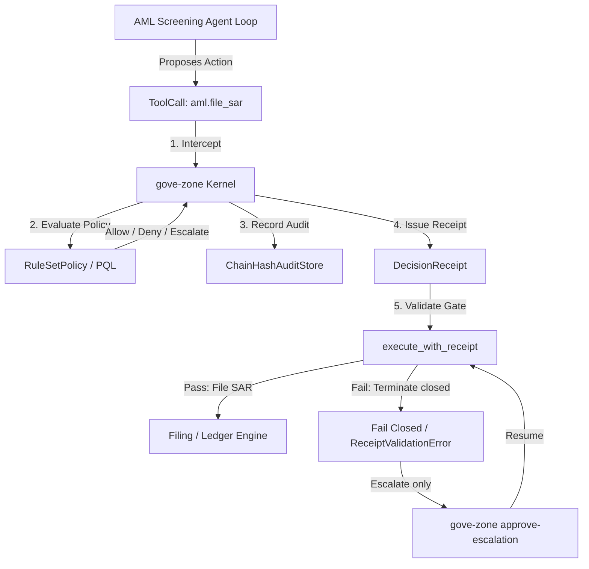

# Governing AI AML Transaction-Screening Agents: Case Study

Status: Case Study / Design Note
Supplements: `docs/design/sandbox-isolation-and-call-time-governance.md`,
`docs/design/governance-vulnclaw-pentest.md`
Drivers: Demonstrate how to apply `gove-zone` call-time policies and
receipt-gated execution to an Anti-Money-Laundering (AML) transaction-screening
agent capable of sanctions screening, SAR (Suspicious Activity Report) filing,
fund release, account freezes, and case-report export.

---

## 1. Context: The AML Transaction-Screening Agent

A financial-crimes AML agent sits in the transaction pipeline of a regulated
institution. It typically:
1. **Screens transactions** against sanctions/watchlist data as they clear.
2. **Files Suspicious Activity Reports (SARs)** with regulators when a pattern
   (e.g. structuring) is detected.
3. **Releases or holds funds**, and **freezes accounts**, based on risk signals.
4. **Exports case reports** and supporting evidence for auditors and
   examiners.

Because these actions carry direct regulatory, financial, and legal
consequences — a wrongly released transaction, an unfiled SAR, or a report
leaked to the wrong mount are each reportable incidents — an autonomous agent
must not be allowed to take any of them without a verifiable, policy-evaluated
decision recorded first.

---

## 2. High-Risk Side-Effects & Hazards

### A. Sanctions and Watchlist Exposure
*   **False-negative screening**: An agent that always "allows" screening
    without gating risks releasing funds tied to a sanctioned counterparty —
    both a regulatory violation and a potential criminal exposure for the
    institution.

### B. Unauthorized Regulatory Filings
*   **SAR filing is a regulatory act.** A SAR submitted by an automated
    process without a compliance officer's review can misstate facts, leak
    the existence of an investigation ("tipping off"), or simply be wrong.

### C. Fund Movement and Account Freezes
*   **Fund release above reporting thresholds** without a completed review
    can move money before a hold is cleared. **Account freezes** are a
    customer-facing, high-impact action that ordinarily requires supervisor
    sign-off.

### D. Filesystem/Export Egress
*   **Case-report export**: AML case files contain PII and investigative
    detail. Left ungoverned, an agent might export them to an
    externally-mounted or otherwise unapproved path.

---

## 3. The Interception Boundary

`gove-zone` intercepts execution at the **tool-dispatch membrane**, ensuring
that no screening decision, SAR filing, fund release, freeze, or export
proceeds without a valid, cryptographically verifiable `DecisionReceipt`.



### ToolCall Schema Mapping
Before executing any tool, the AML orchestrator converts the proposed action
into a structured `ToolCall`:
- `aml.screen_transaction`: `{"transaction_id": "txn-1002", "counterparty": "Sanctioned Shell Corp", "amount": 15000.0}`
- `aml.file_sar`: `{"case_id": "case-4471", "narrative": "Structuring pattern across 5 txns"}`
- `aml.release_funds`: `{"transaction_id": "txn-1003", "amount": 25000.0}`
- `aml.freeze_account`: `{"account_id": "acct-8890", "reason": "suspected structuring"}`
- `aml.export_report`: `{"output_dir": "/mnt/regulated-exports/case-4471", "case_id": "case-4471"}`

---

## 4. Declaring Governance Policies for AML Screening

We enforce fine-grained safety boundaries using a `RuleSetPolicy` bundle. It
denies sanctioned-counterparty screening and over-threshold releases outright,
escalates SAR filings and account freezes to the required approval tier, and
locks report exports to approved paths.

### Policy Configuration Example

```json
{
  "id": "policy-aml-screening-governance",
  "rules": [
    {
      "id": "DENY_SANCTIONED_COUNTERPARTY_SCREEN",
      "effect": "deny",
      "tools": ["aml.screen_transaction"],
      "state_equals": { "sanctioned_counterparty": true },
      "reason": "A transaction tied to a sanctioned counterparty cannot be auto-screened; it must route to manual sanctions review."
    },
    {
      "id": "ESCALATE_SAR_FILING_TO_COMPLIANCE_OFFICER",
      "effect": "escalate",
      "tools": ["aml.file_sar"],
      "allow": { "trust_tiers": ["compliance-officer"] },
      "reason": "Filing a Suspicious Activity Report is a regulatory act that requires compliance-officer approval before submission."
    },
    {
      "id": "DENY_RELEASE_OVER_THRESHOLD",
      "effect": "deny",
      "tools": ["aml.release_funds"],
      "state_equals": { "over_threshold": true },
      "reason": "Releasing funds above the currency-transaction-report threshold without a cleared review is prohibited."
    },
    {
      "id": "ESCALATE_FREEZE_TO_SUPERVISOR",
      "effect": "escalate",
      "tools": ["aml.freeze_account"],
      "allow": { "trust_tiers": ["supervisor", "compliance-officer"] },
      "reason": "Freezing a customer account is a high-impact action that requires supervisor sign-off."
    },
    {
      "id": "RESTRICT_EXPORT_DIRECTORY",
      "effect": "deny",
      "tools": ["aml.export_report"],
      "path_prefix": "/mnt/regulated-exports",
      "reason": "AML case reports cannot be exported to the regulated-exports mount without an approved export-path allowance."
    }
  ]
}
```

`RuleSetPolicy` rules can only `deny` or `escalate`; ALLOW is the default when
no rule matches. Positive scoping (e.g. "compliance officers may file SARs")
is expressed as an `allow` exemption on the rule itself, not as a separate
`allow` effect — so a broad rule can never accidentally mask a later denial.

---

## 5. Execution Gate Mechanics

The AML runner wraps every sensitive capability inside an `execute_with_receipt`
gate. Both `DENY` and `ESCALATE` receipts fail closed at this gate — only an
`ALLOW` receipt reaches the underlying tool implementation. Under production
profiles (`require_signature=True`), this also guarantees the receipt was
issued by the authorized `Validator` and its contents are tamper-evident.

```python
from gove_zone import execute_with_receipt, DecisionReceipt

def file_sar(case_id: str, narrative: str):
    # Real SAR filing / regulator submission code
    return {"status": "success", "case_id": case_id, "filed": True}

def governed_file_sar(receipt: DecisionReceipt, case_id: str, narrative: str):
    return execute_with_receipt(
        tool_fn=file_sar,
        args={"case_id": case_id, "narrative": narrative},
        receipt=receipt,
        expected_tenant_id="tenant-financial-crimes",
        expected_execution_boundary="aml-screening-sandbox",
        expected_action="aml.file_sar",
        expected_actor="compliance-officer-1",
        require_signature=False,  # Set to True in production to verify signature
    )
```

An `ESCALATE` receipt is not a "soft deny" — it is a distinct outcome meaning
the action needs a human decision before it can proceed. In this demo it is
handled the same way as `DENY` at the gate (caught, no side effect), but its
case-study meaning is: a compliance officer or supervisor must resume the
captured decision via `gove-zone approve-escalation` before the SAR filing or
account freeze can execute.

---

## 6. Verification and Replay

Every intercepted tool execution compiles into a hash-chained
`ChainHashAuditStore` event record. During forensic or examiner reviews:
1. The auditor verifies the cryptographic integrity of the hash chain.
2. The replay engine re-evaluates the historical state against the active
   policy bundle to ensure that no unauthorized SAR filing, fund release, or
   account freeze ever bypassed the execution membrane.

---

## 7. Runnable Proof

The scenarios above are exercised end-to-end by an executable demo that runs
against the current `gove-zone` kernel (tempdir-only, no external state):

```bash
uv run --package gove-zone python examples/governed_aml_screening/demo.py
```

It walks ten ALLOW/DENY/ESCALATE scenarios across sanctions screening, SAR
filing, fund release, account freezes, and case-report export, asserts each
governance invariant (expected decision, and that a denied or escalated
action's mock side-effect never ran), and verifies the tamper-evident audit
chain — printing a single JSON report to stdout and exiting non-zero if any
invariant is violated. The demo is kept from rotting by
`tests/docs/test_docs_and_examples.py`.

This is a demo with mock tools running in unsigned dev mode
(`require_signature=False`). It proves executor placement and fail-closed
behavior; it does not claim compliance certification or regulator approval.
