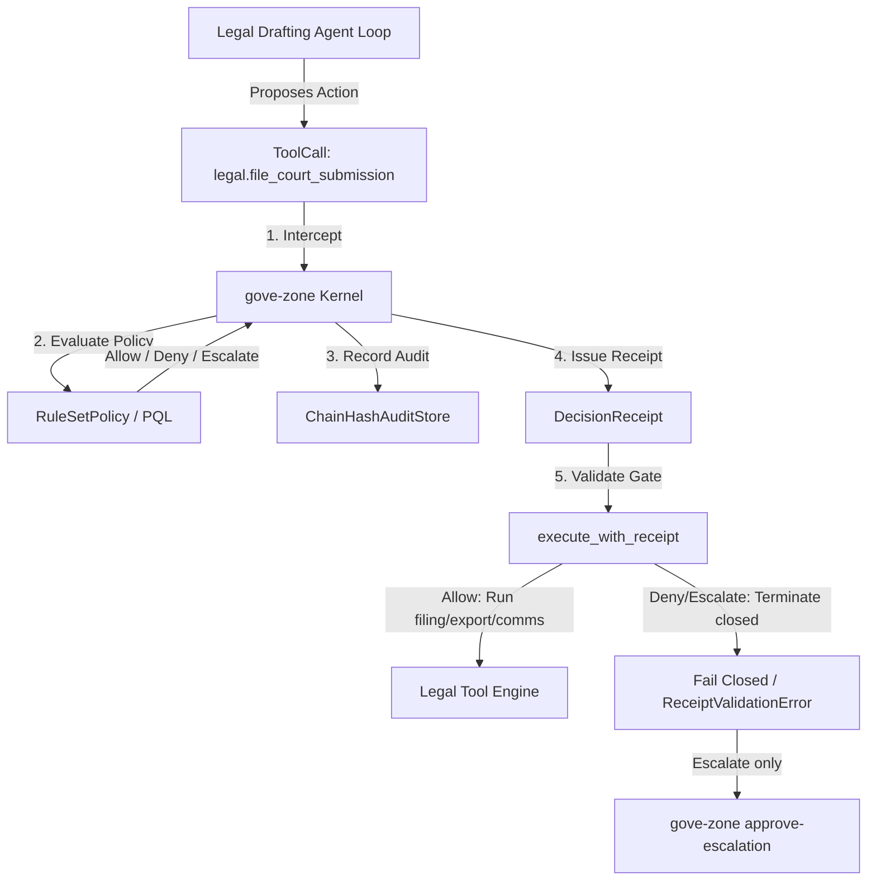

# Governing AI Legal Drafting & Discovery Agents: Case Study

Status: Case Study / Design Note
Supplements: `docs/design/sandbox-isolation-and-call-time-governance.md`
Drivers: Demonstrate how to apply `gove-zone` call-time policies and receipt-gated execution to
a legal drafting/discovery agent capable of drafting documents, filing court submissions,
accessing attorney-client privileged material, messaging clients, and exporting discovery sets.

---

## 1. Context: The Legal Drafting & Discovery Agent

A legal drafting/discovery agent automates routine matter work for a firm or in-house legal
team by orchestrating:
1. **Document drafting**: Generating contracts, motions, and other work product from matter
   context and templates.
2. **Court and regulatory filing**: Submitting drafted documents to courts or regulators —
   an irreversible, externally visible action.
3. **Privileged material access**: Reading attorney-client privileged documents scoped to a
   specific matter.
4. **Client communication**: Drafting and sending status updates or advice to clients.
5. **Discovery export**: Assembling and writing discovery sets to shared or external
   locations for production.

Because several of these actions are irreversible (a court filing cannot be un-filed), carry
professional-responsibility stakes (privilege waiver, unauthorized practice, unsupervised
client advice), or risk leaking privileged material, placing an autonomous agent in control of
this action set without governance poses real legal, ethical, and reputational risk.

---

## 2. High-Risk Side-Effects & Hazards

Running a legal drafting/discovery agent ungoverned exposes the firm and its clients to
several classes of hazard:

### A. Unauthorized or Premature Filing
*   **Court/Regulatory Submissions**: An agent that files motions, briefs, or regulatory
    responses without attorney sign-off can bind the client to an unreviewed position, miss a
    procedural requirement, or waive an argument — with no practical way to retract the filing.

### B. Privilege and Ethical-Wall Violations
*   **Cross-Matter Privileged Access**: An agent that can read privileged material outside the
    matter it is scoped to (e.g. due to a conflict, an ethical wall, or a former-client
    restriction) risks an inadvertent privilege waiver or a disqualifying conflict.

### C. Unsupervised Client Communication
*   **Unreviewed or Non-Attorney Advice**: Sending draft legal advice to a client before
    attorney review, or having a non-attorney actor send communications that read as legal
    advice, creates malpractice and unauthorized-practice-of-law exposure.

### D. Discovery Leakage via Filesystem Egress
*   **Discovery Set Exports**: An agent that writes discovery productions to shared or
    unmanaged mount points (rather than the matter's controlled export location) can expose
    privileged or confidential material to parties who should never see it.

---

## 3. The Interception Boundary

To govern the legal drafting/discovery agent, `gove-zone` intercepts execution at the
**tool-dispatch membrane**, ensuring that no filing, privileged-document read, client message,
or discovery export proceeds without a valid, cryptographically verifiable `DecisionReceipt`.



### ToolCall Schema Mapping
Before executing any tool, the agent's orchestrator converts the proposed action into a
structured `ToolCall`:
- `legal.draft_document`: `{"matter_id": "M-1001", "doc_type": "motion_to_compel"}`
- `legal.file_court_submission`: `{"matter_id": "M-1001", "court": "N.D. Cal.", "document_id": "doc-501"}`
- `legal.access_privileged_docs`: `{"matter_id": "M-1001", "doc_id": "priv-12"}`
- `legal.send_client_communication`: `{"matter_id": "M-1001", "client_id": "client-acme", "body": "..."}`
- `legal.export_discovery`: `{"matter_id": "M-1001", "output_dir": "./exports"}`

---

## 4. Declaring Governance Policies for the Legal Agent

We enforce fine-grained safety boundaries using `RuleSetPolicy` bundles. The policy below
requires supervising-attorney sign-off for filings, enforces an ethical wall on privileged
material, blocks unreviewed or non-attorney client communications, and locks discovery exports
to the matter's managed output location.

### Policy Configuration Example

```json
{
  "id": "policy-legal-drafting-governance",
  "rules": [
    {
      "id": "ESCALATE_COURT_SUBMISSION_NON_ATTORNEY",
      "effect": "escalate",
      "tools": ["legal.file_court_submission"],
      "allow": {
        "trust_tiers": ["supervising-attorney"]
      },
      "reason": "Court and regulatory filings require supervising-attorney sign-off before submission."
    },
    {
      "id": "DENY_PRIVILEGED_ACCESS_OUTSIDE_SCOPE",
      "effect": "deny",
      "tools": ["legal.access_privileged_docs"],
      "state_equals": {
        "outside_matter_scope": true
      },
      "reason": "Attorney-client privileged material cannot be accessed outside the matter's ethical-wall scope."
    },
    {
      "id": "DENY_UNREVIEWED_CLIENT_COMMS",
      "effect": "deny",
      "tools": ["legal.send_client_communication"],
      "state_equals": {
        "unreviewed": true
      },
      "reason": "Unreviewed draft communications cannot be sent to clients without a QC pass."
    },
    {
      "id": "ESCALATE_CLIENT_COMMS_NON_ATTORNEY",
      "effect": "escalate",
      "tools": ["legal.send_client_communication"],
      "allow": {
        "trust_tiers": ["attorney", "supervising-attorney"]
      },
      "reason": "Reviewed client communications still require an attorney-tier sender before sending."
    },
    {
      "id": "DENY_DISCOVERY_EXPORT_TO_PRIVILEGED_MOUNT",
      "effect": "deny",
      "tools": ["legal.export_discovery"],
      "path_prefix": "/mnt/privileged",
      "reason": "Discovery exports cannot be written to privileged/shared mount paths."
    }
  ]
}
```

Note that `RuleSetPolicy` has no `allow` *effect* — every rule is `deny` or `escalate`, and
positive authorization is expressed as an explicit actor/trust-tier exemption on the rule
itself (the `allow` block). A call that matches no rule, or is exempted from every matching
rule, defaults to ALLOW. `legal.draft_document` has no governing rule in this bundle, so it is
always ALLOW — drafting itself is low-risk; the gate is on the downstream irreversible actions.

---

## 5. Execution Gate Mechanics

The legal agent runner wraps all sensitive side-effectful capabilities inside
`execute_with_receipt` gates. Under production profiles (`require_signature=True`), this
guarantees that policies were evaluated by the authorized `Validator` and that the receipt
contents are tamper-evident. Both `DENY` and `ESCALATE` receipts fail closed at this gate — an
`ESCALATE` receipt cannot authorize execution on its own; it means the action requires human
approval (via `gove-zone approve-escalation`) before it can resume.

```python
from gove_zone import execute_with_receipt, DecisionReceipt

def run_court_submission(matter_id: str, court: str, document_id: str):
    # Real filing-system integration
    return {"status": "success", "filed": True}

def governed_court_submission(receipt: DecisionReceipt, matter_id: str, court: str, document_id: str):
    return execute_with_receipt(
        tool_fn=run_court_submission,
        args={
            "matter_id": matter_id,
            "court": court,
            "document_id": document_id,
        },
        receipt=receipt,
        expected_tenant_id="tenant-legal-ops",
        expected_execution_boundary="legal-drafting-sandbox",
        expected_action="legal.file_court_submission",
        expected_actor="attorney-jane",
        require_signature=False  # Set to True in production to verify signature
    )
```

---

## 6. Verification and Replay

Every intercepted tool execution compiles into a hash-chained `ChainHashAuditStore` event
record. During matter audits or malpractice-defense review:
1. The auditor verifies the cryptographic integrity of the hash chain.
2. The replay engine re-evaluates the historical state against the active policy bundle to
   confirm that no filing, privileged-document access, client communication, or discovery
   export ever bypassed the execution membrane.

---

## 7. Runnable Proof

The scenarios above are exercised end-to-end by an executable demo that runs against the
current `gove-zone` kernel (tempdir-only, no external state):

```bash
uv run --package gove-zone python examples/governed_legal_drafting/demo.py
```

It walks ten ALLOW/DENY/ESCALATE scenarios, asserts each governance invariant, and verifies the
tamper-evident audit chain — printing a single JSON status report to stdout (human-readable
scenario diagnostics go to stderr) and exiting non-zero if any invariant is violated. The demo
is kept from rotting by `tests/docs/test_docs_and_examples.py`.

This demo uses mock tools and unsigned dev-mode receipts (`require_signature=False`). It proves
executor placement and fail-closed behavior for a legal-agent policy shape; it does not prove
bar approval, regulator certification, attorney-supervision-rule compliance, or production
deployment.
