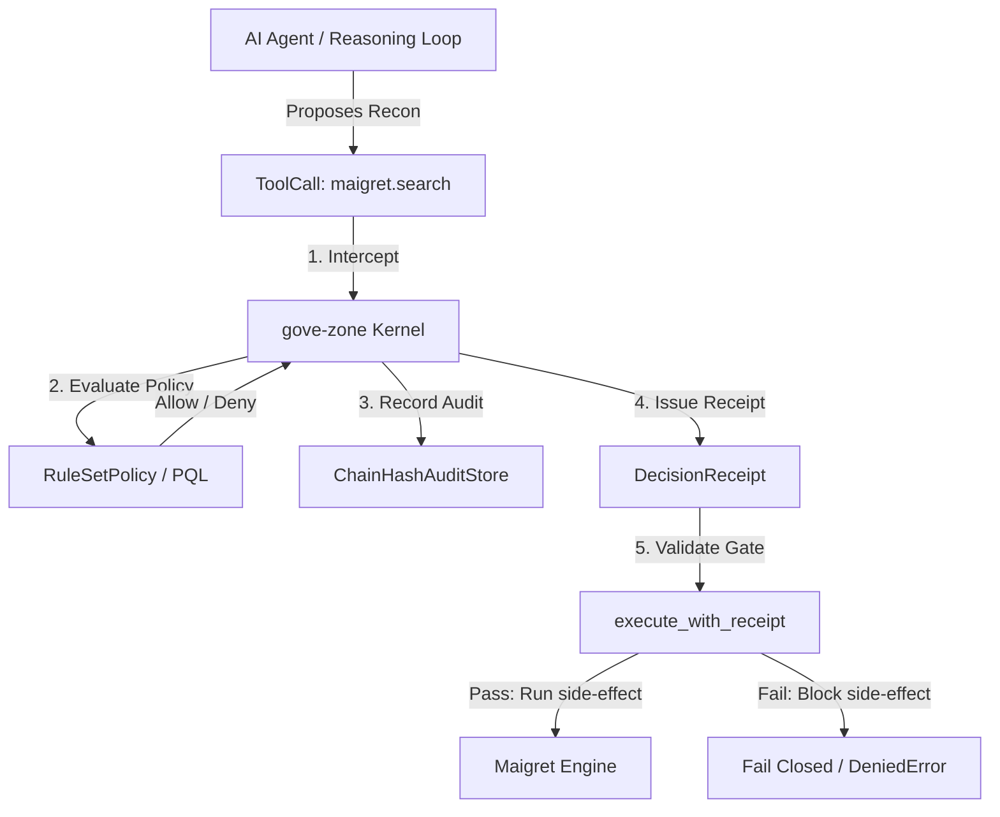

# Governing Reconnaissance Agents: Case Study of Maigret OSINT Tool

Status: Case Study / Design Note
Supplements: `docs/design/sandbox-isolation-and-call-time-governance.md`
Drivers: Demonstrate how to apply `gove-zone` call-time policies and receipt-gated execution to highly active OSINT scraping agents using the Maigret username-reconnaissance engine.

---

## 1. Context: The Maigret OSINT Engine

[Maigret](https://github.com/soxoj/maigret.git) is a powerful, recursive OSINT (Open Source Intelligence) tool designed to collect a dossier on a subject based solely on a username. Forked from Sherlock, Maigret extends reconnaissance by:
1. **Scanning 3,000+ sites** via dynamic DB updates to determine if a username exists.
2. **Recursively extracting metadata** (names, IDs, links, locations, linked accounts) from discovered profile pages.
3. **Retrieving profiles from Tor (.onion) and I2P domains**.
4. **Generating summaries using LLMs** (via OpenAI-compatible APIs).
5. **Writing report files** in HTML, PDF, JSON, and TXT formats.

While highly effective for OSINT research, running an autonomous agent equipped with Maigret presents severe security, compliance, and operational risks.

---

## 2. High-Risk Side-Effects & Hazards

When an AI agent uses Maigret, it triggers side-effects across multiple layers:

### A. Network Egress Side-Effects (High Volume & Information Disclosure)
*   **High-Volume Scrapes:** Scanning hundreds or thousands of sites sequentially can trigger site-scraping blocks, blocklist the executing IP, and violate third-party Terms of Service.
*   **Tor and I2P Routing:** Interacting with darknet domains can breach organizational compliance policies.
*   **LLM API Exfiltration:** The `--ai` summary option sends scraped profile data to external APIs, potentially disclosing sensitive personal identifiable information (PII).

### B. Category & Domain Hazards
*   Maigret indexes sites of all categories. An agent searching for a username on dating, financial, gaming, or adult sites could lead to inappropriate content exposure, compliance violations, or unintended reputational damage.

### C. Filesystem Side-Effects
*   Maigret writes reports (`.html`, `.pdf`, `.json`) containing aggregated intelligence. Left ungoverned, an agent could write these reports to public directories or sensitive internal mounts.

---

## 3. The Interception Boundary

To govern Maigret, `gove-zone` intercepts its actions **before** execution. We support two primary integration patterns depending on how the agent triggers Maigret.



### Pattern A: Library API Interception (Recommended)
Rather than executing raw CLI strings, the agent calls Maigret via a Python tool wrapper. This provides a structured, type-safe schema that maps directly to a `ToolCall`:

```python
# The schema exposed to the agent as a tool
def search_username(
    username: str,
    tags: list[str] | None = None,
    output_dir: str = "./reports",
    use_ai: bool = False
) -> dict:
    ...
```

This maps to `gove_zone.tool.ToolCall` as:
*   `name`: `"maigret.search"`
*   `args`: `{"username": username, "tags": tags, "output_dir": output_dir, "use_ai": use_ai}`

### Pattern B: CLI Execution Interception
If the agent runs Maigret as a shell command (e.g. `maigret <username>`), the `shell.exec` or `subprocess.run` tool is intercepted. The command string is parsed to reconstruct the parameters:

*   `name`: `"shell.exec"`
*   `args`: `{"cmd": "maigret martin_dev --tags coding,social --folder /safe/reports"}`

---

## 4. Declaring Governance Policies for Maigret

We enforce policies using `RuleSetPolicy` bundles. Rules can restrict the target usernames, categories of sites, output folders, and AI integrations.

### Policy Configuration Example

```json
{
  "id": "policy-recon-governance",
  "rules": [
    {
      "id": "DENY_SYSTEM_USERNAMES",
      "effect": "deny",
      "tools": ["maigret.search"],
      "state_contains": {
        "restricted_usernames": ["admin", "root", "administrator", "system", "support"]
      },
      "reason": "Searching for system administration usernames is prohibited."
    },
    {
      "id": "RESTRICT_SENSITIVE_CATEGORIES",
      "effect": "deny",
      "tools": ["maigret.search"],
      "state_contains": {
        "restricted_tags": ["dating", "adult", "finance"]
      },
      "allow": {
        "trust_tiers": ["elevated"]
      },
      "reason": "Standard agents are blocked from searching dating, adult, or financial sites."
    },
    {
      "id": "RESTRICT_OUTPUT_DIRECTORY",
      "effect": "deny",
      "tools": ["maigret.search"],
      "path_prefix": ["/opt/secure/secrets"],
      "reason": "Reports cannot be written to secure secrets directory paths."
    },
    {
      "id": "BLOCK_RECON_AI_SUMMARY",
      "effect": "deny",
      "tools": ["maigret.search"],
      "state_equals": {
        "use_ai": true
      },
      "allow": {
        "actors": ["lead-investigator"]
      },
      "reason": "Only the lead-investigator actor may run AI-based profile summarization."
    }
  ]
}
```

---

## 5. Execution Gate Mechanics

Before the Maigret search executes, the runner verifies the receipt. Under `require_signature=True`, this ensures that the receipt has not been tampered with and was issued by a trusted validator.

```python
from gove_zone import execute_with_receipt, DecisionReceipt

# The real function executing Maigret
def run_maigret_search(username: str, tags: list[str], output_dir: str, use_ai: bool):
    # Real Maigret search logic here
    return {"status": "success", "username": username, "results": []}

# Intercepted wrapper
def governed_search(receipt: DecisionReceipt, username: str, tags: list[str], output_dir: str, use_ai: bool):
    return execute_with_receipt(
        tool_fn=run_maigret_search,
        args={
            "username": username,
            "tags": tags,
            "output_dir": output_dir,
            "use_ai": use_ai
        },
        receipt=receipt,
        expected_tenant_id="tenant-security-ops",
        expected_execution_boundary="maci-sandbox",
        expected_action="maigret.search",
        expected_actor="recon-agent-1",
        require_signature=False # Set to True in production with a public key verifier
    )
```

---

## 6. Verification and Replay

Every Maigret search evaluation is saved in the `ChainHashAuditStore` as a hash-chained, tamper-evident event. When auditing past investigations, the replay engine ensures that:
1. The exact same arguments were evaluated.
2. The rules configured in the policy at that time yielded the exact same `ALLOW`, `DENY`, or `TRANSFORM` decision.

This establishes a high-fidelity audit trail proving that the agent never queried unpermitted domains or usernames.
