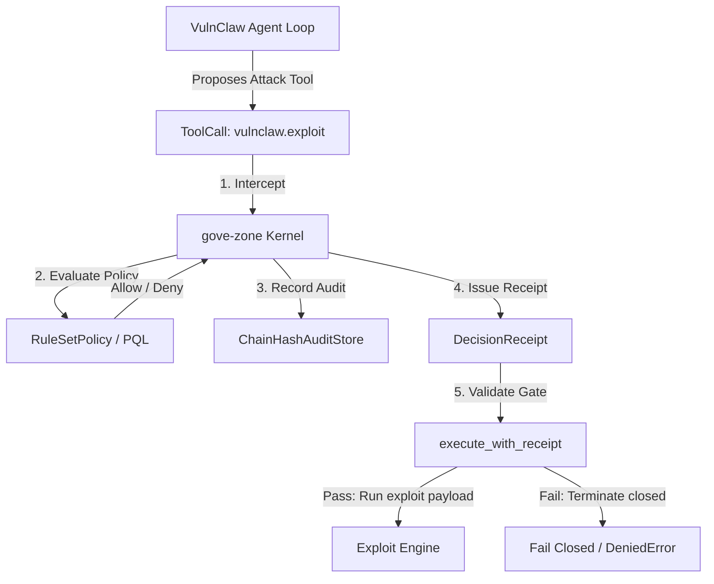

# Governing AI Penetration Testing Agents: Case Study of VulnClaw

Status: Case Study / Design Note
Supplements: `docs/design/sandbox-isolation-and-call-time-governance.md`
Drivers: Demonstrate how to apply `gove-zone` call-time policies and receipt-gated execution to highly privileged penetration testing agents (like VulnClaw) capable of reconnaissance, target exploitation, arbitrary local code execution, and report generation.

---

## 1. Context: The VulnClaw Pentesting Engine

[VulnClaw](https://github.com/Unclecheng-li/VulnClaw.git) is an open-source, AI-powered penetration testing CLI tool. It automates security assessments by orchestrating:
1. **Model Context Protocol (MCP) Toolchains**: Connecting LLMs directly to browser automation, local file search, network scanning, and reverse-engineering services.
2. **Pentest Skill Dispatcher**: Selectively loading detailed methodology references (e.g. Android/Web security guides, CTF crypto toolkits).
3. **Autonomous Loops**: A goal-driven attack planner that persistently reconnoiters, scans, exploits targets, and generates structured reports and Python PoC scripts.

Because VulnClaw is designed to discover and exploit vulnerabilities, placing an autonomous agent in control of its command loop without governance poses extreme operational, legal, and safety risks.

---

## 2. High-Risk Side-Effects & Hazards

Running VulnClaw exposes the host environment and target networks to severe hazards:

### A. Network Egress and Target Disruptions
*   **High-Volume Scans**: Port scanning (Nmap) and path enumeration can crash unstable target systems, exhaust system resources, and trigger network-level IDS blocks.
*   **Active Exploitation**: Sending SQL injection, command injection, or buffer overflow payloads to verify CVEs could corrupt production databases or lead to unintended denial-of-service (DoS).

### B. High-Risk Local Code Execution
*   **Arbitrary Python Execution**: VulnClaw includes a built-in `python_execute` tool, allowing the reasoning LLM to dynamically write and execute Python code on the host machine to parse responses or craft custom payloads. Without strict isolation, this can lead to remote code execution (RCE) on the pentesting runner itself.

### C. Filesystem Write Egress
*   **Report and PoC Generation**: VulnClaw writes pentest reports and executable Python PoC scripts to the local filesystem. Left ungoverned, the agent might write these assets to sensitive mounts (e.g., system configuration directories or shared cloud volumes), exposing exploit details.

---

## 3. The Interception Boundary

To govern VulnClaw, `gove-zone` intercepts execution at the **tool-dispatch membrane**, ensuring that no scan, exploit, or script execution proceeds without a valid, cryptographically verifiable `DecisionReceipt`.



### ToolCall Schema Mapping
Before executing any tool, VulnClaw's orchestrator converts the proposed action into a structured `ToolCall`:
- `vulnclaw.port_scan`: `{"target": "10.0.0.5", "ports": [22, 80, 443]}`
- `vulnclaw.exploit`: `{"target": "10.0.0.5", "cve_id": "CVE-2024-1234", "payload": "id"}`
- `vulnclaw.python_execute`: `{"script_body": "import sys; print(sys.version)"}`
- `vulnclaw.generate_report`: `{"output_dir": "./reports", "format": "markdown"}`

---

## 4. Declaring Governance Policies for VulnClaw

We enforce fine-grained safety boundaries using `RuleSetPolicy` bundles. The policy below restricts target scope, confines exploitation capabilities, blocks unsandboxed local command execution, and locks report directories.

### Policy Configuration Example

```json
{
  "id": "policy-vulnclaw-governance",
  "rules": [
    {
      "id": "DENY_UNAUTHORIZED_TARGETS",
      "effect": "deny",
      "tools": ["vulnclaw.port_scan", "vulnclaw.exploit"],
      "state_equals": {
        "is_unauthorized_target": true
      },
      "reason": "Scanning or exploiting targets outside the authorized scoping boundary is prohibited."
    },
    {
      "id": "RESTRICT_EXPLOITATION_TO_ADMINS",
      "effect": "deny",
      "tools": ["vulnclaw.exploit"],
      "allow": {
        "actors": ["elevated-administrator", "system-operator"]
      },
      "reason": "Standard agent actors are restricted from triggering target exploitation payloads."
    },
    {
      "id": "BLOCK_LOCAL_PYTHON_EXECUTION",
      "effect": "deny",
      "tools": ["vulnclaw.python_execute"],
      "allow": {
        "trust_tiers": ["system-admin"]
      },
      "reason": "Arbitrary local Python code execution is blocked for standard and elevated security agents."
    },
    {
      "id": "RESTRICT_REPORT_DIRECTORY",
      "effect": "deny",
      "tools": ["vulnclaw.generate_report"],
      "path_prefix": ["/etc", "/var", "/opt/secure/secrets"],
      "reason": "Pentesting reports and PoC scripts cannot be written to secure system directory paths."
    }
  ]
}
```

---

## 5. Execution Gate Mechanics

The VulnClaw runner wraps all sensitive side-effectful capabilities inside `execute_with_receipt` gates. Under production profiles (`require_signature=True`), this guarantees that policies were evaluated by the authorized `Validator` and that the receipt contents are tamper-evident.

```python
from gove_zone import execute_with_receipt, DecisionReceipt

def run_exploit(target: str, cve_id: str, payload: str):
    # Real exploit execution code
    return {"status": "success", "exploit_delivered": True}

def governed_exploit(receipt: DecisionReceipt, target: str, cve_id: str, payload: str):
    return execute_with_receipt(
        tool_fn=run_exploit,
        args={
            "target": target,
            "cve_id": cve_id,
            "payload": payload
        },
        receipt=receipt,
        expected_tenant_id="tenant-security-ops",
        expected_execution_boundary="maci-sandbox",
        expected_action="vulnclaw.exploit",
        expected_actor="recon-agent-1",
        require_signature=False  # Set to True in production to verify signature
    )
```

---

## 6. Verification and Replay

Every intercepted tool execution compiles into a hash-chained `ChainHashAuditStore` event record. During forensic reviews:
1. The auditor verifies the cryptographic integrity of the hash chain.
2. The replay engine re-evaluates the historical state against the active policy bundle to ensure that no unauthorized vulnerability scans or exploit scripts ever bypassed the execution membrane.

---

## 7. Runnable Proof

The scenarios above are exercised end-to-end by an executable demo that runs against the current `gove-zone` kernel (tempdir-only, no external state):

```bash
uv run --package gove-zone python packages/gove-zone/examples/governed_vulnclaw_demo.py
```

It walks the eight allow/deny scenarios, asserts each governance invariant, and verifies the tamper-evident audit chain — exiting non-zero if any invariant is violated. The demo is kept from rotting by `packages/gove-zone/tests/test_examples_run.py`.
