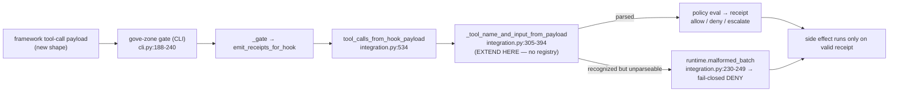

# feat: Skill Forge contribution runbooks (adapter + policy-bundle)

## Summary

Borrow the one load-bearing idea from the Hermes Repo Dojo article — **Skill Forge**: turn an implicit, reverse-engineered contribution procedure into an explicit, copy-followable runbook. Produce **two** vendor-neutral markdown runbooks under `docs/runbooks/` and wire them for discovery. This directly unblocks the runtime-adapter good-first-issues already advertised in `CONTRIBUTING.md`, and enforces the handler-wiring + fail-closed rules at *authoring* time instead of only at review time.

Scope was validated and amended by a CCA review (Codex GPT-5 on correctness/wiring + agy on governance) — both lanes returned **AMEND, plan shape correct**. The amendments are baked into this plan: the claims runbook is cut, the blog cross-reference is deferred, and the adapter runbook's test/registry framing is corrected to match the actual code.

---

## Problem Frame

Three of the "good first issues" in `CONTRIBUTING.md` (CrewAI / AutoGen / LlamaIndex tool-call normalization) are the *same shape*, but the pattern they must follow is implicit — a contributor has to reverse-engineer it from `packages/gove-zone/src/gove_zone/integration.py` plus its tests. Worse, the obvious-but-wrong mental model ("register a new adapter, add a parser unit test") produces a contribution that is **dead code**: a parser never reached by the inbound gate path, with no fail-closed behavior. The same gap exists, more mildly, for contributing a policy bundle.

A runbook closes the gap *only if it is accurate*. The CCA review found the eval's first-pass framing had three inaccuracies that the runbook must not inherit (no adapter registry exists; the correct test is a CLI-gate enforcement test, not a "dispatcher-level" parser test; `docs/CLAIMS.md` has no "Update Procedure" to codify).

---

## Requirements

- **R1.** Produce `docs/runbooks/add-a-runtime-adapter.md` that an external contributor can follow to land one of the advertised adapter good-first-issues without reverse-engineering `integration.py`.
- **R2.** The adapter runbook must encode the **fail-closed** contract (`runtime.malformed_batch`) and the **handler-wiring** rule ("the gate/executor enforces, not the adapter"; an unwired parser is dead code), so a contributor following it cannot ship a fail-open or unreachable adapter.
- **R3.** Produce `docs/runbooks/add-a-policy-bundle.md` scoped to bundle *shape* + fixture/gate tests only — explicitly **not** policy lifecycle/registry (which the code does not yet support).
- **R4.** Make both runbooks discoverable, with at least one link that the `tests/docs` link checker validates (so a broken/renamed runbook link fails CI).
- **R5.** All claims in both runbooks trace to real code/tests at cited `file:line`; no overclaim, no implied capability that does not ship (claim discipline).
- **R6.** `uv run python -m pytest tests/docs --import-mode=importlib -q` and `make lint-docs` stay green.

Traceability: R1–R2 → U1; R3 → U2; R4 → U3; R5 → U1, U2 (authoring discipline) + U4 (verification); R6 → U4.

---

## Key Technical Decisions

- **KTD-1: Vendor-neutral markdown runbooks, not `.claude/skills/`.** Matches ACGS's vendor-neutral positioning and the existing `docs/runbooks/` convention (`submodule-token.md`). A Claude-only skill would couple contributor onboarding to one agent vendor. (Both CCA lanes agreed.)
- **KTD-2: No adapter registry — extend the hardcoded parse/expand branches.** Per Codex review, adding a framework today means extending `_tool_name_and_input_from_payload` (`integration.py:305-394`) and batch expansion (`integration.py:252-302`); there is no plugin registry. The runbook must say this plainly so contributors don't look for (or invent) one. (see origin: `docs/internal/HERMES_DOJO_ONBOARDING_EVALUATION.md` §3)
- **KTD-3: The required test is a CLI-gate enforcement test + a `runtime.malformed_batch` negative-path test — not a parser-only unit test called "dispatcher-level".** The real inbound path is `gove-zone gate → _gate → emit_receipts_for_hook → tool_calls_from_hook_payload` (`cli.py:188-240`). A parser unit test (`test_integration_hook.py:287-396`) does not prove the new shape is reached by the gate; the gate-level test (pattern: `test_setup.py:220-274`, `test_setup.py:407-457`) does. (Codex, correctness/wiring lane.)
- **KTD-4: Distinguish "parser-shape contribution" from "full host adapter".** The advertised good-first-issue is a *parser shape* (normalize a framework's payload). A *real* framework adapter additionally requires proof that the framework's execution path calls the gate before the raw tool runs — `integration.py` provides no host registration, so an unwired parser is dead code (handler-wiring rule). The runbook must scope the good-first-issue to the parser shape and flag host-wiring as the larger, separate effort.
- **KTD-5: Discoverability via a link in a `REQUIRED_DOCS`-scanned doc, plus the human home in `CONTRIBUTING.md`.** Codex confirmed `tests/docs` has **no** orphan-doc check and the link checker scans only `REQUIRED_DOCS` + example READMEs (`test_docs_and_examples.py:161-172`). A link in `CONTRIBUTING.md` aids humans but is not CI-validated unless `CONTRIBUTING.md` is in `REQUIRED_DOCS`; a link in a confirmed `REQUIRED_DOCS` doc (e.g. `docs/INTEGRATION_GUIDE.md`) *is* validated. Add both; the validated one satisfies R4.
- **KTD-6: Defer the blog "denylist guardrail" cross-reference to a separate positioning PR.** It is claim-sensitive (non-attack + claim discipline) and would couple low-risk onboarding docs with high-stakes positioning copy. (agy, governance lane.)

---

## High-Level Technical Design

The adapter runbook's central job is to point the contributor at the *gate path*, not just the parser, so the test they write proves the new shape is actually enforced. The inbound path the runbook must describe:

The runbook's "what to test" section maps to this diagram: the **CLI-gate enforcement test** exercises A→H (a denied/blocked new-shape payload returns a blocking decision), and the **malformed-batch negative test** exercises A→F (a recognized-but-unparseable child fails closed). A parser-only unit test stops at E and proves nothing about enforcement. *(Directional — the runbook author picks exact fixtures.)*

---

## Scope Boundaries

In scope: two markdown runbooks + their discovery links + a green docs gate.

### Deferred to Follow-Up Work

- **Blog "denylist guardrail" cross-reference** in `docs/blog/2026-06-receipts-vs-guardrails-*.md` — separate positioning PR, under claim discipline (KTD-6).
- **A real host adapter** (CrewAI/AutoGen/LlamaIndex execution-path wiring that calls the gate) — the runbook *documents* this as the larger effort; building one is its own feature, not this docs plan.
- **An `AGENTS.md` "Runbooks" index section** — nice-to-have human discovery; include only if it falls out naturally in U3, otherwise defer.

### Out of scope (cut)

- **`docs/runbooks/add-or-change-a-claim.md`** — cut by CCA. `docs/CLAIMS.md` has only a public-wording rule (`CLAIMS.md:35-37`), no numbered Update Procedure to codify (that lives in `acgi-ai/CLAIM_VALIDATION.md`); and claim curation is a maintainer duty, not an onboarding flow.
- Auto-generating Repo DNA / Architecture Mapping / Brain Replay — already covered better by hand (`AGENTS.md`, `llms.txt`, `docs/START_HERE.md`).

---

## Implementation Units

### U1. Write `docs/runbooks/add-a-runtime-adapter.md`

**Goal:** A copy-followable runbook for the runtime-adapter good-first-issues that bakes in the fail-closed + handler-wiring contracts.

**Requirements:** R1, R2, R5.

**Dependencies:** none.

**Files:**
- `docs/runbooks/add-a-runtime-adapter.md` (create)

**Approach:** Structure the runbook around the gate path (see High-Level Technical Design), not the parser in isolation. Required sections:
1. **What this unblocks** — name the CrewAI/AutoGen/LlamaIndex good-first-issues; scope them to the *parser-shape* contribution (KTD-4).
2. **Where to edit (no registry)** — point at `_tool_name_and_input_from_payload` (`integration.py:305-394`) and batch expansion (`integration.py:252-302`). State explicitly there is no adapter registry (KTD-2).
3. **The fail-closed rule** — a recognized-but-unparseable batch child must become `runtime.malformed_batch` (`integration.py:230-249`, `:500-518`); never silently drop or fall through. State "the gate/executor enforces the decision, not the adapter; the adapter only normalizes shape" (R2).
4. **The tests you must add** — a CLI-gate enforcement test (pattern: `test_setup.py:220-274`) **and** a malformed-batch negative test (pattern: `test_setup.py:407-457`). Explicitly say a parser-only unit test is necessary but **not sufficient** (KTD-3).
5. **Real host adapter vs parser shape** — if wiring an actual framework, you must prove its execution path calls the gate before the raw tool runs, or the parser is dead code (KTD-4, handler-wiring rule). Mark this as the larger separate effort.
6. **Run the gate** — the package-local validation command (`uv run --package gove-zone python -m pytest packages/gove-zone/tests --import-mode=importlib -q`).

**Patterns to follow:** tone/format of `docs/runbooks/submodule-token.md`; the good-first-issue framing already in `CONTRIBUTING.md`; the handler-wiring rubric in `~/.claude/rules/review-handler-wiring.md`.

**Test scenarios:**
- Test expectation: none (documentation unit) — verification is accuracy + gate-green, handled in U4. Specifically: every `file:line` and command cited in the runbook must resolve against the current tree, and the "tests you must add" section must reference test patterns that actually exist (`test_setup.py` gate tests, not invented names).

**Verification:** A reader can map each runbook step to a real symbol/test in the repo; no cited path is stale; the runbook never instructs an action that would fail open or leave a parser unwired.

---

### U2. Write `docs/runbooks/add-a-policy-bundle.md`

**Goal:** A runbook for contributing a reviewed `RuleSetPolicy` bundle + its fixture/gate test, scoped to what the code actually supports.

**Requirements:** R3, R5.

**Dependencies:** none.

**Files:**
- `docs/runbooks/add-a-policy-bundle.md` (create)

**Approach:** Scope strictly to bundle *shape* + tests. Required content:
1. **Bundle shape** — `RuleSetPolicy.from_dict` with `deny`/`escalate` effects only; positive authorization is exemption-based (`allow.actors` / `allow.trust_tiers`), not an `allow` effect (`policy.py:282-289`, `:406-412`, `:499-526`). Show the canonical export/inspect commands (`gove-zone policy export` / `inspect`, `cli.py:276-309`).
2. **The test you must add** — a fixture test asserting the intended allow/deny/escalate decisions, and a CLI-gate test that the bundle blocks the side effect (pattern: `test_policy_bundle_io.py:33-106`, `test_setup.py:173-217`).
3. **Explicit non-goals** — no policy lifecycle/active-stale-revoked registry; that is not implemented (`SECURITY_MODEL.md:24`). Keep the contribution to a single reviewed bundle.

**Patterns to follow:** `docs/runbooks/submodule-token.md` format; the policy good-first-issue text in `CONTRIBUTING.md`; the `RuleSetPolicy` example in `packages/gove-zone/README.md`.

**Test scenarios:**
- Test expectation: none (documentation unit) — verification in U4. Cited symbols/commands (`RuleSetPolicy.from_dict`, `gove-zone policy export/inspect`, the named test files) must resolve; the runbook must not imply lifecycle/registry support.

**Verification:** A contributor following it produces a bundle + tests that pass the package-local gate, and is not led toward unsupported lifecycle features.

---

### U3. Wire discoverability links

**Goal:** Make both runbooks findable, with at least one CI-validated link.

**Requirements:** R4.

**Dependencies:** U1, U2 (the link targets must exist or the checker fails).

**Files:**
- `CONTRIBUTING.md` (modify — link the runbooks from the relevant good-first-issue bullets)
- One `REQUIRED_DOCS`-scanned doc (modify) — **verify the list at `tests/docs/test_docs_and_examples.py:12-33` first**; `docs/INTEGRATION_GUIDE.md` is the natural candidate for the adapter runbook. The validated link here satisfies R4.
- `AGENTS.md` (optional — a short "Runbooks" pointer; defer if it doesn't fall out naturally)

**Approach:** In `CONTRIBUTING.md`, link `add-a-runtime-adapter.md` from the CrewAI/AutoGen/LlamaIndex bullets and `add-a-policy-bundle.md` from the policy bundle bullet. Add a link from a confirmed `REQUIRED_DOCS` doc so the link checker enforces resolution. Keep wording claim-safe (these are contribution procedures, not capability claims).

**Patterns to follow:** existing relative-link style in `CONTRIBUTING.md` and `docs/START_HERE.md` "Where to go next".

**Test scenarios:**
- The link checker (`test_docs_and_examples.py:161-172`) passes with the new links present (proves the validated link resolves).
- Negative: a deliberately broken link in the scanned doc would fail the checker — confirms R4's "broken runbook link fails CI" property (verify mentally/by the checker's behavior; do not commit the broken link).

**Verification:** `tests/docs` passes with the links in place; the runbooks are reachable from both the contributor path (`CONTRIBUTING.md`) and a scanned doc.

---

### U4. Verify docs gates green

**Goal:** Confirm the whole change keeps the documentation gates green and the cited facts hold.

**Requirements:** R5, R6.

**Dependencies:** U1, U2, U3.

**Files:** none (verification unit).

**Approach:** Run the doc gates and spot-check that the runbooks' cited `file:line` references still resolve (they are line-stable references to current code, but the executor should confirm post-write).

**Test scenarios:**
- `uv run python -m pytest tests/docs --import-mode=importlib -q` → passes (baseline was `7 passed`).
- `make lint-docs` → passes (governance index + AI governance hub docs validation).
- Spot-check: grep the runbooks for cited symbols (`_tool_name_and_input_from_payload`, `runtime.malformed_batch`, `RuleSetPolicy`) and confirm each still exists in the cited file.

**Verification:** Both gate commands exit 0 with literal output captured; no stale citation remains.

---

## Sources & Research

- **Origin / eval:** `docs/internal/HERMES_DOJO_ONBOARDING_EVALUATION.md` (§3 adapter pattern + CCA corrections, §4 blog/positioning, §5 recommendation table).
- **CCA review artifacts (2026-06-07):** Codex GPT-5 correctness/wiring lane and agy governance/critic lane — both VERDICT **AMEND, plan shape correct**. Codex findings are line-cited against `integration.py`, `cli.py`, `policy.py`, `test_setup.py`, `test_docs_and_examples.py`, `Makefile`. agy artifact: `.omc/artifacts/ask/agy-research-critic-lane-*.md`.
- **Code ground truth:** `packages/gove-zone/src/gove_zone/integration.py`, `cli.py`, `policy.py`; tests `test_setup.py`, `test_integration_hook.py`, `test_policy_bundle_io.py`; gate `tests/docs/test_docs_and_examples.py`; `Makefile:130-132` (`lint-docs`).
- **Conventions:** `docs/runbooks/submodule-token.md` (runbook format), `CONTRIBUTING.md` (good-first-issues), `~/.claude/rules/review-handler-wiring.md` (wiring rubric).
- **Gate baseline (pre-change, captured this session):** `tests/docs` → `7 passed`; `make lint-docs` → passed.
