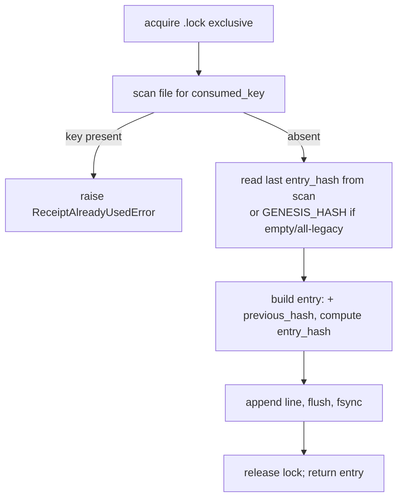

# feat: Tamper-evident consumption ledger (hash-chained single-use record)

> **Target:** `packages/gove-zone` on **master**. Implement on a fresh feature branch cut from `master` (the consumption feature `1c386c6` / #114 only exists there; the current `docs/campaign-launch-drafts` branch is ~92 commits stale and lacks it). All paths below are repo-relative under `packages/gove-zone/`.

---

## Summary

The single-use consumption ledger (`ReceiptConsumptionLedger`, #114) is the enforcement-side record that makes "approve once, run once" real: it burns a receipt's `audit_event_hash` before the side effect runs. But the ledger file itself is **plain append-only JSONL with no inter-line integrity** — while the audit chain it sits beside is hash-chained and tamper-evident. An actor with write access to `consumed.jsonl` can **delete a line to silently un-burn a receipt**, re-enabling exactly one replay, undetectably. This plan closes that asymmetry by hash-chaining the ledger (each entry links to the prior entry's hash, mirroring `ChainHashAuditStore`), adding a `verify_ledger()` integrity walk and a CLI surface to run it, and an explicit `seal()` migration for pre-existing unchained ledgers. It honestly bounds what chaining can and cannot detect (tail truncation needs an external high-water-mark).

This is a security hardening of a fail-closed governance control. It does **not** change the consumption *semantics* (key, burn timing, opt-in posture, `consume()` signature) — only the durability/integrity of the record.

---

## Problem Frame

`ReceiptConsumptionLedger` (`src/gove_zone/consumption.py`) persists one JSONL line per governed execution:

```json
{"consumed_key": "<audit_event_hash>", "receipt_hash": "...", "request_id": "...",
 "tenant_id": "...", "actor": "...", "proposed_action": "...", "consumed_at": "..."}
```

`_scan_consumed` reads the whole file under the exclusive lock and matches on `consumed_key`. Replay protection is therefore only as strong as the *presence* of that line. There is no linkage between lines and no cross-check against the audit chain, so:

- **Deleting** an interior line un-burns that receipt → one silent replay.
- **Reordering / editing** a line is undetectable.
- The control whose entire job is *exactly-once* has a *non-tamper-evident* freshness record, while the **decision** history (`ChainHashAuditStore`) beside it **is** tamper-evident. This is a threat-model asymmetry, flagged in review and acknowledged obliquely by the current docstring ("treat the ledger with the same placement and permissions as the audit chain").

The fix is to give the ledger the same tamper-evidence the audit chain already has, reusing the established pattern rather than inventing one.

---

## Requirements

- **R1** — Each ledger entry is cryptographically linked to the previous entry so that deletion, reordering, or content modification of any committed entry is detectable. (Closes the review's sole "security" finding.)
- **R2** — A `verify_ledger()` operation re-walks the ledger and reports integrity (`valid`, `checked`, `failures`, `last_hash`), mirroring `ChainHashAuditStore.verify_chain()`.
- **R3** — Integrity verification is available operationally (CLI), mirroring the existing audit-chain `replay --audit` verb.
- **R4** — `consume()` keeps its current signature, key (`audit_event_hash`), burn timing (after verify, before execute), opt-in posture, fail-closed behavior, and at-most-once semantics. No behavior regression for existing callers (`execute_with_receipt`, `GovernedExecutor`, `escalation.resume_with_receipt`).
- **R5** — Pre-existing unchained ledgers remain readable and continue to block replay; a documented, explicit path (`seal()`) establishes full tamper-evidence over their current contents.
- **R6** — The plan states honestly what chaining does **not** detect (tail truncation without an external high-water-mark) and what remains deferred.

**Non-functional:** no new runtime dependency (stdlib only — `gove-zone` ships `dependencies=[]`); `consume()` must not become more expensive than today (no full-chain verification on the hot path — mirror `append`, which only reads the last hash).

---

## Key Technical Decisions

### KTD-1 — Mirror `ChainHashAuditStore`, do not invent a scheme
Reuse the audit chain's exact mechanics (`src/gove_zone/audit.py`): `GENESIS_HASH = "0"*64`; entry N's `previous_hash` = entry N-1's `entry_hash`; `entry_hash = sha256_json(entry_minus_entry_hash)` via `gove_zone.decision.sha256_json` (canonical JSON). Rationale: a reviewer and a future maintainer already understand this pattern; `verify_ledger` becomes a near-twin of `verify_chain`; no new crypto surface to audit. Reuse `GENESIS_HASH` and `_exclusive_file_lock` directly from `audit.py` (already imported there).

### KTD-2 — Consumption key field name stays `consumed_key`; new fields are additive
Add `previous_hash` and `entry_hash` to the entry dict. `consumed_key` (= `audit_event_hash`) is unchanged and remains inside the hashed payload, so tampering with the burn anchor breaks `entry_hash`. `_scan_consumed` continues to match on `consumed_key` only — additive fields are backward-readable. Rationale: zero break for replay-blocking on old or new files; the binding to the audit event is already covered by hashing the whole entry.

### KTD-3 — Chain on write under the existing lock; verify is a separate operation
`consume()` already holds the exclusive lock and scans the file; extend that same critical section to capture the last entry's `entry_hash` and write a linked entry. Do **not** verify the whole chain inside `consume()` — `ChainHashAuditStore.append` doesn't either (it only reads the last hash). Rationale: keeps the hot path's cost unchanged; tamper-detection is an explicit `verify_ledger()` / CLI / periodic operation, decoupled from execution latency. (The O(n)-scan-under-global-lock throughput concern is a *separate* improvement, out of scope here — see Scope Boundaries.)

### KTD-4 — Forward-chain in place by default; `seal()` for full baseline
A ledger that predates this change has unchained legacy lines. Default behavior: `consume()` chains every **new** entry; `verify_ledger()` reports the count of `unverified_legacy` leading entries (no `entry_hash`) separately from `failures`, and verifies the chained tail. This lets a ledger transition in place with no destructive rewrite — old entries still block replay, new burns are tamper-evident. For full protection over historical contents, `seal()` performs a one-time, explicitly-invoked trusted rewrite that computes a chain over the existing entries in file order and replaces the file atomically. Rationale: never silently rewrite an append-only security record; make baseline establishment a deliberate, logged operation.

### KTD-5 — Tail-truncation is out of chaining's reach; expose `expected_last_hash`
Hash-chaining cannot detect removal of the *last* N entries — the result is a valid shorter chain (the audit chain shares this limitation, which is why `_replay` compares `actual_audit_hash` against an expected hash). `verify_ledger(expected_last_hash=None)` accepts an optional high-water-mark and reports a `last_hash_mismatch` failure when the walked tail doesn't match. `consume()` returns the persisted entry (incl. `entry_hash`) so a caller can checkpoint it. Durable checkpoint *storage* and audit-chain reconciliation are deferred (Scope Boundaries) — this plan delivers the param and documents the boundary.

### KTD-6 — `verify_ledger` returns a report; it does not raise on tamper
Mirror `verify_chain`: return `{valid, checked, failures, last_hash, unverified_legacy}`. Tamper is a *finding*, not a gate exception (the gate path is `consume`, which still raises `ConsumptionLedgerError` on an unreadable/corrupt file). Rationale: consistent with the audit-chain contract; lets operational tooling act on structured failures.

---

## High-Level Technical Design

Entry linkage (mirrors the audit chain, keyed to the burn anchor it records):

```
entry[0].previous_hash = GENESIS_HASH ("0"*64)
entry[N].previous_hash = entry[N-1].entry_hash
entry[N].entry_hash    = sha256_json(entry[N] without "entry_hash")
                         # entry payload includes consumed_key (= audit_event_hash),
                         # so the burn anchor is bound into the chain hash
```

`consume()` control flow (changed region only — all inside the existing exclusive lock):



`verify_ledger()` walk (twin of `ChainHashAuditStore.verify_chain`):

```
previous = GENESIS_HASH
for entry in file:
    if entry has no entry_hash:          -> unverified_legacy += 1; continue (until first chained entry)
    if entry.previous_hash != previous:  -> failure: previous_hash_mismatch (delete/reorder)
    if entry.entry_hash != recompute:    -> failure: entry_hash_mismatch (content tamper)
    previous = entry.entry_hash
if expected_last_hash and previous != expected_last_hash: -> failure: last_hash_mismatch (tail truncation)
return {valid, checked, failures, last_hash=previous, unverified_legacy}
```

---

## Scope Boundaries

**In scope:** entry chaining on write; `verify_ledger()` with legacy handling and `expected_last_hash`; CLI verification verb; `seal()` migration; threat-model documentation update.

### Deferred to Follow-Up Work
- **Audit-chain reconciliation** (`reconcile(audit_store)`): prove every `consumed_key` is a real `event_hash` in the audit chain (forged-burn detection). Stronger but needs the audit store passed to the ledger; separate unit.
- **Durable high-water-mark storage** for tail-truncation defense (sidecar checkpoint, or recording consumption events into the audit chain itself). This plan exposes `expected_last_hash` but does not persist it.
- **Replay/verify observability hook** (counter / structured log on `ReceiptAlreadyUsedError` and on `verify_ledger` failure) — review's detection point, tracked separately.

### Out of scope (different improvement)
- The **O(n) full-file rescan under a global exclusive lock** throughput ceiling (the SQLite/indexed-backend option). Orthogonal; do not pull in here.
- Any change to consumption key, burn timing, or opt-in posture.

---

## Implementation Units

### U1. Hash-chain each entry on write
**Goal:** `consume()` writes entries linked to the prior entry's hash; new ledgers are tamper-evident from entry 1; existing callers unaffected.
**Requirements:** R1, R2 (data shape), R4.
**Dependencies:** none.
**Files:** `src/gove_zone/consumption.py`; `tests/test_consumption_tamper.py` (new).
**Approach:** Import `GENESIS_HASH` (and reuse `_exclusive_file_lock`) from `gove_zone.audit`; `sha256_json` from `gove_zone.decision`. In the existing locked critical section of `consume()`, have the key-scan also return the last line's `entry_hash` (or `GENESIS_HASH` when the file is empty or contains only legacy entries). Build the entry, set `previous_hash`, compute `entry_hash = sha256_json(entry_without_entry_hash)`, append/flush/fsync as today. Keep the returned dict (now including `previous_hash`/`entry_hash`). `_scan_consumed` is unchanged (still matches `consumed_key`).
**Patterns to follow:** `ChainHashAuditStore.append` and `_read_last_hash_from_disk` in `src/gove_zone/audit.py`.
**Execution note:** Write the tamper-detection tests first (they define the integrity contract) before changing `consume()`.
**Test scenarios** (`tests/test_consumption_tamper.py`):
- Happy: three sequential `consume()` calls produce entries where each `previous_hash` equals the prior `entry_hash`; first `previous_hash == GENESIS_HASH`.
- Happy: each `entry_hash` recomputes to `sha256_json(entry_without_entry_hash)`.
- Edge: empty ledger → first entry chains from `GENESIS_HASH`.
- Edge: `consumed_key` is still inside the hashed payload — editing it in a written line changes the recomputed `entry_hash` (proves the burn anchor is bound).
- Regression: replay of the same receipt still raises `ReceiptAlreadyUsedError`; verify-failure-does-not-burn and tool-failure-still-burns still hold (re-run the existing `tests/test_receipt_consumption.py` scenarios against the chained format).
- Integration: `escalation.resume_with_receipt(..., consumption_ledger=ledger)` still burns and blocks on replay with the new entry format.
**Verification:** existing `tests/test_receipt_consumption.py` passes unchanged; new chaining tests pass; `consume()` signature and return-type contract preserved.

### U2. `verify_ledger()` integrity walk
**Goal:** an operation that re-walks the ledger and reports tamper, mirroring `verify_chain()`.
**Requirements:** R2, R5 (legacy handling), R6 (tail-truncation param).
**Dependencies:** U1.
**Files:** `src/gove_zone/consumption.py`; `tests/test_consumption_tamper.py`.
**Approach:** Add `verify_ledger(self, expected_last_hash: str | None = None) -> dict[str, Any]`. Walk entries (reuse/extend the file-iteration shape from `_scan_consumed`/`iter_events`): skip leading `unverified_legacy` entries lacking `entry_hash`; for chained entries check `previous_hash` linkage and recompute `entry_hash`; when `expected_last_hash` is provided, compare the final `last_hash`. Return `{valid, checked, failures, last_hash, unverified_legacy}`. Failures use typed `{type, ...}` dicts like `verify_chain` (`previous_hash_mismatch`, `entry_hash_mismatch`, `last_hash_mismatch`). Unreadable/corrupt-JSON file still raises `ConsumptionLedgerError` (consistent with `_scan_consumed`).
**Patterns to follow:** `ChainHashAuditStore.verify_chain` in `src/gove_zone/audit.py`.
**Test scenarios:**
- Happy: clean 3-entry ledger → `valid=True`, `checked=3`, `failures=[]`, `last_hash` == last `entry_hash`.
- Tamper (interior delete): remove the middle line → `valid=False` with a `previous_hash_mismatch`.
- Tamper (reorder): swap two lines → `previous_hash_mismatch`.
- Tamper (content edit): change a non-key field (e.g., `actor`) in a line without recomputing → `entry_hash_mismatch`.
- Tail truncation: drop the last entry; with `expected_last_hash=None` → still `valid=True` (documents the limitation); with the real pre-truncation `expected_last_hash` → `last_hash_mismatch`.
- Legacy: a file with N leading unchained entries then M chained → `unverified_legacy == N`, chained tail verified, `valid` reflects only the chained portion.
- Error: corrupt JSON line → `ConsumptionLedgerError` (not a silent False).
**Verification:** verify report matches the audit-chain contract shape; all tamper classes above are caught; legacy ledgers report rather than crash.

### U3. CLI: `verify-ledger` verb
**Goal:** operational surface to run `verify_ledger()`, mirroring the existing audit `replay --audit` verification.
**Requirements:** R3.
**Dependencies:** U2.
**Files:** `src/gove_zone/cli.py`; `tests/` (CLI test alongside the existing replay/CLI tests — match the repo's CLI test location).
**Approach:** Add a subparser (e.g., `verify-ledger --ledger PATH [--expected-last-hash H]`) whose handler constructs `ReceiptConsumptionLedger(path)`, calls `verify_ledger(expected_last_hash=...)`, prints a JSON result (`valid`, `checked`, `unverified_legacy`, `failures`), and exits non-zero when `valid` is False. Mirror the structure of `_replay` (`src/gove_zone/cli.py`, the `verify_chain`-printing path) and its `set_defaults(func=...)` registration.
**Patterns to follow:** the `replay` subcommand + `_replay` handler in `src/gove_zone/cli.py`.
**Test scenarios:**
- Happy: clean ledger → exit 0, `valid: true`, correct `checked`.
- Failure: tampered ledger → exit non-zero, failure detail present in output.
- Wiring: the subcommand is registered and dispatched (invoke through the CLI entry/`main`, not by calling the handler directly — a registration-level test, per the handler-wiring rule).
- Edge: missing/empty ledger path handled with a clear message and defined exit code.
**Verification:** `gove-zone verify-ledger --ledger <path>` returns 0 on a clean ledger and non-zero on a tampered one, end to end through the parser.

### U4. `seal()` migration for pre-existing unchained ledgers + docs
**Goal:** an explicit, trusted one-time operation to baseline a full chain over an existing unchained ledger, plus a documentation update recording the new integrity property and its boundary.
**Requirements:** R5, R6.
**Dependencies:** U1, U2.
**Files:** `src/gove_zone/consumption.py`; `tests/test_consumption_tamper.py`; one of `docs/SECURITY_MODEL.md` / `docs/DECISION_RECEIPT_SPEC.md` (whichever currently documents the consumption ledger — confirm at implementation time).
**Approach:** `seal()` reads all entries in file order under the exclusive lock, recomputes a chain over their existing content (assigning `previous_hash`/`entry_hash`), and atomically replaces the file (write temp + `os.replace` + fsync), so a crash mid-seal cannot leave a partial file. It is never called by `consume()` — it is operator-invoked. Document in the security doc: chaining detects interior delete / reorder / content tamper; it does **not** detect tail truncation without an external high-water-mark (`expected_last_hash`); reconciliation against the audit chain and durable checkpoints are deferred.
**Execution note:** Test-first for the atomic-replace and idempotence properties.
**Test scenarios:**
- Happy: unchained 3-entry file → after `seal()`, `verify_ledger()` reports `valid=True`, `unverified_legacy=0`, `checked=3`, same `consumed_key`s preserved in order.
- Idempotence: `seal()` on an already-sealed ledger leaves a valid chain (no double-wrap, same `consumed_key` set).
- Atomicity: a simulated failure during rewrite leaves the original file intact (no truncation/partial chain).
- Post-seal: subsequent `consume()` chains onto the sealed tail; `verify_ledger()` stays valid.
- Doc: `Test expectation: none -- documentation-only change` for the security-doc edit.
**Verification:** existing ledgers can be brought to full tamper-evidence without losing replay-blocking; the security doc states the integrity property and its honest limits.

---

## Risks & Dependencies

- **R-A (format compatibility):** new `previous_hash`/`entry_hash` fields must not break `_scan_consumed`, `escalation.resume_with_receipt`, or the existing 419-line `tests/test_receipt_consumption.py`. *Mitigation:* additive fields + `consumed_key`-only matching; re-run the full existing suite as a gate (U1).
- **R-B (concurrency):** the last-hash read and the append must stay inside one exclusive-lock critical section, exactly as `ChainHashAuditStore.append`, or a race could fork the chain. *Mitigation:* extend the existing locked region only; reuse the real cross-process lock test pattern (`test_concurrent_consumers_single_winner`) to assert no forked chain under `multiprocessing.fork`.
- **R-C (false sense of security):** chaining does not stop tail truncation or forged burns. *Mitigation:* KTD-5/KTD-6 + the U4 doc update state the boundary explicitly; reconciliation + durable checkpoint are named as deferred, not implied-done.
- **R-D (dangerous edit zone):** `consumption.py` is a fail-closed governance file. *Mitigation:* test-first; run the implementation through a separate review lane (security review at opus tier) before merge; `make typecheck-py`/`test-py` for gove-zone need `--extra crypto`.
- **Dependency:** `gove_zone.audit.GENESIS_HASH`, `_exclusive_file_lock`; `gove_zone.decision.sha256_json`. No new third-party dependency.

---

## Verification Strategy

- Per-unit tests above, plus the **full** existing gove-zone suite green (`uv run --package gove-zone python -m pytest packages/gove-zone/tests --import-mode=importlib -q`), especially the unchanged `tests/test_receipt_consumption.py`.
- `ruff check` + `ruff format --check` + `mypy --extra crypto` on changed source clean.
- End-to-end CLI: clean ledger → exit 0; each tamper class → non-zero with the matching failure type.
- Independent review lane (not the implementer) confirms the locked critical section is intact and the threat-model boundary in docs matches the code.

---

## Sources & Research

- Code review of `master:1c386c6` "feat(gove-zone): single-use receipt consumption ledger (PR-4b, #114)" — identified the tamper-evidence asymmetry as the sole security gap.
- Pattern reference: `src/gove_zone/audit.py` — `ChainHashAuditStore` (`append`, `verify_chain`, `GENESIS_HASH`, `_exclusive_file_lock`, `_read_last_hash_from_disk`).
- Existing contract/tests: `src/gove_zone/consumption.py`, `src/gove_zone/errors.py` (`ReceiptAlreadyUsedError`, `ConsumptionLedgerError`), `tests/test_receipt_consumption.py`, `src/gove_zone/escalation.py` (`resume_with_receipt`), `src/gove_zone/cli.py` (`replay`/`_replay`).
- Constraint: `gove-zone` ships `dependencies=[]` (stdlib-only mandate).
