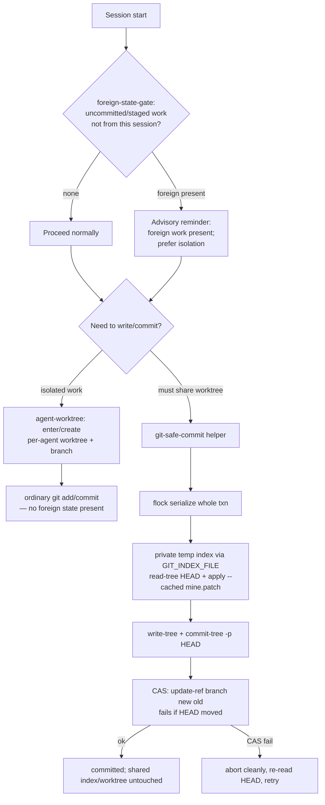

# feat: Multi-agent git-safety workflow

> **Target:** global `~/.claude/` Claude Code config (cross-repo tooling), **not** the ACGS repo. Paths below are relative to `~/.claude/` unless marked otherwise. The plan document lives in this repo's `docs/plans/` for discoverability.

## Summary

Concurrent agent sessions in this workspace commit to the **same branch in the same shared worktree under the same git identity**. This session demonstrated the failure mode directly: a path-scoped commit silently swept another session's uncommitted hunk into my commit, and the "unstage-foreign → commit → restage" recovery dance is only safe while the repo is quiescent (CCA / GPT-5 Codex verdict). This plan makes concurrent agent git operations safe by two complementary means: (1) **worktree-per-agent isolation** as the recommended default, and (2) a **concurrency-safe partial-commit helper** + **session-start foreign-state detection gate** for the shared-worktree case that will persist regardless. Implementation extends the existing `~/.claude` git-safety infrastructure (scope-detect, scope-gate/seal-guard hooks, `multi-agent-git-safety.md`) rather than inventing a parallel system.

---

## Problem Frame

**Root cause:** shared worktree + shared branch + shared git identity + concurrent agents. Git's `.git/index.lock` protects each *single* command, not a multi-step sequence, so any "stage → commit → restore" choreography has a race window where another session's staged or unstaged work can be committed, swept, or lost.

**Observed harm (this session):**
- `git commit -- <path>` uses `--only` (working-tree) semantics, silently committing a foreign unstaged hunk (commit `6fe08ad`, recovered via `reset --soft`).
- The recovered "dance" (`apply --cached` → `reset HEAD -- foreign` → plain `commit` → `git add` restore) restored foreign state byte-identically *in this quiescent run*, but Codex confirms it is **not concurrency-safe** and `git add`-based restore re-derives index state from the working tree (not the original index snapshot), so index-only stage state is not guaranteed.

**Why now:** the failure already happened once and was caught only by manual verification. Without tooling, the next occurrence may not be caught.

---

## Requirements Traceability

| R-ID | Requirement | Source |
|---|---|---|
| R1 | An agent can commit ONLY its own changes without touching another session's staged/unstaged work, safely under concurrency | CCA verdict; this-session incident |
| R2 | An agent detects foreign uncommitted/staged work at session start and is warned before any git write | `scope-gate.md`; incident |
| R3 | Per-agent worktree isolation is the recommended default and is one command to enter | CCA structural recommendation; user-confirmed scope |
| R4 | The shared-worktree path remains supported and is made as safe as possible (serialized transactions) | user-confirmed scope ("共享兼容") |
| R5 | New tooling mirrors existing `~/.claude` hook/script conventions (exit-0-always, inform/block via env, session state under `~/.claude/state/`) | `hooks/scope-gate-precheck.py` |
| R6 | Workflow rules and CLAUDE.md guidance are updated so agents actually follow the new default | existing rule pattern |

---

## High-Level Technical Design

Decision flow an agent follows from session start to a committed change:



Key property of the helper path (J–M): it **never mutates the shared index, working tree, or checked-out branch** — the commit is built in a throwaway index and published via compare-and-swap ref update. This is the only fully concurrency-safe construction (per CCA).

---

## Key Technical Decisions

### KTD1 — Build commits in a private index, not the shared index
Use `GIT_INDEX_FILE=$(mktemp)` + `read-tree HEAD` + `apply --cached` + `write-tree` + `commit-tree` + CAS `update-ref`. Rationale: the shared index is the contended resource; never touching it eliminates the entire class of "foreign staged work swept/lost" races. (see origin: CCA Codex artifact §4.) Rejected alternative: the unstage-foreign→commit→restore dance — correct only when quiescent, and `git add` restore is not byte-exact for index-only state.

### KTD2 — CAS ref update over `reset --soft`/plain branch advance
Advance the branch with `git update-ref refs/heads/<b> <new> <old-HEAD>` so a concurrent foreign commit makes the update *fail* rather than silently clobbering it. Recovery from a bad commit likewise uses CAS, not `reset --soft HEAD~1` (which is race-sensitive on a shared branch).

### KTD3 — Worktree-per-agent is the recommended default; shared stays supported
`agent-worktree` helper makes isolation one command (`agent-worktree enter`). Shared-worktree work routes through `git-safe-commit` + `flock`. Rationale: isolation removes the root cause; flock serialization bounds the residual risk for sessions that must share. (User-confirmed scope.)

### KTD4 — flock-wrap the *entire* git transaction in shared mode
A single `flock ~/.claude/state/git-txn/<repo-hash>.lock` around the full helper invocation, so even the CAS+publish is serialized against other cooperating agents. Only protects against agents that use the wrapper — documented as a cooperative lock, not a kernel guarantee.

### KTD5 — Advisory-by-default, block via env (mirror scope-gate)
`foreign-state-gate` emits a SessionStart `additionalContext` reminder by default; `CLAUDE_GIT_SAFETY_MODE=block` escalates. Exit-0-always. Mirrors `hooks/scope-gate-precheck.py` exactly so behavior is predictable and never disrupts the host session.

### KTD6 — Exact submodule/index restore uses `update-index`, not `git add`
Where any restore of prior index state is unavoidable, use `git update-index --force-remove` / `--cacheinfo` to reproduce exact records rather than `git add` (which re-derives from the working tree). (see origin: CCA Codex artifact §3.)

---

## Output Structure

```
~/.claude/
├── scripts/
│   ├── git-safe-commit.sh        # U1 — private-index + commit-tree + CAS publish
│   └── agent-worktree.sh         # U4 — per-agent worktree enter/create/list
├── hooks/
│   └── foreign-state-gate.py     # U3 — SessionStart foreign-state detector (advisory/block)
├── rules/
│   └── multi-agent-git-safety.md # U5 — extended with new default workflow (existing file)
└── settings.json                 # U3 — register foreign-state-gate on SessionStart (existing file)
```

(Tests live beside the scripts as `*.bats` or a `tests/` shell harness — see units.)

---

## Implementation Units

### U1. Concurrency-safe partial-commit helper
**Goal:** a reusable CLI that commits only a supplied patch (or path set) by building the commit in a private index and publishing via CAS, never touching the shared index/worktree/branch.
**Requirements:** R1, R5.
**Dependencies:** none.
**Files:** `scripts/git-safe-commit.sh` (new); `tests/git-safe-commit.bats` (new).
**Approach:** accept a unified-diff patch path (or `--paths`) + a commit message. Steps: resolve repo root + current HEAD; `idx=$(mktemp)`; `GIT_INDEX_FILE=$idx git read-tree HEAD`; `git apply --cached --check` then `apply --cached` the patch against `$idx`; `tree=$(... write-tree)`; `commit=$(printf '%s' "$msg" | git commit-tree "$tree" -p "$HEAD")`; `git update-ref refs/heads/<branch> "$commit" "$HEAD"`. On CAS failure: do not retry destructively — report, re-read HEAD, exit non-zero with guidance. `trap 'rm -f "$idx"' EXIT`. Note hooks are bypassed by `commit-tree` — print a reminder to run gates manually (or defer to worktree path where ordinary commit runs hooks).
**Patterns to follow:** `scripts/scope-detect.py` for repo-root/topology resolution via `git rev-parse`; exit-code + stderr discipline from `hooks/scope-gate-precheck.py`.
**Test scenarios:**
- Happy path: patch with one hunk in a clean repo → exactly that hunk committed; `git diff HEAD~1 HEAD` equals the patch; working tree and index unchanged afterward.
- Foreign-staged isolation: pre-stage an unrelated file in the shared index, run helper → committed tree contains ONLY the patch; the foreign staged entry remains staged and unchanged (`git ls-files -s` identical before/after).
- Foreign-unstaged isolation: a second hunk exists unstaged in the same file → committed file contains only the helper's hunk; the foreign hunk remains uncommitted in the working tree.
- CAS conflict: move HEAD (simulate concurrent commit) between read and publish → `update-ref` fails, helper exits non-zero, no ref moved, temp index cleaned.
- Patch does not apply: `apply --cached --check` fails → helper aborts before write-tree, exits non-zero, no commit object dangles on a ref.
- Cleanup: temp index file removed on success, on failure, and on SIGINT.
- `Covers` R1.

### U2. Shared-worktree flock transaction wrapper
**Goal:** serialize the entire `git-safe-commit` invocation (and any other cooperating writer) against concurrent agents sharing one worktree.
**Requirements:** R4, R1.
**Dependencies:** U1.
**Files:** `scripts/git-safe-commit.sh` (extend — `--shared` flag wraps body in `flock`); `tests/git-safe-commit-flock.bats` (new).
**Approach:** when `--shared` (or auto-detected non-isolated worktree), acquire `flock -w <timeout> ~/.claude/state/git-txn/<repo-hash>.lock` around the whole transaction. Document as a *cooperative* lock — only protects against writers that also use the wrapper. Lock dir under `~/.claude/state/` mirrors existing state-dir convention.
**Patterns to follow:** `~/.claude/state/scope-gate/` session-state dir layout from `hooks/scope-gate-precheck.py`.
**Test scenarios:**
- Serialization: two concurrent helper invocations on the same repo → both commits land, neither lost, branch advances by exactly two (run under flock); without flock the same race drops one (characterization to justify the wrapper).
- Lock timeout: lock held longer than `-w` → second invocation exits non-zero with a clear "another agent holds the git lock" message, no partial commit.
- Lock release on crash: kill a holder mid-transaction → lock is released (flock fd semantics), next invocation proceeds.
- `Covers` R4.

### U3. Session-start foreign-state detection gate
**Goal:** at session start, detect uncommitted/staged work that predates this session and surface an advisory reminder (block via env), so an agent never edits/commits blind to foreign work.
**Requirements:** R2, R5.
**Dependencies:** none (independent of U1/U2).
**Files:** `hooks/foreign-state-gate.py` (new); `settings.json` (modify — register on `SessionStart`); `tests/test_foreign_state_gate.py` (new).
**Approach:** SessionStart hook reads the hook JSON payload; resolves repo root for cwd; runs `git status --porcelain` + `git diff --cached --name-only`. If any modified/staged/untracked-of-concern entries exist AND no per-session marker yet, emit a reminder via `hookSpecificOutput.additionalContext` listing the foreign paths and recommending `agent-worktree enter` (U4) or `git-safe-commit` (U1). Default mode `inform`; `CLAUDE_GIT_SAFETY_MODE=block` → exit 2 + stderr. Exit-0-always on any error. Record session marker under `~/.claude/state/git-safety/<session>.txt`.
**Execution note:** mirror `hooks/scope-gate-precheck.py` structure closely (payload parse, `_safe_main`, additionalContext envelope, mode switch) — it is the proven template.
**Patterns to follow:** `hooks/scope-gate-precheck.py` (entire shape); settings.json `SessionStart` array wiring (two hooks already present — append, do not replace).
**Test scenarios:**
- Clean repo: no foreign work → hook emits nothing, exit 0.
- Foreign present, inform mode: pre-existing `M`/staged files → additionalContext reminder lists them, exit 0.
- Block mode: `CLAUDE_GIT_SAFETY_MODE=block` + foreign work → exit 2, message on stderr.
- Malformed/empty stdin payload → exit 0, no output (never disrupts session).
- Non-git cwd → exit 0, no output.
- Wiring: with the hook registered in settings.json, a simulated SessionStart payload routes to it (dispatcher-level — invoke via the configured command, not just import the function). Confirms R5 wiring, per `~/.claude/rules/review-handler-wiring.md`.
- `Covers` R2.

### U4. Per-agent worktree helper (recommended default path)
**Goal:** make worktree-per-agent isolation a one-command operation: create or reuse a per-agent worktree + branch off the current branch.
**Requirements:** R3.
**Dependencies:** none.
**Files:** `scripts/agent-worktree.sh` (new); `tests/agent-worktree.bats` (new).
**Approach:** `agent-worktree enter [--base <branch>]` derives a stable per-agent id (session id or `$CLAUDE_SESSION_ID` fallback to user+pid), creates `../<repo>-wt/<agent-id>` with branch `agent/<agent-id>` off base if absent, else reuses it; prints the path to `cd` into. `list` / `prune` subcommands for cleanup of unchanged worktrees. Never touches the parent repo's checked-out branch. Refuse to operate across submodule boundaries (mirror existing boundary discipline).
**Patterns to follow:** existing `ACGS-wt/` per-agent worktree naming seen in memory ([[acgs-lite-pep-closure-pursuit]]); `scope-detect.py` topology checks to avoid acting inside a submodule.
**Test scenarios:**
- Create: in a clean repo, `enter` → new worktree + `agent/<id>` branch created off base; path printed; parent branch unchanged.
- Reuse: second `enter` with same agent id → reuses existing worktree, no duplicate branch, same path printed.
- Prune: `prune` removes worktrees with no commits/changes ahead of base; leaves dirty/ahead ones intact (with a note).
- Submodule guard: invoked with cwd inside a nested submodule → refuses with a clear message, exit non-zero.
- `Covers` R3.

### U5. Workflow rules + CLAUDE.md guidance update
**Goal:** document the new default workflow so agents (and the human) actually adopt it; wire the decision flow into the always-on rules.
**Requirements:** R6.
**Dependencies:** U1, U2, U3, U4 (documents their interfaces).
**Files:** `rules/multi-agent-git-safety.md` (modify — add "Concurrency-safe commit & isolation" section referencing the three helpers + the HTD decision flow); `rules/scope-gate.md` (modify — add foreign-state-gate to the session-start checklist); `CLAUDE.md` global (modify — one-line pointer under the git workflow section). ACGS repo `CLAUDE.md` (modify — optional pointer, repo-relative, only if it adds value).
**Approach:** prose + the decision flowchart; concrete invocation examples for `agent-worktree enter` and `git-safe-commit`. Keep advisory tone consistent with existing rules. No new behavior — pure documentation of U1–U4.
**Test expectation:** none — documentation only. Verification is by review against U1–U4 interfaces.
**Patterns to follow:** existing `rules/multi-agent-git-safety.md` and `rules/scope-gate.md` voice and structure.

---

## Scope Boundaries

**In scope:** the four helpers/hook above + their docs, in `~/.claude/`.

**Deferred to Follow-Up Work:**
- A `git add -p`-equivalent interactive hunk picker — the patch-extraction approach (awk filter / explicit patch) is sufficient for the helper; an interactive picker is a convenience layer.
- Retrofitting existing in-flight foreign branches/worktrees — this plan changes go-forward behavior, not historical cleanup.
- A CI guard that lints for unsafe commit patterns — useful but separate.

**Outside this product's identity (non-goals):**
- Changing ACGS application code, governance kernel, or any package source.
- A multi-agent lock daemon / server — the cooperative `flock` + CAS approach is deliberately serverless.
- Forcing isolation (hard block) on all sessions — default is recommended-not-mandatory per user scope.

---

## Risks & Dependencies

| Risk | Severity | Mitigation |
|---|---|---|
| `commit-tree` bypasses pre-commit/commit-msg hooks (governance gates) | High | U1 prints a reminder to run gates manually; U5 documents that the worktree path (U4 + ordinary `git commit`) runs hooks normally and is preferred for gate-bearing repos |
| Cooperative flock only protects cooperating writers; a non-wrapper `git commit` still races | Medium | U5 documents the cooperative nature; worktree-per-agent (U4) is the real isolation and is the recommended default |
| `agent-worktree` disk/setup friction discourages adoption | Medium | one-command `enter` + `prune`; advisory not mandatory |
| Editing global `settings.json` (consumed by all sessions) could break hook loading | Medium | append to `SessionStart` array, never replace; U3 hook is exit-0-always; validate JSON parse before/after |
| awk/patch extraction fragility for adjacent hunks/renames | Low | U1 takes an explicit patch and runs `apply --cached --check` first; document the GIT_INDEX_FILE path as the safe construction |

**Dependencies:** existing `~/.claude` hook/script conventions; `flock` (util-linux) available on the host (Fedora — present). No new runtime deps.

---

## Sources & Research

- **CCA / GPT-5 Codex review** (load-bearing) — `.omc/artifacts/ask/codex-review-the-safety-and-correctness-of-a-git-partial-commit-te-2026-06-14T03-34-21-821Z.md`: verdict that the dance is quiescent-only-safe; the GIT_INDEX_FILE + commit-tree + CAS construction; `update-index` for exact restore; failure ranking. Shaped KTD1, KTD2, KTD6 and U1.
- Existing infra (pattern source): `~/.claude/hooks/scope-gate-precheck.py`, `~/.claude/scripts/scope-detect.py`, `~/.claude/settings.json` hook wiring.
- Institutional learnings: `git-commit-pathspec-takes-worktree-not-index` (the `--only` trap + safer default), `acgs-concurrent-agents-same-branch` (root cause), `hook-firing-order-deny-rules` (hook/deny-rule ordering).
- External research beyond the CCA artifact was **skipped** — the git plumbing is settled and the CCA lane already provided authoritative implementation guidance. (agy lane of that CCA run hung and was terminated; its threat-model angle is covered by the Risks table.)

---

## Deferred Implementation Notes (execution-time unknowns)
- Exact stable per-agent id source (`$CLAUDE_SESSION_ID` availability in hook env vs. derive from session-state) — resolve when wiring U4 against the real hook payload.
- Whether `foreign-state-gate` should treat untracked files as "foreign" or only tracked modifications — decide against real session-start noise levels during U3 implementation.
- Repo-hash scheme for the flock lock path — finalize when implementing U2.
