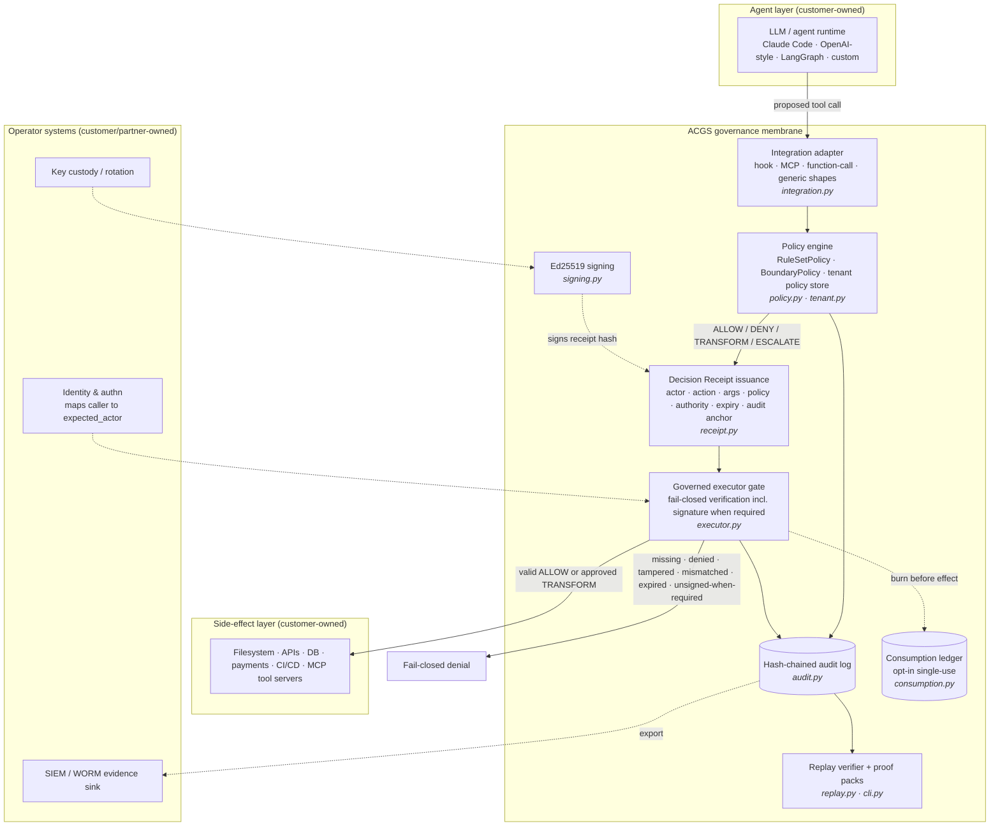

# Enterprise Architecture — ACGS / gove-zone

> **Core invariant: No valid Decision Receipt, no side effect.**

Status: describes the shipped local kernel plus the alpha governed-MCP gateway.
Enterprise operator surfaces (managed control plane, hosted evidence store) are
marked *proposed*.

## 1. Position in the enterprise stack

ACGS is not an agent framework and not a model. It is the enforcement layer
**below** agent reasoning and **above** side-effectful tools. Everything an
agent merely *says* is out of scope; everything an agent *does* (file writes,
API calls, payments, deployments, database changes, MCP `tools/call`) is the
governed surface.



Text fallback of the main flow (same as `docs/ARCHITECTURE.md`):

```text
Agent request -> governance check -> Decision Receipt -> executor validation
             -> side effect (valid ALLOW/approved TRANSFORM)
             -> fail-closed denial (anything else)
Both outcomes -> hash-chained audit evidence -> replay verification / proof pack
```

## 2. Component responsibilities

| Component | Product role | Implementation |
|---|---|---|
| Integration adapter | Normalizes Claude/Codex hooks, MCP `tools/call`, OpenAI-style function calls, generic tool events into governance-shaped calls | `packages/gove-zone/src/gove_zone/integration.py` |
| Policy engine | Evaluates the proposed `ToolCall`; returns ALLOW / DENY / TRANSFORM / ESCALATE; policy runs *before* execution, exceptions and timeouts synthesize DENY | `policy.py`, `kernel.py` |
| Decision Receipt | The sellable artifact: vendor-neutral, hash-bound proof-of-decision | `receipt.py`, spec in `docs/DECISION_RECEIPT_SPEC.md` |
| Executor gate | The enforcement point; rejects missing, denied, malformed, tampered, mismatched, expired, or unsigned-when-required receipts | `executor.py` |
| Audit chain | Append-only JSONL with `previous_hash`/`event_hash`; detects edits, reorders, truncation | `audit.py` |
| Consumption ledger | Opt-in single-use receipts (anti-replay); hash-chained, prunable with clock-rollback watermark | `consumption.py` |
| Signing | Opt-in Ed25519; `require_signature=True` is the default profile and fails closed without a trusted verifier | `signing.py`, `contracts.py` |
| Replay + proof packs | Re-derives decisions from audit evidence; `gove-zone proofpack` / `verify-proofpack` produce and check offline evidence bundles | `replay.py`, `cli.py` |
| Governed-MCP gateway (alpha) | Transparent stdio proxy that fronts a downstream MCP server and gates its `tools/call` through the kernel | `adapters/mcp_gateway.py` |

## 3. Product packaging map

| Package | Enterprise role | Distribution |
|---|---|---|
| `packages/gove-zone/` | Governed runtime kernel — the core product. Zero runtime dependencies (crypto is an optional extra) | Source / internal; self-hosted |
| `packages/acgs-lite/` | PyPI-facing governance library (`pip install acgs-lite`); constitution/engine API plus OpenAI, Anthropic, LangChain, MCP-server integrations | PyPI (v2.10.x) |
| `acgi-ai/` | Web surface: marketing site + privileged operator console | Cloudflare (marketing) + GCP Cloud Run (console) |
| `packages/clinicalguard/` | Clinical-domain governance agent (regulated-vertical proof point) | Private submodule |
| `packages/Acgs-Swarm/` | Constitutional swarm research (not a sold component) | Research repo |
| `packages/agent-bus-analyzer/` | Agent-bus observability layer | Internal |

## 4. Trust boundaries (enterprise view)

| Boundary | Guarantee inside the product | What the customer/operator must supply |
|---|---|---|
| Agent → governance | Agent can propose, never self-authorize (validator ≠ proposer, `expected_actor` at the gate) | Authentication that maps the real caller to `expected_actor` |
| Receipt integrity | Hash-bound fields; Ed25519 signature when engaged | Key custody, rotation; PKI is not included |
| Executor | Complete mediation *for wired paths*; fail-closed on every internal failure | Architecture discipline: no raw tool paths around the gate (ADV9) |
| Evidence | Hash-chained, tamper-evident audit + ledger | WORM/off-host placement for durability; local JSONL is not immutable storage |

## 5. Proposed enterprise extensions (roadmap, not shipped)

- Managed control plane: tenant/policy administration UI over `TenantPolicyStore`.
- Hosted evidence store: WORM-backed audit sink with retention SLAs.
- Cross-host receipt portability validators (roadmap item in `docs/ROADMAP.md`).
- Signed policy-bundle registry with lifecycle (active/stale/revoked).
- Attestation (TEE) binding for compromised-host adversaries (ADV3, proposed).
