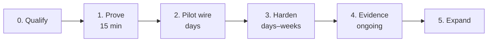

# Customer Onboarding Flow — ACGS / gove-zone

> **Core invariant: No valid Decision Receipt, no side effect.**

Design principle: onboarding is complete when the customer's **real side-effect
path** routes through the gate and they can hand an auditor a proof pack — not
when the package is installed. The known failure mode is "installed but not
wired" (ADV9), so the flow gates each stage on evidence, not on enthusiasm.

## Flow overview



## Stage 0 — Qualify (pre-sales)

- Segment check: does the customer's agent execute actions with real
  consequences (payments, writes, deployments, patient/matter data)? If the
  agent only chats, ACGS is the wrong product — say so.
- Fail-closed tolerance check: confirm the buyer accepts that outages block
  side effects rather than allowing them. If they ask for a production bypass
  switch, disqualify; we do not ship one (deliberate trade-off).
- Artifacts: [`docs/POSITIONING.md`](../POSITIONING.md),
  [`docs/COMPARISON.md`](../COMPARISON.md), design-partner kit
  (`docs/strategy/design-partner-kit/`).

## Stage 1 — Prove the invariant (15 minutes, no commitment)

Runs on a laptop, no accounts, no network:

```bash
pip install acgs-lite                      # or clone + uv sync for gove-zone
tmp=$(mktemp -d)
uv run --package gove-zone gove-zone smoke --audit "$tmp/smoke-audit.jsonl"
uv run --package gove-zone python examples/tamper_demo/demo.py
```

Exit criteria: the customer has watched (a) an allowed action execute with a
receipt, (b) a denied action leave evidence without executing, (c) a tampered
receipt get rejected. This is the demo script in
[`docs/DEMO_SCRIPT.md`](../DEMO_SCRIPT.md) / [`docs/PROOF_PATH.md`](../PROOF_PATH.md).

## Stage 2 — Pilot wiring (one real path, dev mode)

1. Pick **one** high-value side effect (a deploy step, a payment call, an MCP
   tool) — not a blanket rollout.
2. Wire it per [`docs/INTEGRATION_GUIDE.md`](../INTEGRATION_GUIDE.md):
   plain-Python wrapper, MCP gateway, or CI deploy gate depending on shape.
   Check [`docs/INTEGRATION_MATRIX.md`](../INTEGRATION_MATRIX.md) for the
   support tier of the customer's runtime; set expectations honestly for
   pattern-tier runtimes.
3. Dev mode is acceptable here: `require_signature=False`, explicit and
   temporary.
4. **Wiring proof (mandatory exit gate):** a dispatcher-level test in the
   customer's CI that (a) sends a request through the real entry path and sees
   the receipt gate engage, and (b) proves the negative path — no receipt, no
   side effect. A unit test that imports the handler directly does not count.

## Stage 3 — Harden (production posture)

Checklist (details in [02-deployment-options.md](02-deployment-options.md) §4):

- [ ] Signing on: default profile (`require_signature=True`) + trusted verifier;
      key custody documented (customer KMS/HSM).
- [ ] Anti-replay on: `ReceiptConsumptionLedger(path, checkpoint=True)`.
- [ ] `expires_at` set short; `policy_timeout` configured.
- [ ] Audit chain + sidecars on WORM/off-host storage.
- [ ] Identity mapping: authenticated caller → `expected_actor`, reviewed.
- [ ] Policy bundle exported canonically (`gove-zone policy export`), reviewed,
      version-pinned by id + hash.
- [ ] Alerting wired to the `gove_zone.consumption` WARNING logger.
- [ ] `gove-zone doctor` clean.

## Stage 4 — Evidence operations (steady state)

- Weekly: `gove-zone verify-ledger --audit <chain>` reconciliation.
- Per audit/incident: `gove-zone proofpack` → hand the bundle to the auditor;
  they verify offline with `gove-zone verify-proofpack` — no trust in the
  operator required for hash/signature checks.
- Ledger hygiene: `gove-zone prune-ledger` (safe: only expired receipts are
  pruned; the prune watermark blocks clock-rollback replay).
- Escalations: `gove-zone approve` for the human-approval resume path.

**Success metric (matches the product's North Star):** governed side-effecting
operations per week through the gate — measuring that the membrane carries real
traffic, not that it is installed.

## Stage 5 — Expand

- Additional side-effect paths, additional teams (platform-team motion, S2).
- Multi-tenant: per-tenant policy bundles via `TenantPolicyStore`.
- Compliance mapping workshop against
  [`docs/COMPLIANCE_CROSSWALK.md`](../COMPLIANCE_CROSSWALK.md) for the
  customer's framework of record (self-assessment, clearly labeled).

## Onboarding anti-patterns (refuse these)

- Declaring success at install time — the OMTM is wired production
  integrations, not downloads.
- Treating planner approval as execution approval.
- Leaving `require_signature=False` in a production-adjacent path without a
  documented, accepted risk.
- Describing hook observe-mode as enforcement.
- Marketing the pilot as "compliance-certified" — no such certification exists.
